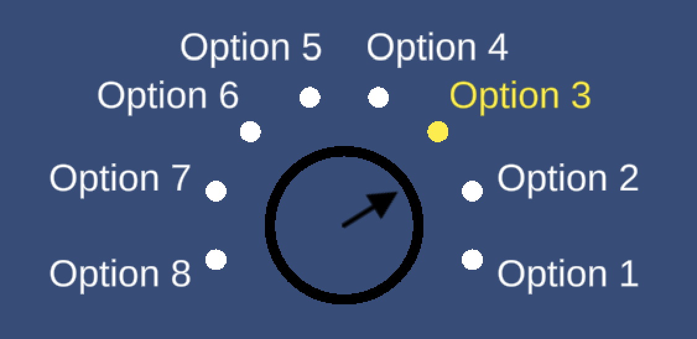
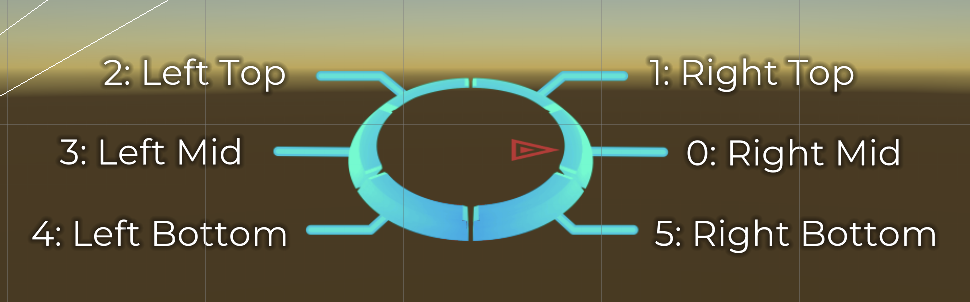

# Dialogue Wheel

This Unity package provides two prefabs: **Six-Segment Dialogue Wheel** and **Automatic-Layout Dialogue Wheel**.&#x20;

This add-on is not part of the open source Yarn Spinner package, and can be purchased from the following locations: Itch.io, Unity Asset Store, Yarn Spinner Store.

This guide provides documentation on implementing, and extending both prefabs.

The oldest supported version of Unity for the Dialogue Wheel is 2021.3

### Automatic-Layout Dialogue Wheel

The Automatic-Layout Dialogue Wheel provides a dialogue wheel with a simple graphical appearance, and can—theoretically—support as many options as you'd like, automatically adjusting to display them. You cannot force an option to appear in a specific place on the wheel.

<figure><figcaption>
The Automatic-Layout Dialogue Wheel, showing 8 options.
</figcaption></figure>

To learn how to use the Automatic-Layout Dialogue Wheel, [read this guide](using-auto-layout-wheel.md).

### Six-Segment Dialogue Wheel

The Six-Segment Dialogue Wheel provides a dialogue wheel with a light scif-fi appearance, and support for up to six segments, and the ability to specify exactly which of the segment positions is used for an option in your Yarn scripts.

<figure><figcaption>
The Six-Segment Dialogue Wheel, showing the 6 option locations.
</figcaption></figure>

To learn how to use the Six-Segment Dialogue Wheel, [read this guide](using-six-segment-wheel.md).
