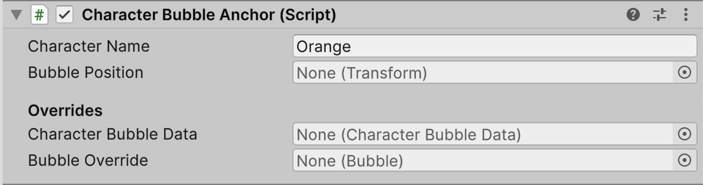
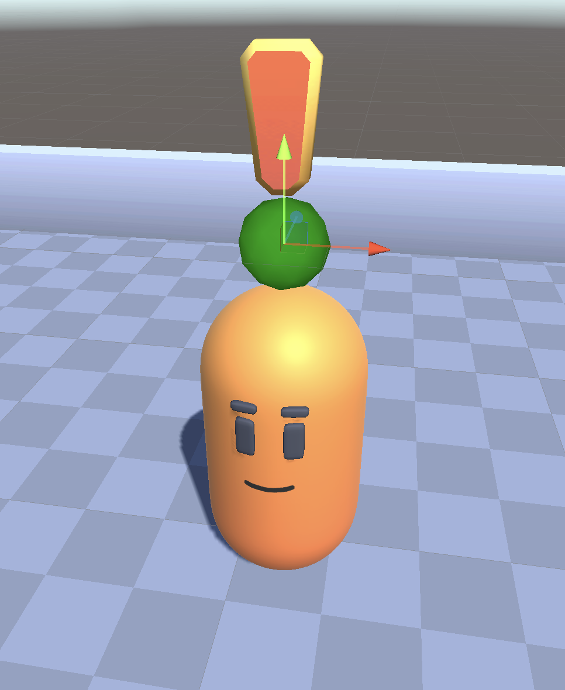

# Using Speech Bubbles

The Speech Bubbles Add-On provides a flexible speech bubble system with a variety of possible customisations. Here, you'll learn how to implement it in a Unity project by looking at a basic little 3D game.
We'll be using prefabs and assets from the Yarn Spinner Samples package to speed this up, but nothing we are using from there is necessary, it's just faster than building all the infrastructure out ourself.

## Setting up for Speech Bubbles

To use Speech Bubbles for Yarn Spinner, you'll need to create a new Unity project and [install the Yarn Spinner package](../../using-yarnspinner-with-unity/installation-and-setup.md), and then [install the Speech Bubbles for Yarn Spinner package](installing-speech-bubbles.md).

For this guide, we'll be making a simple 3D game that will look like this:

<figure><figcaption>Our demo scene in action.</figcaption></figure>

Our environment and the characters will all be using the exact same Sample Package assets we used to build out the examples for the Speech Bubbles in addition to all the samples in the Samples package.

### Building the Basics

First we want to have the environment to wander around in, so from the `Packages/Yarn Spinner Samples/Prefabs` folder grab the Basic Arena prefab out and drop it into the scene.

Our script, which we've yet to write, will have two characters, the player and one NPC so we need them next.
From the `Packages/Yarn Spinner Samples/Prefabs` folder grab the Player prefab and place them somewhere in the arena.
From the same folder grab the NPC prefab and place it somewhere else in the arena.
We also want our NPC to be coloured orange, or else the story won't make any sense.

Select the NPC and rename them to be called "Orange", then in the Inspector find the `Character Appearance` component and select the Orange button.

<figure><figcaption>Configuring the Orange NPC to be coloured orange.</figcaption></figure>

Orange will change to now be coloured the same as their namesake.
Once that is done we should have our world built out.

<figure><figcaption>Our finished environment.</figcaption></figure>

### Camera controls

The player can move about so we will want the camera to track them, luckily the code for that is also already done in the sample assets.
From the `Packages/Yarn Spinner Samples/Prefabs` folder and drag the Camera Rig prefab into the scene.
This includes a camera so we can select the existing Main Camera from the hierarchy and delete it.
For the camera rig to follow the player we need to let it know that that is it's target.
To do this select the Camera Rig and in the Inspector drag the Player from the Hierarchy into the Target field.

<figure><figcaption>Configuring the camera to track the player.</figcaption></figure>

Now our camera is following the player, you can test this by starting the game and walking the player around the scene.

#### Creating the Dialogue and System

Time to make the dialogue happen, first we will make our project by creating a new Yarn Project asset by going `Create -> Yarn Spinner -> Yarn Project` and we'll name it `Demo.yarnproject`.
For our script we'll also make that now `Create -> Yarn Spinner -> Yarn Script` and name that `Demo.yarn`.
Open `Demo.yarn` and add the following dialogue:

<details>

<summary>Simple Yarn Script</summary>

```
title: Orange
---
Orange: Hello!
    -> Why Hello There!
        Orange: You are a bold one.
    -> Who are you?
        Orange: I'm Orange.
    -> You're orange.
        Orange: Yep.
===
```

</details>

With this magnum opus of a story done let's get it into our demo game.

In the Hierarchy right click and add a new `Yarn Spinner -> Dialogue System` to the scene.
Select the Dialogue System and in it's Inspector set the Yarn Project field to be our `Demo.yarnproject` we just made.

<figure><figcaption>Hooking our Yarn Project up to the dialogue runner.</figcaption></figure>

Last piece of the puzzle is to make it so that Orange can trigger dialogue when interacted with.
Select out Orange NPC in the scene and in it's Inspector connect our Dialogue System into it's Dialogue Runner field, our `Demo.yarnproject` project into it's Dialogue field and from the node dropdown select the `Orange` node.

<figure><figcaption>Configuring Orange to participate in the dialogue.</figcaption></figure>

Now if you run the scene once again you'll see it all work, but it's just using the default presenters, and not the speech bubbles.
Everything we've done up until now is just getting a basic scene up and running so that we can add the bubbles, so let's do that now.

## Adding Bubbles

Bubbles are a bit different from most presenters, they need to both be told about the dialogue events, so must participate in the dialogue system but also need to understand the characters they belong two so they can anchor the actual individual bubble with that character.
These two pieces need to be done before they'll work.

### Adding Bubbles to Dialogue System

First up we will need to modify the dialogue system.
Expand out the Dialogue System and it's Canvas.
Select the Line Presenter and Options Presenter and delete both of them, we won't need them as the Speech Bubbles will handle both roles.
Add a new empty game object to the Canvas and name it "Bubble Dialogue View".

<figure><figcaption>Updating our dialogue system hierarchy.</figcaption></figure>

In the Inspector for the Bubble Dialogue View add a new Bubble Dialogue View component to the game object.
This is our actual Speech Bubbles presenter component but it will need some configuration.
In the Bubble Prefab field add the Casual Bubble from the Prefabs folder in the Speech Bubbles install.
In the Bubble Canvas field add the Canvas from the Hierarchy into this field.

<figure><figcaption>Configuring our speech bubbles.</figcaption></figure>

#### Bubble Input and Line Advancer

As discussed in [the Speech Bubbles main page](README.md) the way Line Advancer works with the bubbles is a bit different than other presenters.
We will need to add a Bubble Input system in addition to the Line Advancer otherwise bubbles won't know how to handle their options.

Select the Line Advancer from the Dialogue System.
In it's Inspector add a new Bubble Input component to the Line Advancer game object.
Now to configure it!

Add the Line Advancer from the Hierarchy into the Bubble Input's Line Advancer field.
Add the Bubble Dialogue View from the Hierarchy into the View field.
Add the Dialogue System from the Hierarchy into the Runner field.
Finally, configure the input however you wish, we just left ours as keycodes.

<figure><figcaption>Our configured Bubble Input.</figcaption></figure>

#### Hooking it up

The last step is to make it so the Dialogue Runner is actually aware of these changes, otherwise we are *not* gonna have a fun time.

Select the Dialogue System and in it's Inspector delete all the elements inside the Dialogue Presenters field.
Set the size of that field to be two.
Into the new slots drag the Bubble Dialogue View and the Line Advancer into these slots, respectively.

<figure><figcaption>Letting the runner know about the Bubbles and Input.</figcaption></figure>

Now we need to anchor the bubbles to their characters.

### Anchoring the Bubbles

Because the bubbles don't know the world position of the character they are associated with we need to give them that information.
We do that via a Character Bubble Anchor, which is little more than a transform the Bubble Dialogue View knows about so it can map that anchors world position into a canvas screen position.
Let's add them now.

Select the Player and add a new empty game object to the Player, name it Anchor.
Add a Character Bubble Anchor component to the anchor game object.
In the Inspector set the Character Name field to be `Player`, this is used later so that the Bubble Dialogue View can use the current line's speaker name to work out which anchor to use.
Leave the rest of the values as is.

Do the same with Orange, add a new game object and call it Anchor, add a Character Bubble Anchor to it, and set the Character Name to be `Orange`.

<figure><figcaption>The anchor for Orange.</figcaption></figure>

The transform value set on the anchor, or the transform of the anchor itself if one isn't set, will be the position that is used to anchor the bubble.
So make sure on both the Player and Orange to position the anchor somewhere that feels right to you.
To help with this a small green ball gizmo will be drawn at the anchor location, so using that we placed the anchor point *slightly* above the characters heads, but you can put it anywhere you want.

<figure><figcaption>Our chosen position for the anchor for Orange.</figcaption></figure>

## Playing with Bubbles

With that, you can play your project and see the Speech Bubbles in action:

VIDEO GOES HERE

Next check our provided [Speech Bubble Examples](speech-bubble-examples.md) which show off using the bubbles in 2D as well as 3D and how you can create custom bubble content for individual characters.
