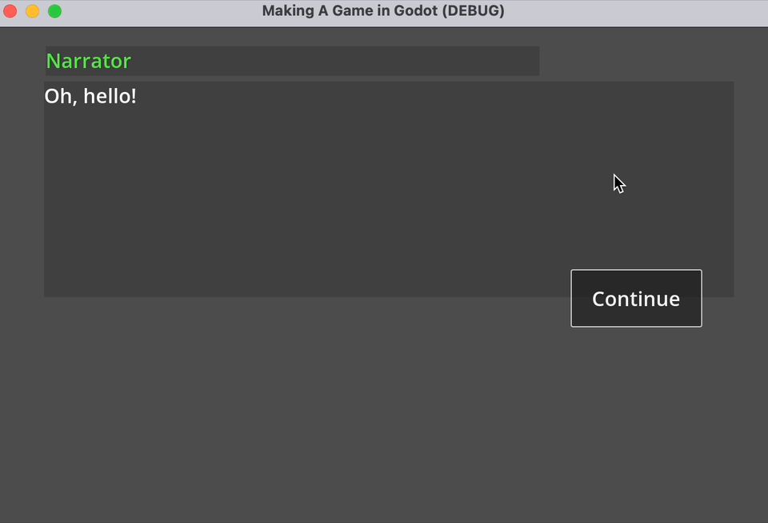

# Yarn Spinner for Godot


Yarn Spinner for Godot is a Yarn Labs project. It is not fully, or officially supported, and may break, or change at any time.


This step of the beginner's guide helps you move from writing Yarn scripts outside of a game engine, to initial integration steps to turn them into a game with Godot

First, launch Godot 4.1 (C# version) and create a new project.

## Installing Yarn Spinner for Godot

Download a[ copy of the latest version of Yarn Spinner for Godot](https://github.com/YarnSpinnerTool/YarnSpinner-Godot/archive/refs/heads/develop.zip) from the [GitHub repository](https://github.com/YarnSpinnerTool/YarnSpinner-Godot/), or clone the repository somewhere.

Locate the `addons/` directory in your new local copy of Yarn Spinner for Godot:

<figure><figcaption><p>The <code>addons</code> directory in a local copy of Yarn Spinner for Godot.</p></figcaption></figure>

Put a copy of this directory into your new Godot project, either by dragging the folder in your file manager (e.g. Finder or Explorer) into the folder of the Godot project, or by dragging from your file manager into the FileSystem dock of your Godot project:

<figure><figcaption><p>The FileSystem dock in Godot, after dragging the <code>addons</code> directory in.</p></figcaption></figure>

Next, choose the Project menu -> Tools -> C# -> Create C# solution. This will create a C# project for you. We have to do this to trigger the creation of the `.csproj` file, which is necessary to let Godot know about the Yarn Spinner plugin.&#x20;

Next, open the project folder in Visual Studio Code. In the sidebar of VS Code, the `.csproj` file and add the following line to it, inside the `<Project>` `</Project>` tags, but not inside an `<ItemGroup>` or `<PropertyGroup>:`

```
  <Import Project="addons\YarnSpinner-Godot\YarnSpinner-Godot.props" />
```

Your brand new project should look something like this in VSCode:

<figure><figcaption><p>The <code>.csproj</code> for your project.</p></figcaption></figure>

Save the tweaked `.csproj` file and return to Godot, everything is almost ready to go. Click the Build button in the very top right-hand corner of the Godot window. This will trigger a build of the C# solution for the project, which is required to make Godot aware of Yarn Spinner for Godot.&#x20;

Once the build is complete, open the Project menu -> Project Settings, change to the Plugins tab, and tick the enabled box next to the Yarn Spinner for Godot plugin:

<figure><figcaption><p>The Project Settings, showing the Plugins tab.</p></figcaption></figure>

With that, you're ready to go!

## Using Yarn Spinner for Godot

In your Godot project, click the Instantiate Child Scene button:

<figure><figcaption><p>The chain-link button, for instantiating a child scene.</p></figcaption></figure>

And navigate into the `addons/YarnSpinner-Godot/Scenes` folder of your project, and choose the `DefaultDialogueSystem.tscn` file as the scene to instantiate:

<figure><figcaption><p>Choosing the provided <code>DefaultDialogueSystem.tscn</code>.</p></figcaption></figure>

Your Scene dock will look like this showing a node hierarchy that's entirely based on the `DefaultDialogueSystem.tscn` scene that you instantiated:

<figure><figcaption><p>The <code>DefaultDialogueSystem</code> instantiated into your scene.</p></figcaption></figure>


You could also instantiate the `DefaultDialogueSystem.tscn` into your scene at a lower part of the hierarchy, instead of the root node, to display dialogue using the provided default UI, instead.


Next, create a new Yarn Project using the menu Tools > YarnSpinner >Create Yarn Project:

<figure><figcaption><p>Opening the menu to create a new .yarnproject file.</p></figcaption></figure>

Then choose a directory to save your new YarnProject in. For example, you can save it to the root of your project. Name the new Yarn Project `FirstProject.yarnproject`:

<figure><figcaption><p>Selecting a location to save your .yarnproject file.</p></figcaption></figure>

Next, create a new Yarn script (a file with a `.yarn` extension) by using the menu Tools > YarnSpinner >Create Yarn Script. In the resulting "Create a new Yarn Script" window, set the File name to `MyStory.yarn`, and click the Save button::

<figure><figcaption><p>Opening the Create Yarn Script window</p></figcaption></figure>

It may take a moment, but Godot will import your new `.yarn` file, and it will appear in the FileSystem dock. When it's appeared, double-click on the Yarn Project, `FirstProject.yarnproject` in the FileSystem dock and look to the Inspector, making sure that `res://MyStory.yarn` is in the list of Source Scripts, which are the Yarn scripts that compromise the new project:

<figure><figcaption><p>The Yarn Project, with the Yarn script identified as a Source Script.</p></figcaption></figure>

Next, open the `MyStory.yarn` file in VS Code, and add the following Yarn script to it, before saving it and returning to Godot:

<details>

<summary>MyStory.yarn</summary>

```
title: Start
tags:
---
Narrator: Oh, hello!
    -> Hi, where am I?
        Narrator: You're in Godot!
            -> Oh.
                <<jump Oh>>
            -> How did I get here?
                <<jump Godot>>
===

title: Oh
---
Narrator: Yeah, fun, right?
===

title: Godot
---
Narrator: Someone read the Beginner's Guide!
===
```

</details>

Select the `DialogueRunner` node in the Scene dock, and look to the Inspector. Assign the Yarn Project you created to the `DialogueRunner` by dragging the `FirstProject.tres` Yarn Project from the FileSystem dock into the Yarn Project slot of the Inspector:

<figure><figcaption><p>The new Yarn Project resource assigned as the Yarn Project for the <code>DialogueRunner</code>.</p></figcaption></figure>

Finally, enter `Start` as the Start Node, and tick the box next to Starts Automatically:

<figure><figcaption><p>Setting the Start Node, and that we want this <code>DialogueRunner</code> to start automatically.</p></figcaption></figure>

Save your scene as `Demo.tscn`, and run the game. At this point, you can play your project, and step through the dialogue in the default Yarn Spinner for Godot Line View and Options List View:

<figure><figcaption></figcaption></figure>

### Next steps with Yarn Spinner for Godot <a href="#next-steps-with-yarn-spinner-for-unity" id="next-steps-with-yarn-spinner-for-unity"></a>

With that, we've reached the end of our beginner's guide. You're ready go forth and build games with Yarn Spinner! You're also equipped to work with the rest of the documentations here! Don't forget to [join the Discord](https://discord.com/invite/yarnspinner) to chat with other Yarn Spinner users, the Yarn Spinner team, seek help, and share your work.\
\
