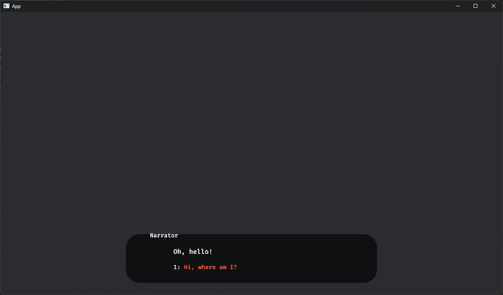

# Yarn Spinner for Rust


Yarn Spinner for Rust is a Yarn Labs project. It is not fully, or officially supported, and may break, or change at any time.


While Yarn Spinner for Rust is built to be engine-agnostic, the intended way to use it is through an engine-specific wrapper. The currently only supported engine is [Bevy](https://bevyengine.org/). It is a data-oriented game engine using an ECS, which broadly means that you don't look at your game world through the traditional lens of objects mutating the world and each other, but instead see the game as a collection of data attached to various entities that can be queried and manipulated through systems.

This chapter will assume that you are familiar with the basics of Bevy. If you're not there not, try to come back after you've gone through the [Bevy Book](https://bevyengine.org/learn/book/introduction/).

## Installing Yarn Spinner for Rust

Let's create a new Rust project called `hello_yarnspinner`. Type the following into your terminal:

```Bash
cargo new hello_yarnspinner
cd hello_yarnspinner
```

Then, let's add our dependencies:

```Bash
cargo add bevy bevy_yarnspinner bevy_yarnspinner_example_dialogue_view
```

## Setting up Bevy Yarn Spinner

### Plugins

Open up the generated `src/main.rs` and remove its content. Now let's import our dependencies:

```rust
use bevy::prelude::*;
use bevy_yarnspinner::prelude::*;
use bevy_yarnspinner_example_dialogue_view::prelude::*;
```

Now on to the main function. Let's start by adding all necessary plugins.

```rust
fn main() {
    let mut app = App::new();
    app.add_plugins((
        DefaultPlugins,
        YarnSpinnerPlugin::new(),
        ExampleYarnSpinnerDialogueViewPlugin::new(),
    ));
}
```

`DefaultPlugins` is necessary for Bevy to do much at all. `YarnSpinnerPlugin` sets up all functionality of Yarn Spinner except for any actual graphical interface. In order to see anything on screen, you need a _Dialogue View_. We are using a simple one provided by the `ExampleYarnSpinnerDialogueViewPlugin` here.


While we are using a simple example dialogue view we created for you, you can also create your own. To learn about this visit [Creating Custom Dialogue Views](../../using-yarnspinner-with-rust/components/dialogue-view/custom-dialogue-views.md), but do note that it is a **significant** step from this Beginner's Guide.


### Systems

Now we need the game to actually _do_ something. We will do this by registering some systems and then running the `app`. Extend your main function with the following code:

```rust
app.add_systems(Startup, setup_camera)
    .add_systems(Update, spawn_dialogue_runner.run_if(resource_added::<YarnProject>()))
    .run();
```

In order to see anything at all, we need a camera in our game world. `setup_camera` does just that when the game starts:

```rust
fn setup_camera(mut commands: Commands) {
    commands.spawn(Camera2dBundle::default());
}
```

The line added for the `Update` system set might look a bit confusing, so let's clear it up before defining the `spawn_dialogue_runner` function.

When the `YarnSpinnerPlugin` starts, it searches for Yarn files in the `assets/dialogue/` directory. Along with any localizations or extra assets it might find, it bundles its findings into a `YarnProject` representing your work. Once this process is finished, a `YarnProject` resource is injected into the world.

A `DialogueRunner` is the component that is responsible for actually running any piece of Yarn dialogue found inside a `YarnProject`. If you want to start, stop or change a dialog, you need to use it. You can guess that this only works once the `YarnProject` has actually finished loading. This is why we use `.run_if(resource_added::<YarnProject>())`; to wait exactly with spawning the `DialogueRunner` until everything is ready.

With that out of the way, let's look at the definition of `spawn_dialogue_runner`:

```rust
fn spawn_dialogue_runner(mut commands: Commands, project: Res<YarnProject>) {
    let mut dialogue_runner = project.create_dialogue_runner();
    dialogue_runner.start_node("Start");
    commands.spawn(dialogue_runner);
}
```

This code will not spawn the `DialogueRunner`, but tells it to immediately run a node called "Start" from a Yarn file.

### Creating a Yarn File

Create a file inside `assets/dialogue/` called `my_story.yarn`. Open it and fill it like this:

<details>

<summary>my_story.yarn</summary>

```yaml
title: Start
tags:
---
Narrator: Oh, hello!
    -> Hi, where am I?
        Narrator: You're in Bevy!
            -> Oh.
            <<jump Oh>>
            -> How did I get here?
            <<jump Rust>>
===

title: Oh
---
Narrator: Yeah, fun, right?
===

title: Rust
---
Narrator: Someone read the Beginner's Guide!
===
```

</details>

Now you can simply run `cargo run` in your terminal and enjoy your freshly created dialog:



## Troubleshooting

If anything went wrong, make sure that your directories look like this:

Your `src/main.rs` should look like this:

<details>

<summary>src/main.rs</summary>

```toml
use bevy::prelude::*;
use bevy_yarnspinner::prelude::*;
use bevy_yarnspinner_example_dialogue_view::prelude::*;

fn main() {
    let mut app = App::new();
    app.add_plugins((
        DefaultPlugins,
        YarnSpinnerPlugin::new(),
        ExampleYarnSpinnerDialogueViewPlugin::new(),
    ));
    app.add_systems(Startup, setup_camera)
    .add_systems(Update, spawn_dialogue_runner.run_if(resource_added::<YarnProject>()))
    .run();
}

fn setup_camera(mut commands: Commands) {
    commands.spawn(Camera2dBundle::default());
}

fn spawn_dialogue_runner(mut commands: Commands, project: Res<YarnProject>) {
    let mut dialogue_runner = project.create_dialogue_runner();
    dialogue_runner.start_node("Start");
    commands.spawn(dialogue_runner);
}
```

</details>

And your `Cargo.toml` should look like this:

<details>

<summary>Cargo.toml</summary>

```toml
[package]
name = "hello_yarnspinner"
version = "0.1.0"
edition = "2021"

# See more keys and their definitions at https://doc.rust-lang.org/cargo/reference/manifest.html

[dependencies]
bevy = "0.13.0"
bevy_yarnspinner = "0.1.0"
bevy_yarnspinner_example_dialogue_view = "0.1.0"
```

</details>

## Next Steps

With that, we've reached the end of our beginner's guide. You're ready go forth and build games with Yarn Spinner! You're also equipped to work with the rest of the documentations here!&#x20;

Don't forget to [join the Discord](https://discord.com/invite/yarnspinner), to chat with other Yarn Spinner users, the Yarn Spinner team, seek help, and share your work. It might also be worthwhile [joining the Bevy Discord](https://discord.com/invite/bevy) (unaffiliated with Yarn Spinner).
