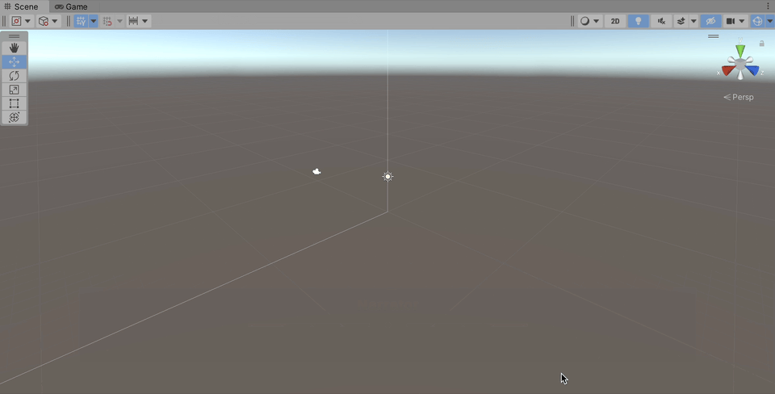

# Yarn Spinner for Unity

This step of the beginner's guide helps you move from writing Yarn scripts outside of a game engine, to initial integration steps to turn them into a game with Unity.

First, launch the Unity Hub, and create a new project for Unity 2021.3 or newer. Then, download and install Yarn Spinner.

You can download and install Yarn Spinner for Unity in four different ways:

* [buy Yarn Spinner for Unity from our Itch.io store](https://yarnspinnertool.itch.io/yarn-spinner), download it, and add the package to your project from the `.unitypackage`
* [buy Yarn Spinner from the Unity Asset Store](https://assetstore.unity.com/packages/tools/behavior-ai/yarn-spinner-for-unity-267061), download it, and install it via Unity
* install Yarn Spinner for Unity via the Unity Package Manager
* install Yarn Spinner for Unity from GitHub


Yarn Spinner is an open source project. You can directly support the Yarn Spinner Team by purchasing Yarn Spinner from [Itch](https://yarnspinner.itch.io) or the [Unity Asset Store](https://assetstore.unity.com/packages/tools/behavior-ai/yarn-spinner-for-unity-267061), but it will always also be available for free. To support the continued development of Yarn Spinner, purchasing Yarn Spinner for Unity from one of the storefronts. This is the best way to directly support the Yarn Spinner team.


## Install from Itch.io

First, visit the [Yarn Spinner Itch.io Store](https://yarnspinnertool.itch.io/yarn-spinner), and click the Buy Now button, and complete the checkout process.

Once you've purchased Yarn Spinner, you'll find a Download button at the top of the page:

<figure><figcaption></figcaption></figure>

The download button will take you the following page, where you can download the Yarn Spinner for Unity `.unitypackage`:

<figure><figcaption></figcaption></figure>

Once you've downloaded the `.unitypackage`, with the Unity project you want to use it in open and ready to go, double click it. Unity will then allow you to import the package into your project:

<figure><figcaption></figcaption></figure>

## Install from the Unity Asset Store

First, [visit the Unity Asset Store page for Yarn Spinner for Unity](https://assetstore.unity.com/packages/tools/behavior-ai/yarn-spinner-for-unity-267061), and add it to your cart, and complete your purchase while logged into the same Unity account you use to activate Unity.

<figure><figcaption></figcaption></figure>

Once you've purchased Yarn Spinner for Unity, you'll find the Add to Cart button replaced by an Open in Unity button. Click this button to launch Unity, and the Package Manager will locate your purchased package:

<figure><figcaption></figcaption></figure>

Once the Package Manager has located the package, you can use the Download button to fetch it:

<figure><figcaption></figcaption></figure>

Once Yarn Spinner for Unity has downloaded, you can use the Import button to start the process of adding it to your project:

<figure><figcaption></figcaption></figure>

This will trigger the Import Unity Package workflow, where you can use the Import button to add the Yarn Spinner for Unity package to your project:

<figure><figcaption></figcaption></figure>

And with that, you're ready to use Yarn Spinner! You might also want to download and import the Yarn Spinner for Unity Samples as a `.unitypackage`, from here.


You can review [Unity's documentation for using the Asset Store](https://docs.unity3d.com/Manual/AssetStorePackages.html) for further guidance on working with purchased packages.


## Installing from other sources

If you would prefer to download and install Yarn Spinner for Unity outside of Itch or the Unity Asset Store, we provide the following methods:

<details>

<summary>Install via the Unity Package Manager</summary>

### Install via the Unity Package Manager

You can also install the Yarn Spinner package into your project using the Package Manager window in Unity. Specifically, Yarn Spinner is available via the [OpenUPM registry](https://openupm.com).

In order to follow the instructions in this section, your project needs to be using Unity 2020.1 or higher. If your project is using an earlier version of Unity, we recommend installing Yarn Spinner from Git.

#### Setting Up the OpenUPM Registry in Your Project

Before you can install Yarn Spinner from OpenUPM, you first need to configure your project so that it knows where to get the package from.

1. In Unity, open the Edit menu, and choose Project Settings.
2. In the list of sections at the left hand side of the window, select Package Manager.

This window is where you tell Unity about where to find packages that come from registries besides Unity's built-in one.

1. In the Name field, type `OpenUPM`.
2. In the URL field, type `https://package.openupm.com`.
3. In the Scopes field, type `dev.yarnspinner`.
4. Click Save.

When you're done, the settings window should look like this:


You can now install Yarn Spinner itself.

#### Installing the Yarn Spinner package

1. Open the Window menu, and choose Package Manager.
2. In the toolbar, click Packages: In Project, and choose My Registries.


1. Yarn Spinner will appear in the list. Select it, and click Install.


Yarn Spinner will download and install into your project.

You can verify that everything is imported succesfully by looking for Yarn Spinner under Packages, in the Project pane.


</details>

<details>

<summary>Install from GitHub</summary>

### Install from GitHub

As an alternative to downloading Yarn Spinner from OpenUPM, you can install Yarn Spinner by downloading the package directly from GitHub, where the project's source code is stored.

Where possible, we recommend installing Yarn Spinner via a purchased `.unitypackage`, or from OpenUPM rather than GitHub, because it's easier to update to new versions.

To install Yarn Spinner from GitHub, follow these instructions.

1. Make sure your system [has Git (minimum version 2.14.0) installed](https://git-scm.com/).
2. In Unity, open the Window menu, and choose Package Manager.
3. Click the `+` button, and choose "Add package from git URL".
4. In the text field that appears, enter the following URL:\
   **`https://github.com/YarnSpinnerTool/YarnSpinner-Unity.git#current`**\
   Be sure to type the URL exactly as it appears in this document.
5. The project will download and install. This might take a moment.

</details>

## Using Yarn Spinner for Unity

Once you've installed Yarn Spinner, you're ready to start using it!

Yarn Spinner for Unity provides a way to get the contents of your Yarn scripts into Unity, which allows you to construct a game around your dialogue. This beginner's guide shows guides you through one simple way of using Yarn Spinner for Unity to do this.

The provided Yarn Spinner views use the Unity package TextMesh Pro to display text. This means you will need to install it before using Yarn Spinner. To do this, open the Window menu and choose -> TextMesh Pro -> Import TMP Essential Resources.


If you work with a preexisting game that you're adding Yarn Spinner to, you may already have TextMesh Pro in your project.


In the empty project that now has the Yarn Spinner for Unity package installed, right click in the Hierarchy and choose Yarn Spinner -> Dialogue Runner. This will add a new Dialogue System prefab to your scene, which we'll be working with in a moment.

<figure><figcaption><p>Creating a new Dialogue Runner in a scene.</p></figcaption></figure>


Instead of right-clicking in the Hierarchy, you can also use the GameObject menu -> Yarn Spinner -> Dialogue Runner.


The Dialogue Runner that has been added to your scene is a prefab supplied by Yarn Spinner for Unity that acts as a bridge between the dialogue written in your Yarn scripts, and everything that happens in Unity.

Specifically, it works with two different things, which are key concepts when working with Yarn Spinner for Unity:

* a Yarn Project
* a Dialogue View

### Creating a Yarn Project

First, we'll look at the Yarn Project. A Yarn Project is a Untiy asset that lives on disk. Create one by right-clicking in the Assets pane and choose Create -> Yarn Spinner -> Yarn Project.

<figure><figcaption><p>Creating a Yarn Project in your project's assets.</p></figcaption></figure>

With the new Yarn Project created, name it `FirstProject`, and then use the same menu to create a Yarn Script. Name the Yarn Script `MyStory`.

<figure><figcaption><p>A Yarn Project and a Yarn Script in your prokect's assets.</p></figcaption></figure>

The Yarn Script you've created is actually a `.yarn` file that's now named `MyStory.yarn`. Double click it in the Assets pane to open it in Visual Studio Code.

Put the following Yarn script into `MyStory.yarn`, save the file and return to Unity:

<details>

<summary>MyStory.yarn</summary>

```
title: Start
tags:
---
Narrator: Oh, hello!
    -> Hi, where am I?
        Narrator: You're in Unity!
            -> Oh.
                <<jump Oh>>
            -> How did I get here?
                <<jump Unity>>
===

title: Oh
---
Narrator: Yeah, fun, right?
===

title: Unity
---
Narrator: Someone read the Beginner's Guide!
===
```

</details>

To connect the Yarn Project you created to the Dialogue Runner that's in the scene, select the Dialogue Runner in the Hierarchy and drag the `FirstProject` from the Assets pane into the Yarn Project slot, as shown here:

<figure><figcaption><p>The Inspector for the Dialogue System, showing the Yarn Project asset you created in the Yarn Project slot of the Dialogue Runner.</p></figcaption></figure>

With that done, select the Yarn Project `FirstProject` in the Assets pane, and look to the Inspector.

<figure><figcaption></figcaption></figure>

You'll see the Source Files field contains `**/*.yarn` — this tells this specific Yarn Project to look for all `.yarn` files in the same folder as the Yarn Project asset, and any subfolders. Thus, any `.yarn` files next to it will be included as part of the project, which means `MyStory.yarn` will be found.

At this point, you can play your project, and step through the dialogue in the default Yarn Spinner for Unity Line View and Options List View:

<figure><figcaption></figcaption></figure>

### What's a Line View and an Options List View?

To understand how this is working, it's important to understand the concept of Yarn Spinner Dialogue Views. Select the Dialogue System in the Hierarchy, and expand the Dialogue Views section:

<figure><figcaption></figcaption></figure>

This section is where you specify which DIalogue Views should be used to display the content coming from the Yarn script(s): in other words, how the lines of dialogue, and choices, should be displayed.

A Dialogue Runner can have multiple Dialogue Views. For example, by default the Dialogue System prefab has one Dialogue View that's designed to display lines of dialogue (Line View), and another that's in charge of displaying options to the player (Options List View).

All Dialogue Views receive all lines and options, and it's up to them to handle them appropriately. So the Line View that we supply will only displays lines that are not options, and the Options List View will only display lines that are options.


While Yarn Spinner for Unity supplies some basic Dialogue Views, you can also create your own. To learn about this visit [Creating Custom Dialogue Views](../../using-yarnspinner-with-unity/components/dialogue-view/custom-dialogue-views.md), but do note that it is a **significant** step from this Beginner's Guide.


## Next steps with Yarn Spinner for Unity

With that, we've reached the end of our beginner's guide. You're ready go forth and build games with Yarn Spinner! You're also equipped to work with the rest of the documentations here! Don't forget to [join the Discord](https://discord.com/invite/yarnspinner), to chat with other Yarn Spinner users, the Yarn Spinner team, seek help, and share your work.
