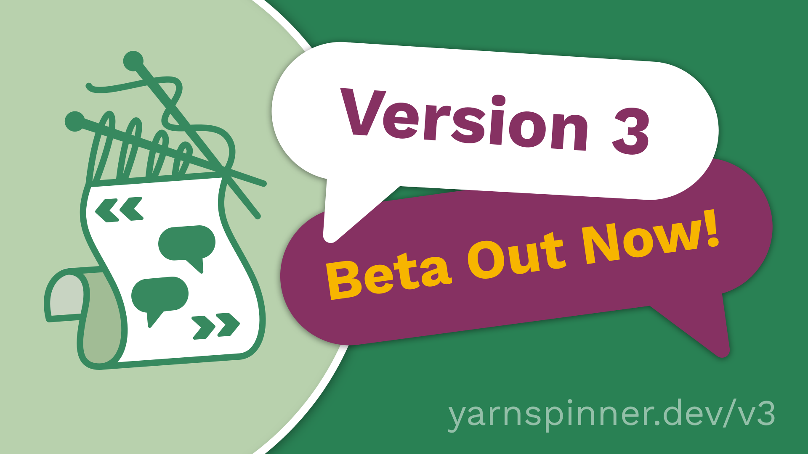

# 🆕 Coming in v3


Yarn Spinner 3 is just around the corner. [Buy it now](http://yarnspinner.itch.io) and get Yarn Spinner 3 when it's released!


<figure><figcaption></figcaption></figure>


You can try most of these new language features now in [Try Yarn Spinner](https://try.yarnspinner.dev).


### New Language Features in Yarn Spinner 3

<details>

<summary><code>detour</code> statements, for briefly jumping to another node, then returning</summary>

## Detours

In Yarn Spinner 3, you can use a `detour` statement to run content from a different node, before returning to the previous node.

Here’s an example of using the `detour` statement.

```html
title: Guard
---
Guard: Have I told you my backstory?

-> Yes.
	Guard: Oh. Well, then.
-> No?
	<<detour Guard_Backstory>>

Guard: Anyway, you can't come in.
===

title: Guard_Backstory
---
Guard: It all started when I was a mere recruit.
// (five minutes of exposition omitted)
===
```

If the player replies _‘No?’_ to the guard’s question, Yarn Spinner will detour to the `Guard_Backstory` node and run its contents. When the end of that node is reached, Yarn Spinner will return to the `Guard` node, and resume from just after the `detour` statement.

When you `detour` into a node, Yarn Spinner runs the content from that node just as if you’d used a `jump` statement. When you reach the end of the node, or reach a `return` statement, Yarn Spinner will return to just after the `detour` statement.

You can return early from a detoured node by using the `return` statement. Doing so will return to just after the `detour`statement, as though the end of the node had been reached.


If Yarn Spinner reaches a `return` statement, and it hasn’t detoured from another node, it will stop the dialogue (that is, it will behave as though you had written a `stop` command.)


When you detour into a node, that node can itself detour into _other_ nodes.

If a detoured node uses a `jump` command to run another node, the return stack is cleared. If you `detour` into a node, and that node `jumps` to another node, Yarn Spinner won’t return to your original `detour` site.

</details>

<details>

<summary><code>once</code> statements, allowing you to only run content a single time</summary>

## Once

In Yarn Spinner 3, you can use a `once` statement to run content only one time. When the script reaches a `once` statement, it checks to see if it’s run before. If it has, it skips over it! Magic.


`once` statements are great for making sure that the player never sees certain content more than once. For example, you might want a character to never introduce themselves to the player twice.


There are two main ways you can use a `once` statement, which we'll explore below.

#### You can wrap some lines in `<<once>>` and `<<endonce>>`:

```html
<<once>>
  // The guard will introduce herself to the player only once. 
  Guard: Hail, traveller! Well met.
  Guard: I am Alys, the guard!
<<endonce>>
```

You can also use an `<<else>>` clause within the `<<once>>` statement, which will be run if the relevant `<<once>>` content has already been seen:

```html
<<once>>
  Guard: Hail, traveller! Well met.
<<else>>
  Guard: Welcome back.
<<endonce>>
```

You can also add an `if` to the `once` to run content a single time, but only when a certain condition is true. In all other cases, it will be skipped (or the `else` content will be run, if there is any):

```html
<<once if $player_is_adventurer>>
  // The guard knows the player is an adventurer, so say this line, 
  // but only ever once!
  Guard: I used to be an adventurer like you, but then I took an arrow in the knee.
<<else>>
  // Either the player is not an adventurer, or we already saw the 
  // 'arrow in the knee' line.
  Guard: Greetings.
<<endonce>>
```

#### You can add `<<once>>` to a line, or options:

If you add `once` (or `once if`) to a line, that line will only appear once, and will be skipped over every other time it’s encountered:

```html
Guard: Who are you? <<once>> // Show this line only one time
Guard: Go on, get lost!
```

Similarly, if you add it to an option, that option will only be selectable once, and will be marked as unavailable after it’s been selected.

```html
-> What's going on? <<once>>
	Guard: The kingdom is under seige!
-> Where can I park my horse? <<once if $has_horse>>
	Guard: Over by the tavern.
-> Lovely day today!
	Guard: Uh huh.
-> I should go.
	Guard: Please do.
```

`once` statements are really useful when you want to show long, detailed content the first time it’s encountered, but you don’t want to show it every time. This means that players don’t need to mash the ‘skip line’ button over and over when they realise that they’re starting to see a long run of lines they’ve already seen:

<pre class="language-html"><code class="lang-html"><strong>&#x3C;&#x3C;once>>
</strong>	// Show long, character-establishing lines the first time
	Guard: There's nothing new to report!
	Guard: I've been at this post for hours, and I'm so bored.
	Guard: I can't wait for the end of my watch.
&#x3C;&#x3C;else>>
	// Show a more condensed version all other times
	Guard: Nothing to report!
&#x3C;&#x3C;endonce>>
</code></pre>


`once` statements keep the information about whether they’ve been run or not in a variable that’s stored in your Dialogue Runner’s Variable Storage, just like any other variable. The variable isn’t directly accessible from your Yarn scripts.


</details>

<details>

<summary>line groups, to create a set of lines that Yarn Spinner will choose from for you</summary>

## Line Groups

In Yarn Spinner 3, you can now create line groups. A line group is collection of lines that Yarn Spinner will choose from.

Line groups are collections of lines that begin with a `=>` symbol:

```
=> Hello! Welcome to my shop!
=> Hi! I'm the blacksmith!
=> Welcome to the blacksmith!
```

When Yarn Spinner encounters a line group, it will select one of the lines in the group and run it.


Line groups are great for running ‘barks’ - collections of short lines that need to run in response to an in-game event. It can be useful to think of them like Yarn Spinner’s existing options `->` syntax, but instead of the player choosing which content to run, the computer picks it for you:

```
=> Guard: Halt!
=> Guard: No entry!
=> Guard: Stop!
```


You can attach conditions to lines in a line group, to ensure that they only run when it’s appropriate to do so. Conditions can be any true or false expression, and can also be combined with the `once` keyword to ensure that a line can only run once:

```html
=> Guard: Greetings, citizen.
=> Guard: Hello, traveller.
	Guard: Stay vigilant. // runs after 'Hello, traveller.'
=> Guard: Hail, adventurer! <<if $player_is_adventurer>>
=> Guard: I used to be an adventurer like you, but then I took an arrow in the knee. <<once if $player_is_adventurer>>
```

A line in a line group can also have additional lines belonging to it, which will run if the item is selected.

</details>

<details>

<summary>node groups, to create a set of nodes that Yarn Spinner will choose from </summary>

## Node Groups

In Yarn Spinner 3, you can now create node groups. A node group is collection of nodes **that share the same name** that Yarn Spinner will choose from.

To create a node group, you create multiple nodes that all share the same name, and ensure that each of the nodes have at least one `when:` header.

The `when:`header tells Yarn Spinner about the conditions that must be met in order to run the node:

<pre class="language-html"><code class="lang-html">title: Guard
<a data-footnote-ref href="#user-content-fn-1">when: once</a>
---
Guard: You there, traveller!
Player: Who, me?
Guard: Yes! Stay off the roads after dark!
===
title: Guard
<a data-footnote-ref href="#user-content-fn-2">when: always</a>
---
Guard: I hear the king has a new advisor.
===
title: Guard
<a data-footnote-ref href="#user-content-fn-3">when: $has_sword</a>
---
Guard: No weapons allowed in the city!
===

</code></pre>

Node groups are combined into a single node that performs the appropriate checks and then runs one of the node group’s members. You start dialogue with a node group using its name. You can also use the `jump` or `detour` statements to run a node group from somewhere else in your Yarn scripts.


Node groups are similar to line groups in their behaviour, but give you more room to create longer passages of content. Your C# code can also check to see how many (if any) nodes can run, which is covered in the Saliency section.


</details>

<details>

<summary>an <code>enum</code> type, for defining variables with a pre-defined constrained set of possibilities</summary>

## Enums

In Yarn Spinner 3, enums let you create variables whose value is constrained to a pre-defined list of possibilities.


An enum (short for ‘enumeration’) is useful when you have a variable that needs to have a wider range of possible values than simply `true` or `false`, but needs to be more specific than a `number` or `string`.


To define an enum you must provide a name, and some cases for it. Here's a new enum called `Food` with the cases `Apple`, `Orange`, and `Pear`:

```markdown
<<enum Food>>
  <<case Apple>>
  <<case Orange>>
  <<case Pear>>
<<endenum>>
```

Once you've created an enum, you can use it just like any other variable:

```markdown
// Declare a new variable with the default value Food.Apple
<<declare $favouriteFood = Food.Apple>>

// You can set $favouriteFood to the 'apple', 'orange' or 'pear'
// cases, but nothing else!
<<set $favouriteFood to Food.Orange>>

// You can use enums in if statements, like any other type of value:
<<if $favouriteFood == Food.Apple>>
  I love apples!
<<endif>>

// You can even skip the name of the enum if Yarn Spinner can 
// figure it out from context!
<<set $favouriteFood = .Pear>>
```

</details>

<details>

<summary>smart variables that determine their value at run-time</summary>

## Smart Variables

In Yarn Spinner 3, smart variables let you create variables whose value is determined at run-time, rather than setting and retrieving a value from storage.


Smart variables give you a simple way to create more complex expressions, and re-use them across your project.


To create a smart variable, declare it like any other variable using the `declare` statement and provide an expression, rather than a single value:

```markdown
// A boolean value that is 'true' when the player has more than 10 money
<<declare $player_can_afford_pie = $player_money > 10>>
```

Smart variables can be accessed anywhere a regular variable would be used:

```markdown
// Run some lines if the player can afford a pie
<<if $player_can_afford_pie>>
  Player: One pie, please.
  PieMaker: Certainly!
<<endif>>
```

</details>

<details>

<summary>shadow lines for reusing lines</summary>

## Shadow Lines

In Yarn Spinner 3, shadow lines let you reuse the same line in multiple places, without having to create duplicate copies.


Shadow lines are copies of other lines, but don’t create a duplicate entry in the string table. This can be useful if you want to re-use an existing line in more than one place, which can be important when each line has in-game assets like voice-over recording.


Shadow lines are marked using the `#shadow:` hashtag. When you use the `#shadow:` tag, you specify the line ID of another line, which is called the source line. The source line must have an explicit `#line:` hashtag to identify it.

Here’s a simple example of using shadow lines:

```
title: Tavern
---
Ava: Hello, barkeep!  
Guy: Hi there, how can I help? 
Ava: I should go. #line:departure
===

title: Kitchen
---
Ava: Greetings, chef!
Guy: What are you doing back here? 
Ava: I should go. #shadow:departure
===
```

The script contains six lines, but only 5 string table entries will be created, because the line _“I should go”_ is shadowed.

Shadow lines are required to have the same text in the Yarn script as their source line, but are allowed to have different hashtags (in addition to the `#shadow:` and `#line:` hashtags).

</details>

<details>

<summary>saliency</summary>

## Saliency

In Yarn Spinner 3, saliency lets you control how line groups and node groups select which content to run.

When a line group or node group needs to run content, it needs to make a decision about which item in the group to choose. The method for making this decision is called a _saliency strategy_.

Saliency strategies are provided with the following information about each item:

* How many of its conditions passed (that is, the `when:` clauses on a node group, or the single condition on a line group)
* How many of its conditions failed
* The total complexity of all of its conditions
  * Complexity is calculated as the total number of boolean operators (and, or, not, xor) present in a condition, plus 1 if the condition is a `once` condition. The `always` condition has a complexity of zero.
* A unique key that identifies the content.

You can either use one of Yarn Spinner's built-in saliency stragegies, or create your own custom saliency strategy.

#### Yarn Spinner has several built-in saliency strategies.

* **First:** The first item in the group that has not failed any of its conditions is selected.
  * If the items of a node group are all in the same file, the ordering of the group is the order in which they appear in the file. If a node group’s nodes are split up across more than one file, the ordering of the nodes is not defined. the node that is considered ‘first’ is not defined.
* **Best:** The items that have not failed any conditions are sorted by their total complexity score, and the first item that has the highest score is selected.
* **Best Least Recently Viewed:** The items that have not failed any conditions are sorted by score, and then by how many times they have been selected by this strategy. If there is more than one best item remaining, the first of these is selected.
* **Random Best Least Recently Viewed:** The items that have not failed any conditions are sorted by score, and then by how many times they have been selected by this strategy. If there is more than one best item remaining, a random one of these is selected.

A saliency strategy is given a collection of possible options, and returns either one of them that should be run, or `null` to indicate that none of them should run.

#### Creating Custom Saliency Strategies

Your C# code can create custom saliency strategies. To do so, create a type that implements the `IContentSaliencyStrategy` interface, and assign it to your `Dialogue` object’s `ContentSaliencyStrategy` property.

`IContentSaliencyStrategy` has two required methods.

* `ContentSaliencyOption? QueryBestContent(IEnumerable<ContentSaliencyOption> content)` determines which of a collection of options, if any, should run. It should return the best content from the available options, or `null` if none of them should run. This is the main method in which you write the specific logic for your custom strategy.
  * Calling this method does _not_ indicate that the content _has been selected;_ rather, it is a query to determine _what should be selected_. Your implementation of this method should not change any state, and should be read-only. The content returned by this method is not guaranteed to actually be run.
* `void ContentWasSelected(ContentSaliencyOption content)` is called to indicate that a specific piece of content returned by a previous call to `QueryBestContent` has been selected. This method should update any appropriate state to represent this fact, such as by updating the total number of times the content has been selected.

#### Querying If Any Content Can Run

You can use a node group to check to see if any of its items can run, This can be useful when determining whether to show if a character should be marked as ready to talk, or whether any of its nodes have a special tag (for example, if a character has important information to discuss, as opposed to more general conversation.)

</details>

## Installing the beta in Unity


Yarn Spinner 3 for Unity requires Unity 2022.3 or newer.


#### To install the beta for Yarn Spinner 3 in your Unity project, follow these instructions:

* Open the Window menu and choose Package Manager.
* Click the `+` button at the top left, and choose “Add package from Git URL”.
* Enter the following text and press enter: `https://github.com/YarnSpinnerTool/YarnSpinner-Unity.git#beta`

#### You’ll also want to install the pre-release version of Yarn Spinner for Visual Studio Code. To install the prerelease, follow these instructions:

* In Visual Studio Code, open the View menu and choose Extensions.
* Type `yarn spinner` in the search box at the top of the pane.
* Select Yarn Spinner, and wait for the page to appear.
* In the main view, click Switch to Pre-Release Version.

[^1]: this version of the node can only run once

[^2]: this version is the line can run any time

[^3]: this version of the node can only run if the variable `$has_sword` is true
