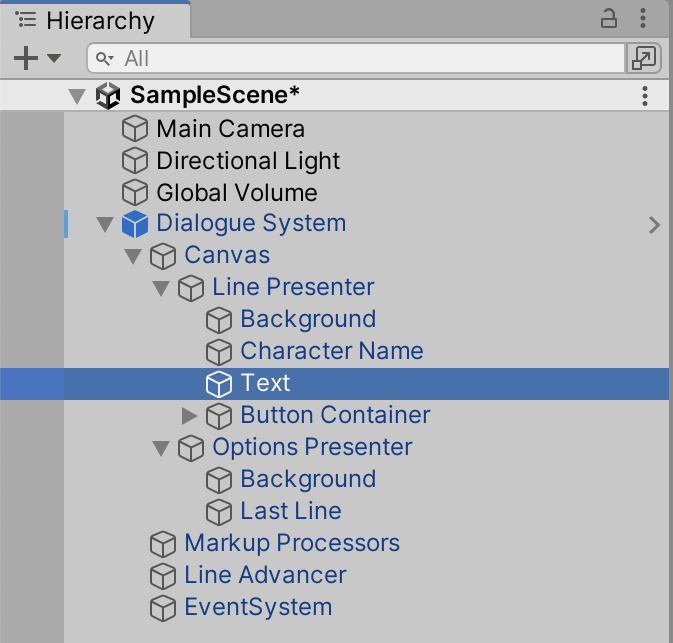
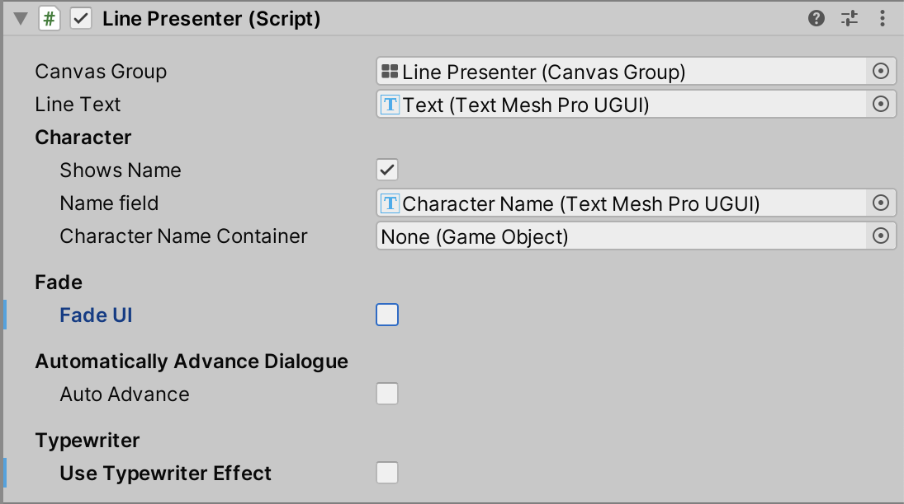

# Text Animator

This guide covers the integration of Text Animator with Yarn Spinner 3's default Line Presenter. While we **strongly recommend** creating custom Dialogue Presenters for precise control over your game's presentation, this guide will help you get the basic integration working quickly.


For production games, consider developing your own custom presenter to achieve the exact behaviour and appearance your game requires.


### Setup

#### Step 1: Locate the Text Component

Expand the Dialogue System prefab in your hierarchy and navigate to the Text game object within the Line Presenter ( `Dialogue System → Canvas → Line Presenter → Text` ).

<figure><figcaption></figcaption></figure>

#### Step 2: Add Text Animator Components

Add the following components to the Text game object:

1. Add a [`TextAnimator_TMP`](https://www.api.febucci.com/tools/text-animator-unity/api/Febucci.UI.TextAnimator_TMP.html) component
2. Add a [`TypewriterByCharacter`](https://www.api.febucci.com/tools/text-animator-unity/api/Febucci.UI.TypewriterByCharacter.html) component

#### Step 3: Configure TextAnimator\_TMP

On the `TextAnimator_TMP` component, ensure that **Typewriter Starts Automatically** is enabled.

#### Step 4: Configure the Line Presenter

Select the Line Presenter game object (`Dialogue System → Canvas → Line Presenter`) and modify the following settings:

* **Disable** `Fade UI`
* **Disable** `Use Typewriter Effect`

<figure><figcaption></figcaption></figure>

#### Step 5: Test the Integration

Run your Yarn script to see the Text Animator effects in action.

{% embed url="https://files.gitbook.com/v0/b/gitbook-x-prod.appspot.com/o/spaces%2F1BtiYLyfkkFBrMlsYGWS%2Fuploads%2FCZ4o29AenEFqjuX9apah%2F1.mp4?alt=media&token=5e8325c5-ba41-44dc-a51c-2217a428a258" %}

### Important Limitations

#### Action Markup Compatibility

Due to architectural considerations in our markup system design, **Action Markup and Text Animator cannot currently be used together**.

**Workaround:** If you need both Text Animator effects and inline events, use [Text Animator's event system](https://docs.febucci.com/text-animator-unity/typewriter/trigger-events-when-typing) to achieve similar functionality.

This limitation is planned to be addressed in a future update.

#### Line Advancement Behavior

When using Text Animator, the Line Advancer can detect when a line has finished displaying but has not been dismissed via action markup. This changes the default "quick advance" behavior where rapidly pressing the advance button would skip the line entirely.

**To restore quick-skip functionality:**

1. Enable **Multi Advance is Cancel** on the Line Advancer component
2. Set **Advance Count** to `2`

This configuration allows players to press the advance button twice in quick succession to skip the current line, similar to the original behavior.
