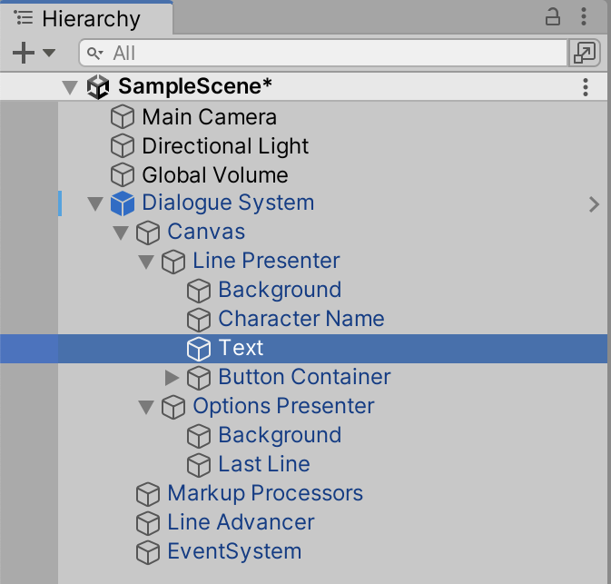
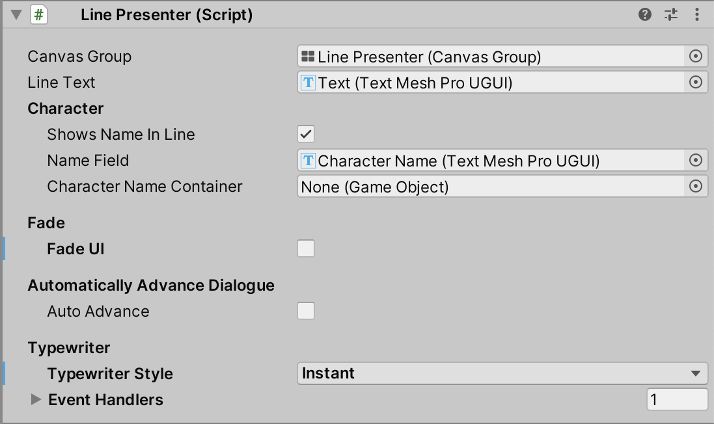

# Text Animator


This page gives you the basics of integrating [Text Animator](https://docs.febucci.com/text-animator-unity) with Yarn Spinner for Unity. If you want complete integration, consider [purchasing Yarn Spinner for Unity](../../yarn-spinner-for-unity/unity-add-ons/text-animator/), or build out the integration yourself.


This guide covers the integration of Text Animator with Yarn Spinner 3's default Line Presenter. While we **strongly recommend** creating custom Dialogue Presenters for precise control over your game's presentation, this guide will help you get the basic integration working quickly.

This guide is written for Text Animator v2, the differences between version two and three are small and most of the information here will work for version three also. We also have a [paid add-on](../../yarn-spinner-for-unity/unity-add-ons/text-animator/) which has direct support for Text Animator, for both version two and three, and is already pre-configured to work with the default and custom presenters.


For production games, consider developing your own custom presenter to achieve the exact behaviour and appearance your game requires.


### Setup

#### Step 1: Locate the Text Component

Expand the Dialogue System prefab in your hierarchy and navigate to the Text game object within the Line Presenter ( `Dialogue System → Canvas → Line Presenter → Text` ).

<figure><figcaption></figcaption></figure>

#### Step 2: Add Text Animator Components

Add the following components to the Text game object:

1. Add a [`TextAnimator_TMP`](https://www.api.febucci.com/tools/text-animator-unity/api/Febucci.UI.TextAnimator_TMP.html) component
2. Add a [`TypewriterByCharacter`](https://www.api.febucci.com/tools/text-animator-unity/api/Febucci.UI.TypewriterByCharacter.html) component

#### Step 3: Configure TextAnimator\_TMP

On the `TextAnimator_TMP` component, ensure that **Typewriter Starts Automatically** is enabled.

#### Step 4: Configure the Line Presenter

Select the Line Presenter game object (`Dialogue System → Canvas → Line Presenter`) and modify the following settings:

* **Disable** `Fade UI`
* **Typewriter Style** `Instant`

<figure><figcaption></figcaption></figure>

#### Step 5: Test the Integration

Run your Yarn script to see the Text Animator effects in action.

{% embed url="https://files.gitbook.com/v0/b/gitbook-x-prod.appspot.com/o/spaces%2F1BtiYLyfkkFBrMlsYGWS%2Fuploads%2FCZ4o29AenEFqjuX9apah%2F1.mp4?alt=media&token=5e8325c5-ba41-44dc-a51c-2217a428a258" %}


**Action Markup Compatibility**

Due to architectural considerations in our markup system design, **Action Markup and Text Animator cannot currently be used together**.

**Workaround:** If you need both Text Animator effects and inline events, use [Text Animator's event system](https://docs.febucci.com/text-animator-unity/typewriter/trigger-events-when-typing) to achieve similar functionality.

This limitation is resolved in the [Text Animator paid add-on](../../yarn-spinner-for-unity/unity-add-ons/text-animator/).


### Line Advancement Behaviour

When using Text Animator, the Line Advancer can detect when a line has finished displaying but has not been dismissed via action markup. This changes the default "quick advance" behavior where rapidly pressing the advance button would skip the line entirely.

**To restore quick-skip functionality:**

1. Enable **Multi Advance is Cancel** on the Line Advancer component
2. Set **Advance Count** to `2`

This configuration allows players to press the advance button twice in quick succession to skip the current line, similar to the original behavior.


This page gives you the basics of integrating [Text Animator](https://docs.febucci.com/text-animator-unity) with Yarn Spinner for Unity. If you want complete integration, consider [purchasing Yarn Spinner for Unity](../../yarn-spinner-for-unity/unity-add-ons/text-animator/).

