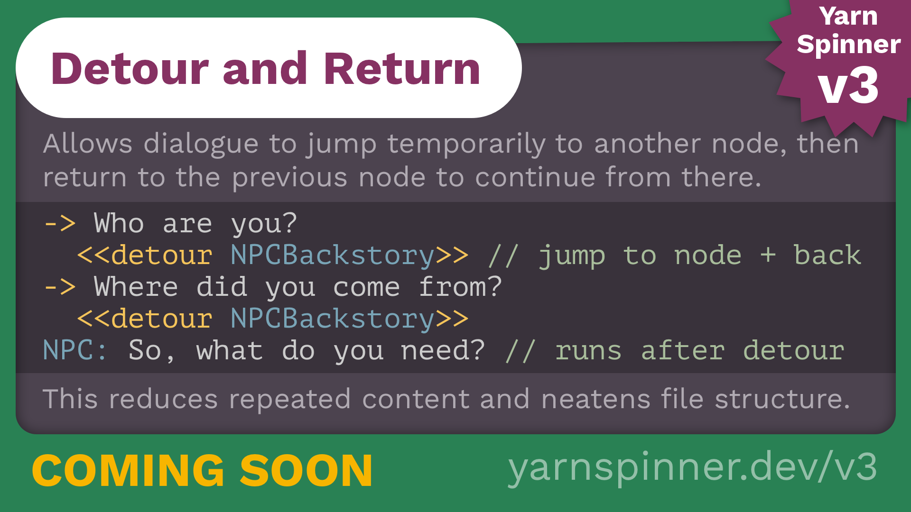

# Detour

<figure><figcaption></figcaption></figure>

In Yarn Spinner 3, you can use a `detour` statement to run content from a different node, before returning to the previous node.



Here’s an example of using the `detour` statement.

```html
title: Guard
---
Guard: Have I told you my backstory?

-> Yes.
	Guard: Oh. Well, then.
-> No?
	<<detour Guard_Backstory>>

Guard: Anyway, you can't come in.
===

title: Guard_Backstory
---
Guard: It all started when I was a mere recruit.
// (five minutes of exposition omitted)
===
```

If the player replies _‘No?’_ to the guard’s question, Yarn Spinner will detour to the `Guard_Backstory` node and run its contents. When the end of that node is reached, Yarn Spinner will return to the `Guard` node, and resume from just after the `detour` statement.

When you `detour` into a node, Yarn Spinner runs the content from that node just as if you’d used a `jump` statement. When you reach the end of the node, or reach a `return` statement, Yarn Spinner will return to just after the `detour` statement.

You can return early from a detoured node by using the `return` statement. Doing so will return to just after the `detour`statement, as though the end of the node had been reached.


If Yarn Spinner reaches a `return` statement, and it hasn’t detoured from another node, it will stop the dialogue (that is, it will behave as though you had written a `stop` command.)


When you detour into a node, that node can itself detour into _other_ nodes.

If a detoured node uses a `jump` command to run another node, the return stack is cleared. If you `detour` into a node, and that node `jumps` to another node, Yarn Spinner won’t return to your original `detour` site.
