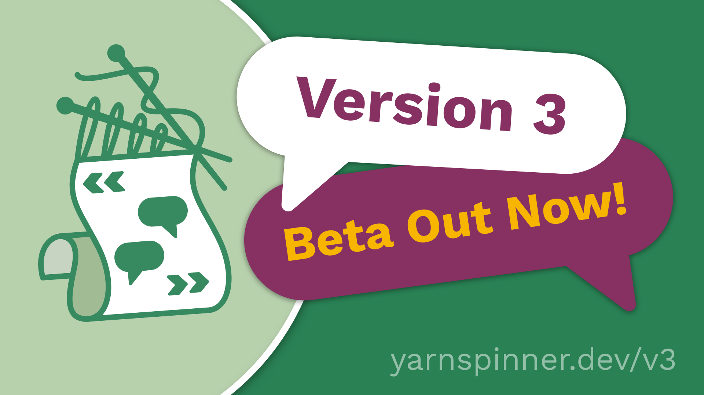

# Overview

<figure><figcaption></figcaption></figure>

Yarn Spinner 3 has many new features. While everything that existed in Yarn Spinner 2.x should largely keep working the same way in Yarn Spinner 3, there's so many new things that we thought we'd highlight them separately!&#x20;



To use Yarn Spinner 3 for Unity and Yarn Spinner 3 for Visual Studio Code, you'll need to [install it.](installing-the-beta.md)




Yarn Spinner 3 is currently only available for **Unity** and **Visual Studio Code**. Other platforms and tools to follow, in the full release.


### New Unity Features

Coming Soon


If you love what we're doing, the best way to support us is to [buy Yarn Spinner on Itch](https://yarnspinner.itch.io) or the [Unity Asset Store](https://assetstore.unity.com/publishers/91946), or join [our Patreon](http://patreon.com/secretlab). ❤️


