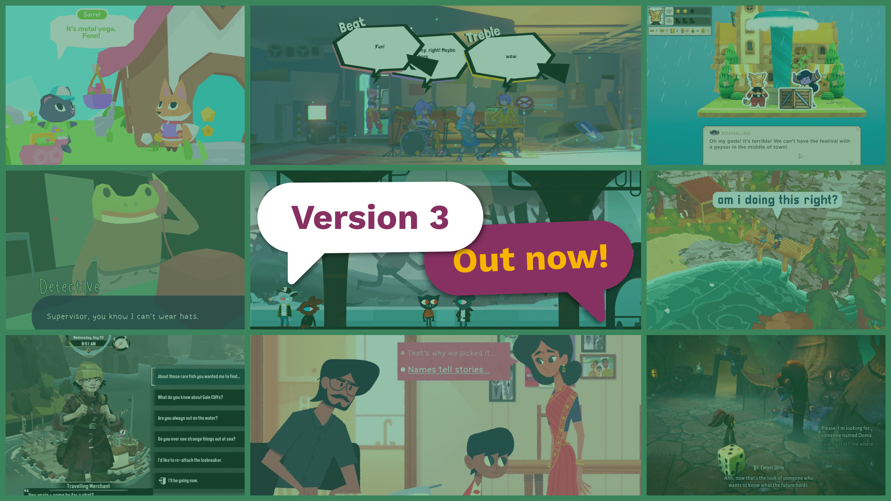

# Yarn Spinner 3

<figure><figcaption></figcaption></figure>

**Yarn Spinner 3** is out! It's the culmination of 10 years of Yarn Spinner development, taking inspiration from how people use Yarn Spinner in wildly successful and amazing games like DREDGE, Lil' Guardsman, A Short Hike, and Demonschool.

For the development of Yarn Spinner 3, stewardship of Yarn Spinner moved from our original game development studio, [Secret Lab](http://secretlab.games/), to a whole new entity focused solely on Yarn Spinner development. It's now our primary job!

Yarn Spinner is developed in the open on GitHub, and can be purchased from the [Yarn Spinner Itch.io Store](https://yarnspinner.itch.io/) or the [Unity Asset Store](https://assetstore.unity.com/packages/tools/behavior-ai/yarn-spinner-for-unity-267061).


You can **hire us** to add features you want to Yarn Spinner, build games, or help you customise and integrate Yarn Spinner. Email us at hello AT yarnspinner.dev


Yarn Spinner 3 introduces so many improvements and new things, and makes writing complex interactive narratives easier than ever.

Get started with Yarn Spinner 3 via the [beginners-guide.md](../beginners-guide.md "mention")!


If you've got a project that's in development already in Unity, and you want to move from Yarn Spinner 2 to Yarn Spinner 3, visit [upgrading-from-yarn-spinner-2.md](../changelog/upgrading-from-yarn-spinner-2.md "mention").


## Yarn Spinner powers amazing games, including:



**... use it to power your game too!**
