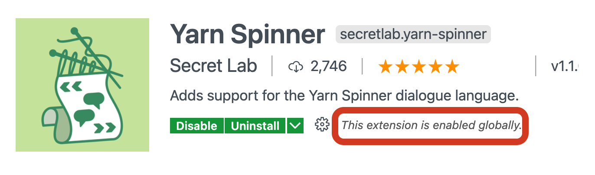

# Editing Yarn Scripts

## Installing a text editor

Yarn Scripts are plain text files with the `.yarn` extension. Our favourite editor for working with Yarn Scripts is Visual Studio Code \("_VS Code_" or sometimes just "_Code_"\).

* Install **Visual Studio Code** from Microsoft:



## Installing the Yarn Spinner Extension

We provide a **Yarn Spinner Extension** for VS Code. It provides syntax highlighting for Yarn Scripts, with the goal of providing more features in the future.

To install the Yarn Spinner Extenson for VS Code:

* Switch to the [Extensions View of VS Code](https://code.visualstudio.com/docs/editor/extension-gallery), and search for Yarn Spinner.
* Choose the Yarn Spinner Extension from the search results.
* Click the Install button. 

* Verify that the extension has installed.

