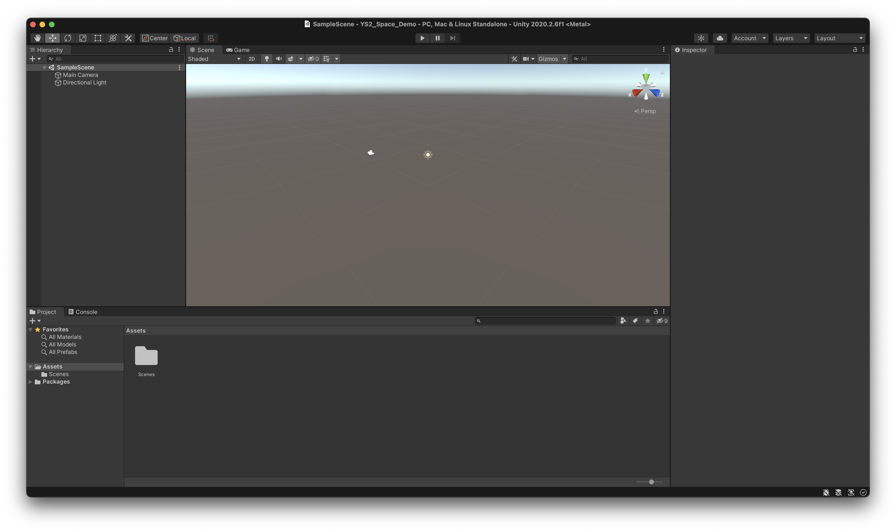
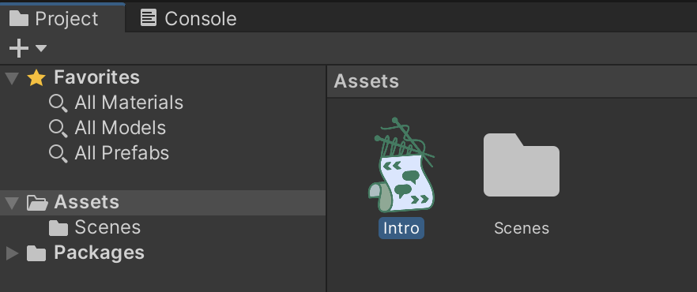

# Setting up the Unity project

## **Create a new project in Unity**

It doesn't really matter which project template you use. In this case, we've chosen the 3D template.

## Create a new Yarn Script

* Choose _Assets — Create — Yarn Script_ to create a new Yarn Script in your project's assets.

* Rename the new asset to _Intro_, using the Project pane.

* Double click the Intro script to open it in your preferred text editor. You should see an empty Yarn Script, with some placeholder material. 


If you need to setup your text editor, check back to the [Editing Yarn Scripts tutorial](../editing-yarn-scripts.md).


## 

