# Using Auto-Layout Wheel

The Automatic-Layout Dialogue Wheel provides a dialogue wheel with a simple graphical appearance, and can—theoretically—support as many options as you'd like, automatically adjusting to display them.&#x20;

## Using the Automatic-Layout Dialogue Wheel

To use the Automatic-Layout Dialogue Wheel [make sure your Unity project has the Yarn Spinner package installed](../../yarn-spinner-for-unity/installation-and-setup.md), and the [install the Dialogue Wheel for Yarn Spinner package](installing-dialogue-wheel.md).

Then, create a new Dialogue Runner in your Hierarchy:

<figure>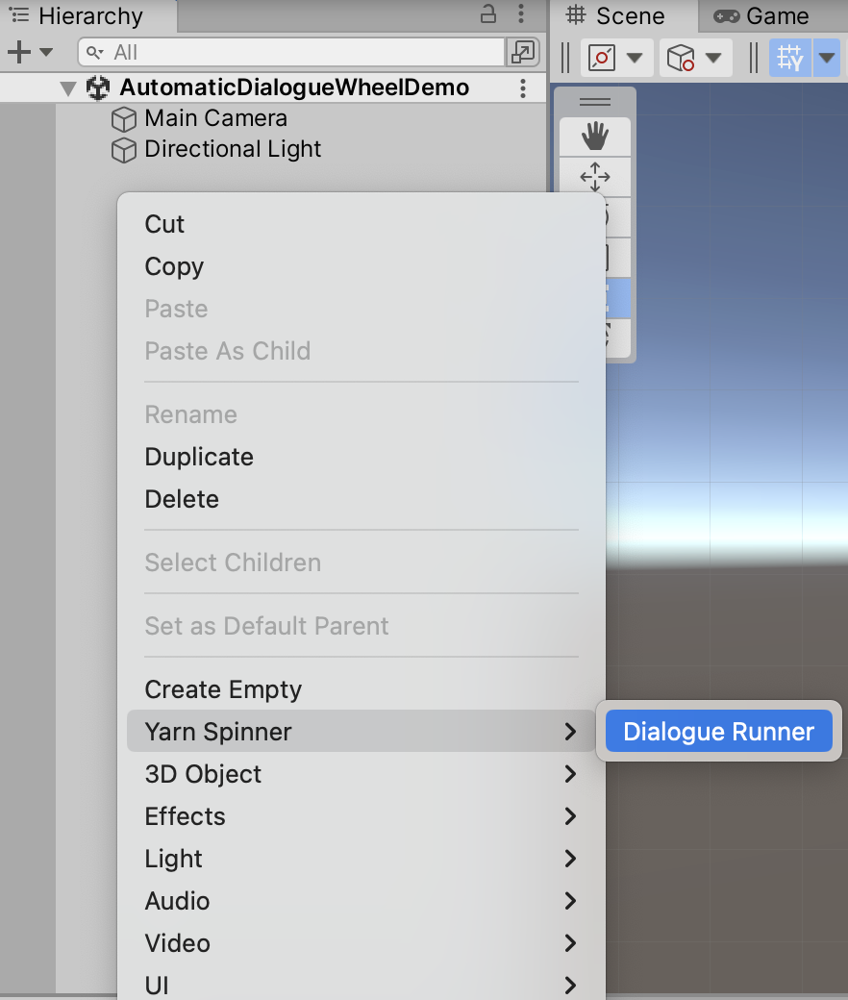<figcaption><p>Adding a new Dialogue Runner to your scene.</p></figcaption></figure>

Then, in the Project pane, create a new Yarn Project asset:

<figure><figcaption><p>Creating a new Yarn Project asset in the Project pane.</p></figcaption></figure>

And create a new Yarn Script to use:

<figure>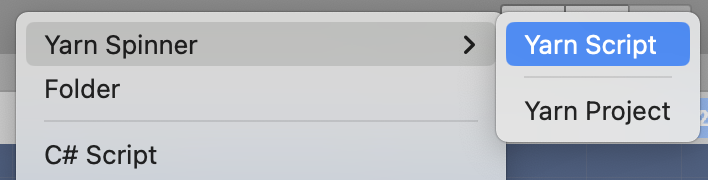<figcaption><p>Creating a new Yarn Script asset in the Project pane.</p></figcaption></figure>

Name both the Yarn Project, and the Yarn Script, something appropriate:

<figure>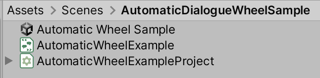<figcaption><p>A Yarn Project, and a Yarn Script, alongside a scene</p></figcaption></figure>

Open the Yarn script to write your story. Then save the Yarn script and return to Unity.

We've provided an initial sample story here, if you want to test things out.

<details>

<summary>Initial sample story for Automatic-Layout Dialogue Wheel</summary>


```xml
title: Start
---
Narrator: What brings to the pool?
-> Cleaning
    I have come to clean the pool.
    Narrator: Ah, just as I thought.
        -> I'm a pool cleaner
            Narrator: I know.
            <<jump End>>
        -> I was actually lying.
            Narrator: Oh, I see.
            <<jump End>>
-> Treasure 
    I am looking for the lost treasure of... the pool.
    Narrator: There is no treasure in the pool.
        -> WHAT!?
            WHAT?! WHY NOT? I WAS TOLD THERE WAS TREASURE HERE!
            Narrator: Nope. 
            <<jump End>>
        -> Oh, okay.
            Oh, well, I guess I'll go.
            Narrator: OK, bye!
            <<jump End>>
        -> I know.
            I know, I just wanted a swim.
            Narrator: In you get, then!
            <<jump End>>
-> No reason
    I have a fetish for pool cleaning equipment.
    Narrator: Whatever floats your boat...
        -> Thanks.
            Narrator: Uh uh.
            <<jump End>>
-> Commerce
    I'd like to buy a pool.
    Narrator: Well, it's not for sale.
    Narrator: Go away.
    <<jump End>>
-> Swimming
    I'm here to go for a swim. 
    Narrator: Well, you can't.
    <<jump End>>
===

title: End
---
Narrator: Anyway...
Narrator: Have a nice day!
<<stop>>
===
```


</details>

Back in Unity, choose the Dialogue Runner that you added to the Hierarchy, right-click it and choose Prefab -> Unpack. This will allow you to modify the contents of the (former) prefab, in order to add the Automatic-Layout Dialogue Wheel as a Dialogue View.

<figure>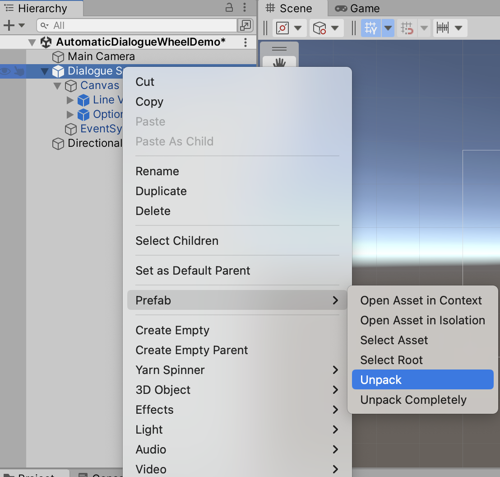<figcaption><p>Unpacking the Dialogue System prefab.</p></figcaption></figure>

With the Dialogue Runner selected in the Hierarchy, drag the Yarn Project that you created from the Project pane into the Yarn Project slot in the Dialogue System's Inspector:

<figure>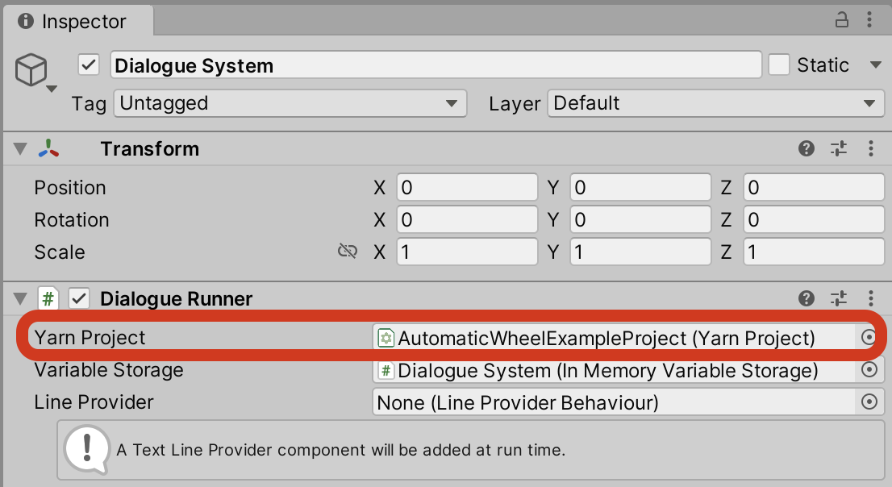<figcaption><p>Assigning your Yarn Project to the Dialogue System.</p></figcaption></figure>

Next, locate the Automatic-Layout Dialogue Wheel prefab, supplied with this add-on, and drag it from the Project pane, so it's below the Canvas in the Hierarchy:

<figure>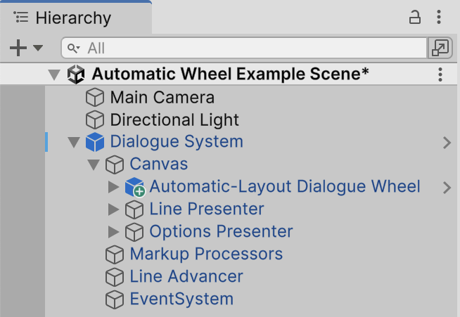<figcaption><p>The Automatic-Layout Dialogue View, added below the Canvas of the unpacked Dialogue System.</p></figcaption></figure>

Right-click on the Options List View in the Hierarchy, and choose Delete. You won't need that view, as you'll be displaying a wheel, instead of a list. To make the Dialogue System aware of the Automatic-Layout Dialogue Wheel, select it (the Dialogue System) in the Hierarchy, and drag the Automatic-Layout Dialogue View from the Hierarchy into the Element 1 slot of the Dialogue Views section in the Inspector:

<figure>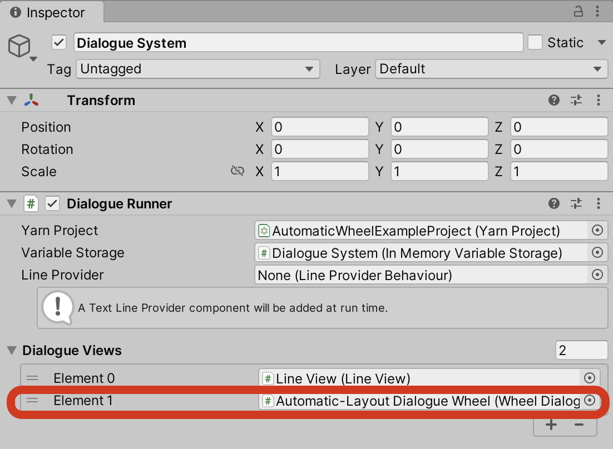<figcaption><p>Adding the Automatic-Layout Dialogue Wheel to the Dialogue System.</p></figcaption></figure>

If you save your scene and run it, your Automatic-Layout Dialogue Wheel should now be working!

<figure>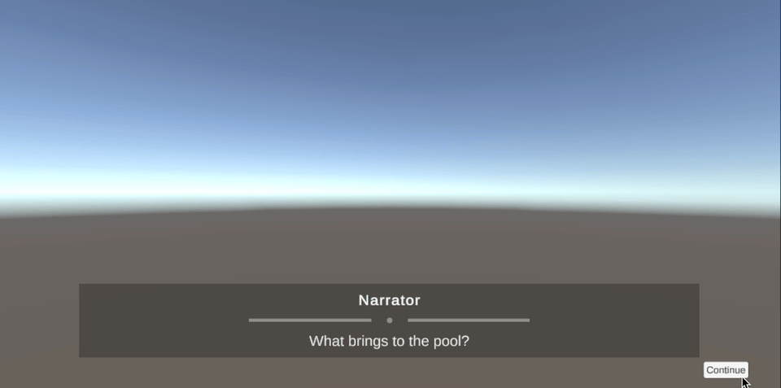<figcaption><p>The Automatic-Layout Dialogue Wheel in action.</p></figcaption></figure>

## Customising the Automatic-Layout Dialogue Wheel

### Customising the Wheel

To customise the supplied wheel, select the Wheel Graphic in the Hierarchy:

<div data-full-width="true"><figure>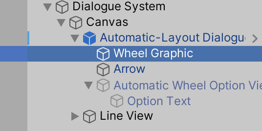<figcaption><p>The Wheel Graphic selected, inside the Automatic-Layout Dialogue View.</p></figcaption></figure></div>

And look to the Inspector:

<figure>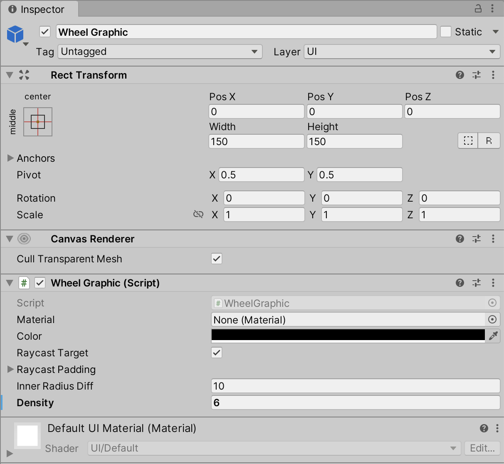<figcaption><p>The Inspector for the Wheel Graphic.</p></figcaption></figure>

Here, on the Wheel Graphic component, you can customise a variety of things, such as the material, color, inner radius, and density of the wheel. For example, if you set the Density field to 6, as we did above, your wheel will become a hexagon:

<figure>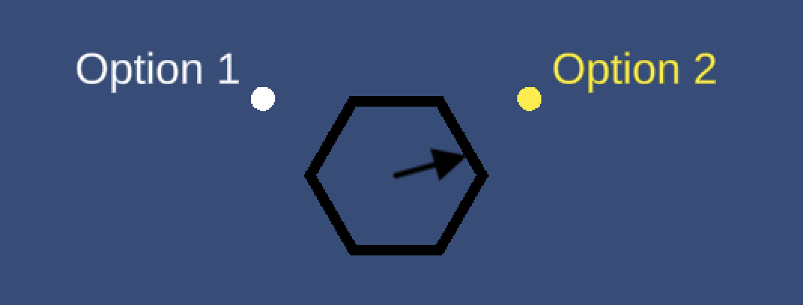<figcaption><p>The wheel, customised to display as a hexagon, via a modification to the Density field of the Wheel Graphic.</p></figcaption></figure>

### Customising the Options

To customise the way each option is displayed around the wheel, select the Automatict Wheel Option View under Automatic-Layout Dialogue Wheel prefab:

<figure>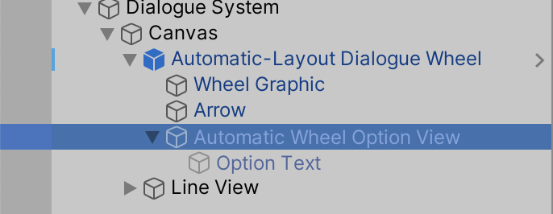<figcaption><p>The Automatic Wheel Option View selected.</p></figcaption></figure>

And look to the Inspector:

<figure>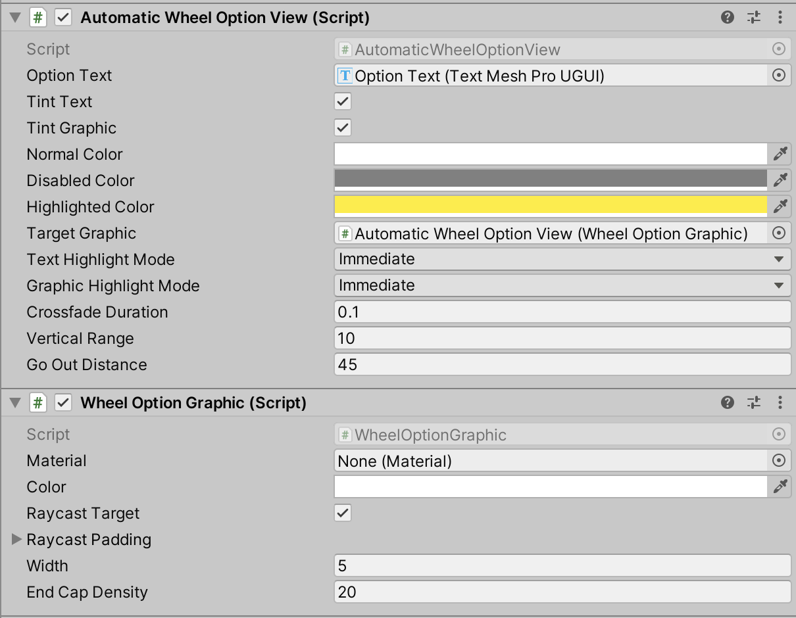<figcaption><p>The Inspector for the Automatic Wheel Option View.</p></figcaption></figure>

You can tweak some of the fields here to customise the options that are displayed around the wheel. Specifically, you might want to customise the following.

On the Automatic Wheel Option View:

* Normal Color — the color of each option that's not currently highlighted or disabled
* Disabled Color — the color of each option that's displayed, but cannot be chosen
* Highlighted Color — the color of the option that's currently selected (but not yet chosen)
* Text/Graphic Highlight Mode — whether each option is immediately highlighted when it's selected, or whether they crossfade between
* Crossfade Duration — the duration of the crossfade, if crossfading

On the Wheel Option Graphic:

* Material — the Material used for circle graphic displayed near each option
* Width — the size of the circle graphic displayed near each option

For example, if you wanted to highlight selected options in green, and crossfade between them, you could set the following:

<figure>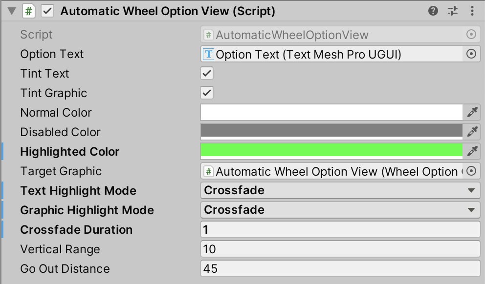<figcaption><p>Tweaks to the Automatic Wheel Option View, to customise the way options are displayed around the wheel.</p></figcaption></figure>

Which would result in something like this:

<figure>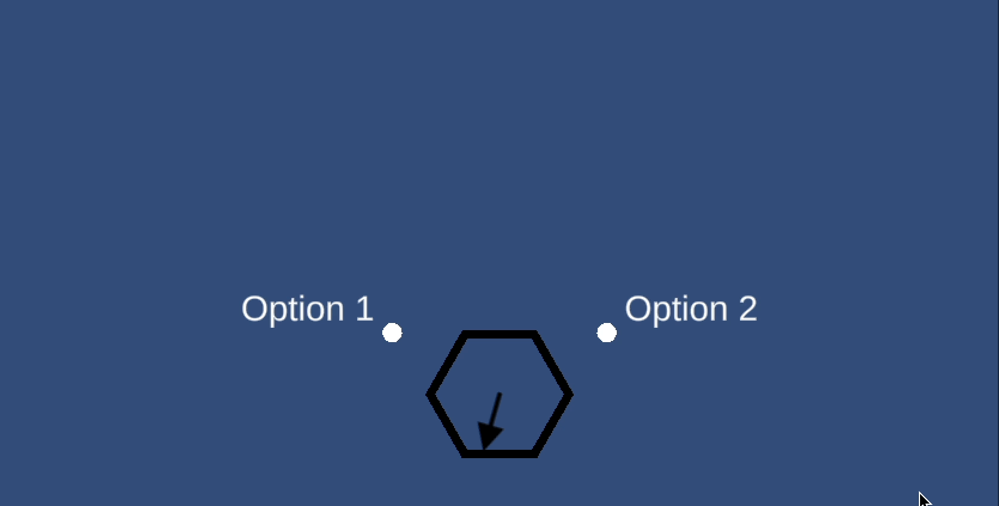<figcaption><p>The customised options in action.</p></figcaption></figure>

And that's everything you need to know to use the Automatic-Layout Dialogue Wheel! Review the [Dialogue Wheel Examples](dialogue-wheel-examples.md) for more.
