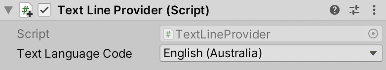

# Text Line Provider

Text Line Provider is a Line Provider that fetches localized text for a line of dialogue, given the user's language.

### Inspector

|Property|Description|
|---|---|
|Text Language Code|The language that the Text Line Provider should use to fetch localised text for.|