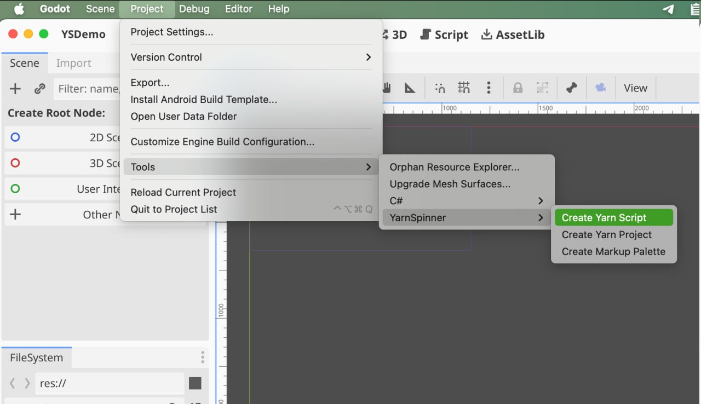

# Yarn Scripts

A Yarn script is a text file containing your dialogue.


Yarn scripts need to be part of a [Yarn Project](yarn-projects.md) in order to be used in your game.


## Creating a New File

To create a new Yarn script in Godot, follow these steps:

* Open the Project menu, and choose Tools > YarnSpinner -> Yarn Script.
* Choose a directory and filename for the new Yarn script in the dialog that appears.

The new file that you've just created will contain a single [node](../../getting-started/writing-in-yarn/lines-nodes-and-options.md#writing-nodes-in-plain-text), which has the same name as the file.


Creating a Yarn Script in Godot is exactly the same as creating a `.yarn` file externally (i.e. in macOS Finder or Windows Explorer), and dragging it into the directory of your Godot project.


## Editing Yarn Scripts

You can edit .yarn scripts with the text editor of your choice. To open your editor from within Godot, ensure that you have associated .yarn files on your computer with your desired editor. Then, right click a .yarn script in the Filesystem panel and click Edit in External Program. When you save your changes and return to Godot, it will be re-compiled.


You can learn about our recommended editor, Visual Studio Code with the official Yarn Spinner Extension at: [editing-with-vs-code](../../getting-started/editing-with-vs-code/ "mention").

