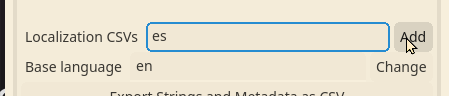
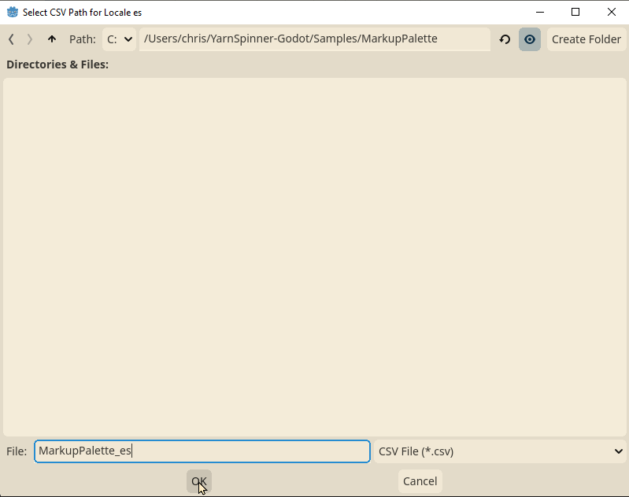

# 🗺️ Localization

Yarn Spinner Godot provides functionality for running your dialogue in languages other than your base language.

To add a new language to your Yarn Project, open the inspector for the project in godot.

Find the text entry labeled Localization CSVs. Enter the [locale code](https://docs.godotengine.org/en/stable/tutorials/i18n/locales.html) for the language you would like to add, then click the Add button to the right of the text entry.

This will add a new row beneath the text entry that maps the locale code you added to a path where the localization CSV file will be stored. Initially, there will be no value for the path, and the inspector will display (none) next to the new locale.



Click the Browse button next to (none) to browse the file system of your project and enter a directory and file name to save the CSV file to.



Once you have set a path to save your CSV to, from that point on you can click the button labeled "Update Localizations" in your project to create or update the CSV file.

The CSV file follows this format, with fields providing context for each line of dialogue to assist in localization.

```csv
language,id,text,original,file,node,lineNumber,lock,comment
es,line:d66cf000,,Alice: this is a [calm]quick[/calm] demonstration of using the [hype]new[/hype] MarkupPalette feature,res://Samples/MarkupPalette/Palette-dialogue.yarn,Start,3,ebccb08d,
```

By default, the CSV file will be marked as "Keep File (No Import)" in the Import panel of the Godot editor. Make sure to keep this import preset setting, because the CSV format does not match Godot's default localization CSV format due to the additional context columns like original, lineNumber, and file.

To enter the localized content for a line, enter it in the `text` column of the row in the CSV for that line and language. Whenever you press the "Update Localizations" button, Yarn Spinner for Godot will generate or update a .translation file in the same directory as the CSV file. These are Godot [Translation](https://docs.godotengine.org/en/stable/classes/class_translation.html) files.

Make sure any .translation files that you want to use in-game are [added to your project settings](https://docs.godotengine.org/en/stable/tutorials/i18n/internationalizing_games.html#configuring-the-imported-translation).

Once you have generated .translation files and added them to your project. You can control which language your dialogue will display in by changing the value of the `textLanguageCode` in the TextLineProvider in your dialogue UI. The provided TextLineProvider script uses the Godot `Tr()` method to retrieve the localized line text.

If you want to have greater control over which locale code is active, or localize your content by different means and provide that localized text to your DialogueRunner, you can also implement a custom subclass of the `LineProviderBehaviour` abstract class rather than using the default TextLineProvider.
