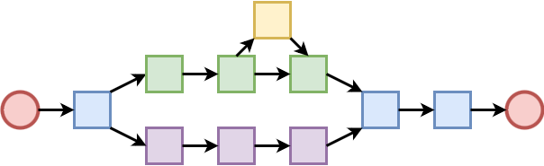
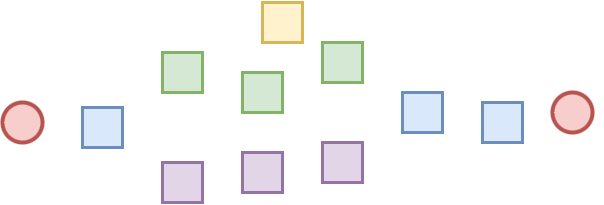
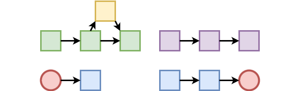

# Storylets and Saliency Primer

> When you do things right, people won't be sure you've done anything at all. - [**Futurama**](https://morbotron.com/caption/S04E05/1161426)

### Introduction

Storylets and saliency represent an evolution in interactive storytelling techniques. To understand their significance, let's examine how narrative approaches have developed over time.


A lot of the terminology used here, and in Yarn Spinner, are based on the work by [Emily Short (2019)](https://emshort.blog/2019/11/29/storylets-you-want-them/), and [Kreminksi and Wardrip-Fruin (2018)](https://mkremins.github.io/publications/Storylets_SketchingAMap.pdf), and these are just great resources on the topic, go read them.


### The Evolution of Interactive Storytelling

#### Linear Narratives

The earliest approach to storytelling was linear. Stories followed a single, author-defined path with each moment crafted to lead directly to the next.


#### Branching Narratives

The next evolution introduced branching, allowing stories to have multiple paths for players to explore.



Branching narratives offer remarkable flexibility. Some branches might be extensive with significant impact, while others could be minor, adding subtle flavor. Some paths might terminate, while others reconnect with the main storyline. Despite this flexibility, each step remains author-crafted, with branches fixed in the writer's intended order.


If you are ever after a great breakdown of some of the most common shapes and patterns in branching narrative check out [Kabo Ashwell (2015)](https://heterogenoustasks.wordpress.com/2015/01/26/standard-patterns-in-choice-based-games/).


#### Storylet-Based Narratives

Storylets represent the next step in this evolution. They break the rigid connections between narrative elements, creating a more dynamic flow. Theoretically, a story could move from any storylet to any other storylet, creating a potential connection from every block to every other block.



### Understanding Saliency

If narrative chunks are disconnected, how do they form a coherent experience? This is where saliency comes in—it's the mechanism that links story pieces together.


To be a bit more precise about this, saliency is the way Yarn Spinner does this. There are other approaches, the simplest being "present everything and let the player select the next piece".


Saliency determines which storylet is most relevant (or "salient") at any given moment. Instead of an author-defined sequence, saliency selects the ordering dynamically. For example, if you have two storylets—one about entering any room in an apartment, and another specifically about entering the bedroom—when the player is in the bedroom, the more specific storylet would be more salient.

Interestingly, linear and branching narratives can be viewed as salient stories composed of storylets, where the most salient storylet is defined by the author's explicit connections. This perspective highlights a major strength of storylets: they can incorporate and blend previous structural approaches. This gives you precise control when needed while maintaining flexibility for dynamic narrative progression.




You might be going "hang on, this sounds a lot like what _**\[Classic Game]**_ did, a game from ages ago I really enjoyed!?" and you'd be right, it is very similar. These ideas aren't new, nor was the evolution of these concepts as discrete as we've implied here.


### Storylet Granularity

.png>)

The storylet is the fundamental unit of this narrative system, but how large or small should a storylet be? The answer depends on your specific narrative needs.

Storylets typically exist at three levels of granularity:

1. **Collection Level**: The largest unit—a vignette, conversation, or paragraph. At this level, your story assembles by connecting self-contained moments. These moments generally function independently, so their precise order may be flexible, or they might be designed to flow naturally with a subset of other moments.
2. **Line Level**: Here, a storylet represents a single line of dialogue. Conversations build by assembling individual lines, which then form larger narrative moments. This approach is particularly effective for creating dynamic NPC barks in games.
3. **Sub-Line Level**: The smallest unit, where storylets are fragments within a single line. These pieces combine to form complete lines of dialogue, which then assemble into conversations.

Many games blend these approaches, often mixing storylet techniques with traditional linear or branching content. Rather than focusing exclusively on storylet size, consider what type of narrative experience you want to create and determine what level of storylet granularity will best support that vision.

### Types of Saliency

How do we determine which storylet is "best" to present next? The approach varies based on your narrative goals.

#### Quality-Based Saliency

The most common approach uses conditions on each storylet—boolean expressions like "_are we in the bedroom?_" or "_does the player have more than 25 gold coins?_" These conditions filter available storylets and help select among the remaining options. When multiple storylets are valid, you select the one with the highest "quality"—typically the one that satisfies the most conditions.

#### Tag-Based Saliency

Another approach tags storylets with various attributes. When selecting the next storylet, you filter based on relevant tags. The filtering criteria might come directly from player choices or from systems guiding the narrative.

#### Directed Saliency

Some approaches aim to guide the narrative toward specific outcomes:

* **Pathfinding**: Storylets exist on a graph, and the system attempts to progress from the current storylet toward a specific destination, influenced by player choices along the way.
* **Drama Management**: A system with narrative goals selects storylets to work toward those goals. For example, [Façade](https://en.wikipedia.org/wiki/Fa%C3%A7ade_\(video_game\)) selects storylets to maximize conversational drama. Pathfinding can be viewed as drama management where the goal is reaching a specific point in the narrative graph.

#### Simple Saliency Approaches

Two less complex but still useful approaches include:

* **Player Selection**: Present all available storylets and let the player choose.
* **Random Selection**: Choose randomly from available storylets.

These methods often incorporate knockout or deprioritization systems to prevent repetition. They're also effective for resolving ambiguity when multiple storylets have equal saliency.

### Storylets in Practice

Storylets serve various narrative functions in games:

#### NPC Barks

Perhaps the most common use is creating contextual NPC comments. Skyrim's infamous "arrow to the knee" line exemplifies this—triggered when the player has cleared a dungeon, a condition most players eventually satisfy.

#### Environmental Flavor

Storylets create specific moments that add life to the game world without connecting directly to the main plot. Mass Effect's elevator conversations, filtered based on your current squad members, demonstrate this approach.

#### Contextual Reactions

Storylets can create highly specific dialogue responding to gameplay moments, making NPCs seem more aware and reactive. Left 4 Dead's combat and downtime barks showcase this, as do Ellie's contextual reactions in The Last of Us.

#### Emergent Narrative

In games without predetermined stories, storylets create meaningful moments and side-narratives. Civilization VII uses storylets for historical and alternative historical events, triggered by factors like civilization type, leaders, and current player actions.

#### Explorable Narratives

Database-driven games use storylets to let players explore narrative space freely. Her Story exemplifies this approach, with self-contained story chunks that both stand alone and contribute to an overall narrative.

#### Complete Narrative Systems

Some games build entire narratives from storylets. Mask of a Rose and Wildermyth assemble stories entirely from storylets based on player actions, allowing players to create their own unique narratives.


Many of these games haven't talked about their approaches as using storylets, but its much easier to talk about it using the terminology already in this guide rather than use the terms the devs themselves said which are different for each game.


### Storylets in Yarn Spinner

Yarn Spinner supports two primary levels of storylet granularity: line-based and node-based. Both integrate seamlessly with traditional branching and linear Yarn scripts.

#### Line Groups

Line Groups implement line-level storylets. They visually resemble option groups but use `=>` instead of `->`. Each line within a group represents a potential storylet, but only one will be selected.

```yarn
Barry: Oh is that so?

=> Alice: Yep.
=> Alice: Of course it is!
=> Alice: Why would you think otherwise?
```

The dialogue system receives the Barry line, then one selected line from Alice. The player might see:

```yarn
Barry: Oh is that so?
Alice: Of course it is!
```

The system doesn't indicate that the Alice line came from a storylet selection—it's simply presented as the next line of dialogue.

We can add conditions to modify selection:

```yarn
Barry: Oh is that so?

=> Alice: Yep.
=> Alice: Of course it is! <<if $barry_suspicion > 3>>
=> Alice: Why would you think otherwise? <<if $barry_suspicion > 5>>
=> Alice: I am not talking without my lawyer <<if $barry_suspicion > 5 && $knows_barry_is_cop>>
```

Assuming high Barry suspicion and knowledge that he's a cop, the dialogue might present:

```yarn
Barry: Oh is that so?
Alice: I am not talking without my lawyer
```

The final line is selected as the most salient option, even though multiple options satisfy their conditions.

Like option groups, line groups support nested content that only appears if that specific line is chosen:

```yarn
Barry: Oh is that so?

=> Alice: Yep.
    Barry: lol lmao, thanks nerd.
=> Alice: Of course it is! <<if $barry_suspicion > 3>>
=> Alice: Why would you think otherwise? <<if $barry_suspicion > 5>>
=> Alice: I am not talking without my lawyer <<if $barry_suspicion > 5 && $knows_barry_is_cop>>
    Barry: Why would you need a lawyer?
    Alice: *cool silence*
```

Any Yarn dialogue or commands can be nested, including other storylets, jumps, and detours.

#### Node Groups

Node groups allow larger storylet chunks to be associated. They look like standard nodes but require a `when` header:

```yarn
title: Barry
---
Barry: Oh is that so?
<<jump Alice>>
===

title: Alice
when: always
---
Alice: Yep.
Barry: lol lmao, thanks nerd.
===

title: Alice
when: $barry_suspicion > 3
---
Alice: Of course it is!
===

title: Alice
when: $barry_suspicion > 5
---
Alice: Why would you think otherwise?
===

title: Alice
when: $barry_suspicion > 5
when: $knows_barry_is_cop
---
Alice: I am not talking without my lawyer
Barry: Why would you need a lawyer?
Alice: *cool silence*
===
```

When `<<jump Alice>>` executes, it jumps to the most salient node in the "Alice" group. If Barry is highly suspicious and Alice knows he's a cop, the system selects the last node.

For this simple example, node groups require more writing than line groups for the same effect. However, for larger conversations with significant variability, node groups become more advantageous.


You might notice that you can have as many `when` headers as you want on a node storylet. You might also notice the `when: always` header on one of the storylets, this is required with node groups to say "this one is always available".


Like line groups, node groups can contain any valid Yarn content, including jumps, detours, and line groups.

#### Saliency Strategies

The dialogue runner consults a saliency strategy when presenting a storylet, whether from a line group or node group. While you can create custom strategies to implement any approach, Yarn Spinner provides several built-in quality-based strategies:

* Best (select the most salient)
* Best Least Recently Viewed (prioritize salient content that hasn't been seen recently)
* Random Best Least Recently Viewed (like above, with some randomization)
* Random (completely random selection)

All built-in strategies first filter out storylets with failing conditions, though custom strategies can include failing conditions if desired.

The recommended default is Random Best Least Recently Viewed, which balances selection of the highest-saliency content while preventing repetition.
