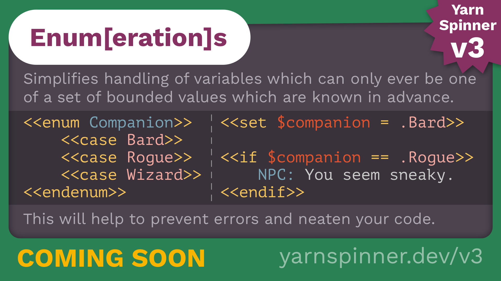

# Enums

<figure><figcaption></figcaption></figure>

In Yarn Spinner 3, enums let you create variables whose value is constrained to a pre-defined list of possibilities.&#x20;


An enum (short for ‘enumeration’) is useful when you have a variable that needs to have a wider range of possible values than simply `true` or `false`, but needs to be more specific than a `number` or `string`.



Try a sample of enums online in Try Yarn Spinner.


To define an enum you must provide a name, and some cases for it. Here's a new enum called `Food` with the cases `Apple`, `Orange`, and `Pear`:

```markdown
<<enum Food>>
  <<case Apple>>
  <<case Orange>>
  <<case Pear>>
<<endenum>>
```

Once you've created an enum, you can use it just like any other variable:

```markdown
// Declare a new variable with the default value Food.Apple
<<declare $favouriteFood = Food.Apple>>

// You can set $favouriteFood to the 'apple', 'orange' or 'pear'
// cases, but nothing else!
<<set $favouriteFood to Food.Orange>>

// You can use enums in if statements, like any other type of value:
<<if $favouriteFood == Food.Apple>>
  I love apples!
<<endif>>

// You can even skip the name of the enum if Yarn Spinner can 
// figure it out from context!
<<set $favouriteFood = .Pear>>
```
