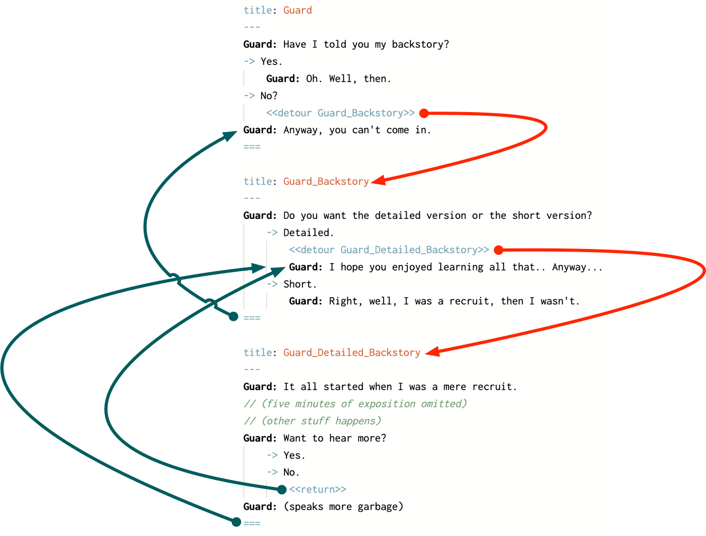

# Detour Command

In addition to using the [jumps.md](../jumps.md "mention") to move between nodes, you can also use a `detour` command. A `detour` command looks very simlar to jump: it takes a single parameter with the title of the node you want to move to, but unlike the jump command the detour command will return to the node that called it.

## Using the Detour Command

The detour command works much like the jump command, except it will return to the node it detoured from after that node is done. Here’s an example of it in action:

```css
title: Guard
---
Guard: Have I told you my backstory?
-> Yes.
	Guard: Oh. Well, then.
-> No?
	<<detour Guard_Backstory>>
Guard: Anyway, you can't come in.
===

title: Guard_Backstory
---
Guard: It all started when I was a mere recruit.
// (five minutes of exposition omitted)
===
```

If the player replies `No?` to the guard’s question, Yarn Spinner will detour to the node titled  `Guard_Backstory` and run its contents. When the end of that node is reached, Yarn Spinner will return to the node titled `Guard`, and resume from just after the `detour` statement.

### Using Detour with the Return Command

When you `detour` into a node, Yarn Spinner runs the content from that node just as if you’d used a `jump` statement. When you reach the end of the node, or reach a `return` command, Yarn Spinner will return to just after the `detour` command. A return command looks like `<<return>>`. There are no parameters.

You can return early from a detoured node by using the `return` command. Doing so will return to just after the `detour` command as though the end of the node had been reached, for example:

```css
title: Guard
---
Guard: Have I told you my backstory?
-> Yes.
	Guard: Oh. Well, then.
-> No?
	<<detour Guard_Backstory>>
Guard: Anyway, you can't come in.
===

title: Guard_Backstory
---
Guard: Do you want the detailed version or the short version?
    -> Detailed.
        <<detour Guard_Detailed_Backstory>>
        Guard: I hope you enjoyed learning all that.. Anyway...
    -> Short.
        Guard: Right, well, I was a recruit, then I wasn't.
===

title: Guard_Detailed_Backstory
---
Guard: It all started when I was a mere recruit.
// (five minutes of exposition omitted)
// (other stuff happens)
Guard: Want to hear more?
    -> Yes.
    -> No.
        <<return>>
Guard: (speaks more garbage)
===
```


If Yarn Spinner reaches a `return` comand, and it hasn’t detoured from another node, it will stop the dialogue (that is, it will behave as though you had written a `stop` command.)


When you detour into a node, that node can itself detour into _other_ nodes. If a detoured node uses a `jump` command to run another node, the return stack is cleared. If you `detour` into a node, and that node `jumps` to another node, Yarn Spinner won’t return to your original `detour` site.

<figure><figcaption><p>The flow of detours and returns (automatic and triggered by the return command) in this snippet.</p></figcaption></figure>

## Write some Detour Commands



### Write a simple story with several nodes.

Spread your story out over the nodes in a sensible manner.



### Use the `<<detour>>` command to move between nodes in your story.

Make sure you specify the name of the node you want to jump to inside each `<<detour>>` command.



### Run your story using Preview.

Play through it, and make sure the detours behave as you'd expect.



Next up, learn about [logic-and-variables.md](logic-and-variables.md "mention") in Yarn Spinner Scripts.
