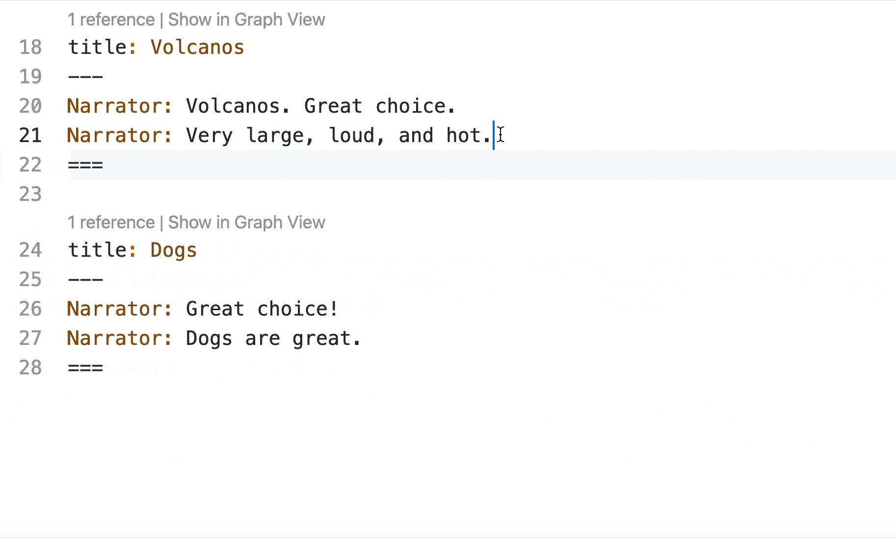
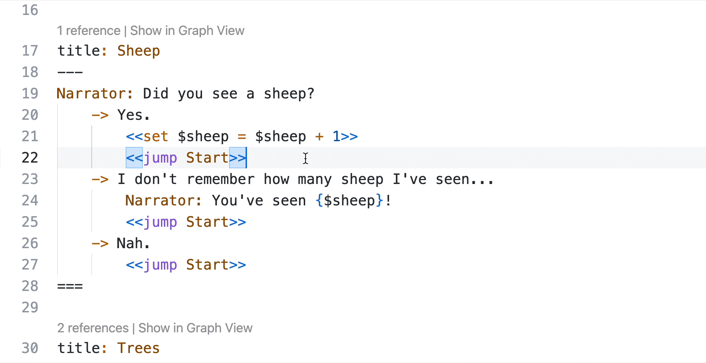
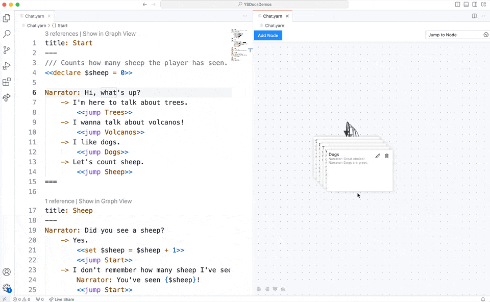
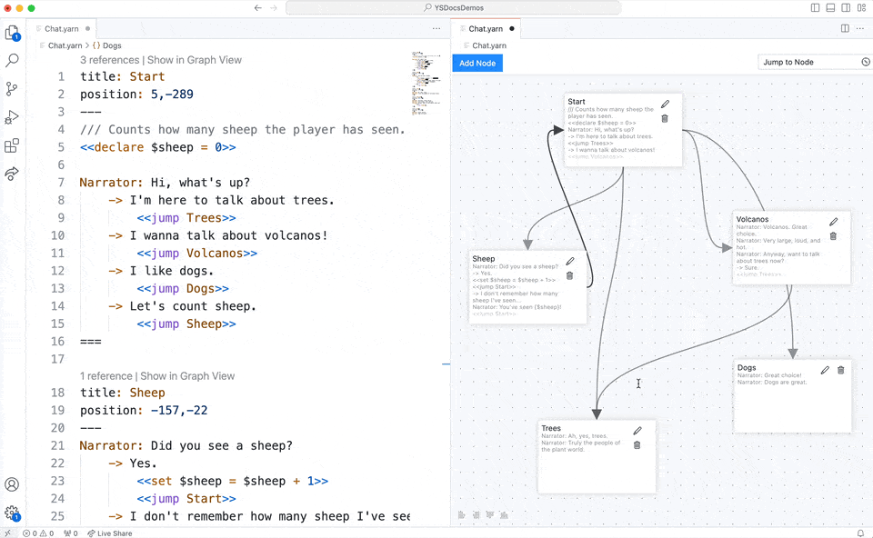

# Writing Yarn in VS Code

Now that you've got Visual Studio Code and Yarn Spinner for Visual Studio Code installed, it's time to learn how to use it to write Yarn Spinner Scripts.

## Writing Yarn Spinner Scripts with VS Code

Yarn Spinner for Visual Studio Code is designed to work with a folder, not single files. You should always work on a project-by-project basis with folders containing your `.yarn` file or files in it, even if your narrative only has one `.yarn`file, put it in a folder of its own.


If you're working on Yarn Spinner Scripts that are part of a game—for example a Unity game—you're likely to have a folder for your narrative/dialogue within the project structure.&#x20;

If you're using VS Code as your C# editing environment with Unity, you can reach your Yarn Spinner scripts by choosing the Assets menu -> Open C# Project from within Unity, and then navigating to the appropriate folder within VS Code to work with your Yarn Spinner Scripts.

If you're not using VS Code as your C# editing environment with Unity, you can still open the Narrative folder with VS Code to work with your Yarn Spinner Scripts.


### Opening a folder


You can download this folder as a `.zip` file here, if you want to follow along. **TODO LINK**.


For this example, we'll start with an existing story (`Chat.yarn`) in a folder (`YSDocsDemos`):

<figure><figcaption><p>A folder on disk containing a Yarn file.</p></figcaption></figure>

If we open VS Code, the default screen will have an Open button right in the middle.

<figure><figcaption><p>The Open button on the Visual Studio Code start screen.</p></figcaption></figure>

Click this button, or choose the File menu -> Open Folder..., and then open the folder containing your `.yarn` files:

<figure><figcaption><p>Opening a folder containing <code>.yarn</code> files.</p></figcaption></figure>

When the folder opens, you'll see the sidebar of VS Code change to reflect the contents of the folder. You can click on a `.yarn` file to open it in the text editor:

<figure><figcaption><p>Choosing a <code>.yarn</code> file to edit.</p></figcaption></figure>

## Working with Yarn in Visual Studio Code

With a `.yarn` file open in VS Code, you can verify that the Yarn Spinner for Visual Studio Code Extension is active by looking in the bottom right-hand corner of the screen, and locating the words "Yarn Spinner":

<figure><figcaption><p>The status bar of VS Code showing that the Yarn Spinner extension is active.</p></figcaption></figure>


The bottom right-hand corner of Visual Studio Code window will only show "Yarn Spinner" if both the Yarn Spinner for Visual Studio Code extension is installed, and the currently active file is recognised as a `.yarn` file by its extension.


You can use the text editing view to work with `.yarn`, and to write your narratives. The Yarn Spinner for Visual Studio Code extension provides all sorts of features to make this process easier.&#x20;

For example, if you hold the Command key (on macOS) or the Control key (on Windows or Linux) and hover over names of nodes in, for example, \``<<jump>>` statements, you'll be able click on them to move the editor view to the Yarn that represents that node:

<figure><figcaption><p>Command/Control allows you to click a node name to jump to its definition.</p></figcaption></figure>

You'll also be offered autocomplete suggestions based on node names that exist in your project. For example, if you create a new `<<jump>>` statement, you'll be able to pick from your nodes:

<figure><figcaption><p>Choosing a node to jump to with autocomplete.</p></figcaption></figure>

If your Yarn projects also use variables, Yarn Spinner for VS Code will help out as well. For example, when you `<<declare>>` a new variable, you can add a comment with three `/` in front of it to provide a description of the variable:

<figure><figcaption><p>Using the the special <code>///</code> comment syntax to describe a variable.</p></figcaption></figure>

Then, when you use the variable, you can hover over it in VS Code for a reminder of its purpose (and its default value):

<figure><figcaption><p>Viewing a variable's description.</p></figcaption></figure>

Variable names will also autocomplete when you try and use them, and errors will be show if there are type isues. So, if you `<<declare>>` a variable to be a certain type, for example a `boolean`:

<figure><figcaption><p>Using `<code>&#x3C;&#x3C;declare>></code> to declare a boolean.</p></figcaption></figure>

... and then attempt to use that variable in a way that would produce an error. For example, by attempting to assign a number to it, then Yarn Spinner for Visual Studio Code will show an error:

<figure><figcaption><p>An error arising from trying to use a <code>boolean</code> like an <code>integer</code>.</p></figcaption></figure>

You'll also be able to see documentation comments from commands defined in your game's C# source code:

<figure><figcaption><p>Comments from C# commands in your Yarn scripts.</p></figcaption></figure>

## Working with nodes

While Yarn is a text based language, our Yarn Spinner for Visual Studio Code extension provides a handy Graph View. You can open the Graph View for whichever `.yarn` file you're currently working with by clicking the Graph View button in the top right-hand corner:

<figure><figcaption><p>The Graph View button.</p></figcaption></figure>

You might notice that, when you first look at the Graph View for a `.yarn` file, all the nodes appeared stacked on each other, like this:

<figure><figcaption><p>Nodes stacked on each other in the graph view.</p></figcaption></figure>

To make sense of things, and better understand the `<<jump>>` use between nodes, you can rearrange the nodes by clicking and dragging to wherever you want them:

<figure><figcaption><p>Rearranging your nodes.</p></figcaption></figure>

The position of the nodes will be stored in each node's header:

<figure><figcaption><p>The position of each node is stored in the header.</p></figcaption></figure>

You can use the Add Node button, found at the top of the Graph View, to add new nodes. New nodes will appear in the Graph View, and in the text editor:

<figure><figcaption><p>The Add Node button.</p></figcaption></figure>

Double-clicking a node in the Graph View will jump to that node in the Text View:

<figure><figcaption><p>Double-clicking a node in the Graph View to edit it in the Text View.</p></figcaption></figure>

If you have a lot of nodes, you can use the Jump to Node menu, in the top right-hand corner of the Graph View, to jump the Graph View to a specific node:

<figure><figcaption><p>The Jump to Node menu.</p></figcaption></figure>

At any point you can also click Show in Graph View, found above each node in the Text View to jump the Graph View to it:

<figure><figcaption><p>Show in Graph View</p></figcaption></figure>

### Customising the Graph View

You can add some additional metadata to the headers of each node to customise your Graph View, for ease of understanding the relationships between areas of your script. For example, if you add the `color` field to the header, you can colour-code your nodes:

<figure><figcaption><p>Colour-coded nodes.</p></figcaption></figure>


You can use `red`, `green`, `blue`, `orange`, `yellow`,  or `purple`. The colours that you see may be different, depending on your VS Code theme.


The `color` field works like any other header element, and goes below the `title` and above the `---`:

```
title: NodeName
color: purple
---

===
```

You can also group your nodes by adding the `group` field to your node headers. For example, if you add `group: Main_Options` to the header of the `Volcanos`, `Dogs`, and `Trees` nodes, you'd end up with this:

<div data-full-width="true"><figure><figcaption><p>Grouping nodes in the Graph View.</p></figcaption></figure></div>

## Using the Command Palette&#x20;

The VS Code Command Palette has a number of useful Yarn Spinner features as well. Summon the Command Palette by pressing Shift + Command + P (Mac) or Ctrl + Shift + P (Windows/Linux), or choosing the View menu -> Command Palette..., and type "Yarn Spinner" to filter the available commands to those provided by the Yarn Spinner for Visual Studio Code Extension:

<figure><figcaption><p>The Command Palette</p></figcaption></figure>

From here you can Preview Dialogue, which will allow you to play through your narrative, right inside Visual Studio Code. To learn more about this, read [previewing-your-dialogue.md](previewing-your-dialogue.md "mention").

The Export Dialogue as HTML... option will export a self-contained playable version of your narrative as an HTML file, which is otherwise the same as the experience your get when previewing.

The Export Dialogue as Graph... option will allow you to export a `.dot` file of your graph. To learn about `.dot` files, check out the GraphViz documentation: [https://graphviz.org/doc/info/lang.html](https://graphviz.org/doc/info/lang.html)

And finally, the Export Dialogue as Recording Spreadsheet... option will allow you to export a spreadsheet, which can be useful for voice actors recording dialogue.&#x20;
