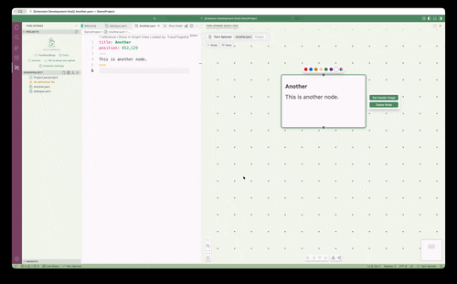

# Writing Yarn in VS Code

Now that you've got Visual Studio Code and Yarn Spinner for Visual Studio Code installed, it's time to learn how to use it to write Yarn Spinner Scripts.


This documentation is for Yarn Spinner for Visual Studio Code 3.2.x and newer.


#### Opening a Folder

Open VS Code and click the **Open** button on the welcome screen, or choose **File → Open Folder**, and select the folder containing your `.yarn` and `.yarnproject` files.

When the folder opens, the Yarn Spinner sidebar will appear showing your projects, their definition files, yarn files, and localisation settings.

You can also open an empty folder and create everything from scratch using the extension.


Yarn Spinner for Visual Studio Code is designed to work with projects, not single files. You should always open a **folder** containing your `.yarn` files, even if your project only has one.

Every Yarn Spinner project needs a `.yarnproject` file. This tells the extension (and the compiler) which files belong to your project, what language your dialogue is written in, and where your definition files are. When you create a new project through the extension, it generates this file for you.

If you're working on dialogue for a game — for example in Unity, Godot, or Unreal — you'll typically have a folder for your narrative within the game's project structure.


<figure><figcaption></figcaption></figure>

#### Creating a New Project

If you don't have a `.yarnproject` file yet, you can create one in the active folder:

1. Open the Command Palette (`Cmd+Shift+P` on macOS, `Ctrl+Shift+P` on Windows/Linux)
2. Type "Yarn Spinner: Create New Yarn File" or use the new file button in the sidebar
3. The extension will create a `.yarnproject` file and a starter `.yarn` file for you

The `.yarnproject` file is the heart of your project. It controls which files are included, your compiler settings, and your editor preferences. You can open it to see and edit your project configuration in a visual editor.

You can also choose to create a new Yarn Spinner project from a template in the sidebar.

<figure><figcaption></figcaption></figure>

If you do this, you can choose from a few pre-made templates:

<figure><figcaption></figcaption></figure>

### Verifying the Extension is Active

With a `.yarn` file open, look at the bottom left corner of VS Code for the words **Yarn Spinner** and a tick. This confirms the extension is installed and recognises your file.

<figure><figcaption></figcaption></figure>

The Yarn Spinner sidebar (the speech bubbles icon in the activity bar) shows all your projects, their files, and their status, as found in the open folder.

<figure><figcaption></figcaption></figure>

### Features of the Extension

Use the text editor to write your `.yarn` files. The extension provides:

#### Extension Settings

You can open the Extension Settings from the Yarn Spinner Sidebar:

<figure><figcaption></figcaption></figure>

#### Syntax Highlighting

Yarn Spinner scripts are colour-coded so you can easily distinguish dialogue lines, commands, options, variables, and comments. The extension includes custom light and dark themes designed specifically for Yarn Spinner.

You can set the theme scope in Extension Settings — choose **Whole Editor** to always use the Yarn Spinner theme, or **Yarn Files Only** to automatically switch themes when you move between yarn files and other files.

<figure><figcaption></figcaption></figure>

#### Autocomplete

The extension offers autocomplete suggestions as you type:

* **Node names** — when writing `<<jump>>` or `<<detour>>` statements, you'll see a list of all nodes in your project
* **Variable names** — when using variables, previously declared names are suggested
* **Commands and functions** — if your project has a `.ysls.json` definitions file, custom commands and functions from your game code are suggested with their parameter types and documentation

<figure><figcaption></figcaption></figure>

#### Hover Information

Hold `Cmd` (macOS) or `Ctrl` (Windows/Linux) and hover over:

* **Node names** in `<<jump>>` statements to see a preview, or click to navigate to that node
* **Variables** to see their type, default value, and documentation comment
* **Commands and functions** to see their signature, parameters, and documentation from your game code

<figure><figcaption></figcaption></figure>

#### Variable Documentation

When you `<<declare>>` a variable, add a documentation comment with `///` above it:

```yarn
/// How many times the player has visited the shop
<<declare $shop_visits = 0>>
```

This description appears in hover tooltips and autocomplete suggestions whenever the variable is used.

<figure><figcaption></figcaption></figure>

#### Error Checking

The extension validates your scripts in real time:

* **Type errors** — assigning the wrong type to a variable (e.g. a number to a boolean)
* **Missing nodes** — jumping to a node that doesn't exist
* **Syntax errors** — malformed commands, missing delimiters
* **Undeclared variables** — using a variable without declaring it (when `requireVariableDeclarations` is enabled)

Errors and warnings appear as squiggly underlines in the editor and in the Problems panel.

<figure><figcaption></figcaption></figure>

<figure><figcaption></figcaption></figure>

#### Spell Checking

The extension integrates with VS Code's spell checking. You can configure it per-project in the `.yarnproject` editor:

* Enable or disable spell checking
* Add custom words (character names, made-up terms, game-specific vocabulary)

<figure><figcaption></figcaption></figure>

### The Graph View

While Yarn Spinner is a text-based language, the extension provides a visual **Graph View** to help you understand the structure of your dialogue.

#### Opening the Graph View

Click the **Show Graph** button in the top right corner of the editor when a `.yarn` file is open, or use the graph view panel in the sidebar.

<figure><figcaption></figcaption></figure>

#### File View

The default view shows nodes from the currently open `.yarn` file. Use the toggle in the graph view toolbar to switch modes between the current file and the whole project.

<figure><figcaption></figcaption></figure>

* **Drag nodes** to rearrange them — positions are saved in the node's `position` header automatically
* **Double-click** a node to jump to it in the text editor
* **Click "Show in Graph View"** above any node in the text editor to find it in the graph
* Arrows show `<<jump>>` connections between nodes
* Dashed arrows show `<<detour>>` connections
* Cross-file jumps appear as small stub nodes showing the destination file and node name, with an arrow connecting to them — so you can see where your dialogue leaves the current file

<figure><figcaption></figcaption></figure>

#### Project View

Switch to **Project** view using the toggle in the toolbar to see every node across every file in your project at once.

<figure><figcaption></figcaption></figure>

In project view:

* Each `.yarn` file is shown as a **container** with its nodes inside
* **Cross-file jumps** are shown as dashed coloured lines between file containers
* **Drag file containers** to arrange your project layout — positions are saved in your `.yarnproject` file
* **Colour file containers** by selecting one and using the colour picker toolbar that appears

<figure><figcaption></figcaption></figure>

* **Align containers** using the alignment buttons at the bottom (align left, right, top, bottom)
* **Auto-layout** the entire project vertically or horizontally
* **Double-click** an inner node to open that file at that node in the text editor

Project view is useful for understanding the high-level structure of your narrative — which files connect to which, and how dialogue flows across your project.

#### Navigating Between Views

*   From file view, click **Project** in the toolbar to see the whole project

    <figure><figcaption></figcaption></figure>
* From project view, click a file name to switch to file view for that file
* Use **Show in Graph View** (the code lens above each node in the text editor) to jump to a specific node — if the graph is in project view, it switches to file view and focuses the node

<figure><figcaption></figcaption></figure>

#### Adding Nodes

Use the **+ Node** button at the top of the graph view, or right-click on empty space and choose **Add Node**. New nodes enter inline rename mode so you can type a name immediately.

You can also drag from a node's connection handle to create a new connected node.

<div data-full-width="true"><figure><figcaption></figcaption></figure></div>

#### Sticky Notes

Use the **+ Note** button to add sticky notes to your graph. These are visual-only notes for yourself or your team — they help add context to your narrative structure.

Sticky notes are just regular nodes with `style: note` in their header:

```yarn
title: Note_Reminder
style: note
color: red
position: 100,200
---
TODO: Add more dialogue options for the shopkeeper.
===
```

<figure><figcaption></figcaption></figure>

#### Customising Nodes

Add metadata to node headers to customise how they appear in the graph:

**Colours:**

```yarn
title: EvilPath
color: purple
---
```

Available colours: `red`, `green`, `blue`, `orange`, `yellow`, `purple`. You can also use hex codes for custom colours via the colour picker in the graph view.

<figure><figcaption></figcaption></figure>

**Clusters:**

Group related nodes by adding a `cluster` header:

```yarn
title: Volcanos
cluster: MainTopics
---
```

All nodes with the same cluster value are visually grouped together.

<figure><figcaption></figcaption></figure>

**Images:**

Add a header image to a node:

```yarn
title: ForestScene
image: forest.png
---
```

The image path is resolved relative to the `imagePath` setting in your project configuration.

<figure><figcaption></figcaption></figure>

#### Auto Layout

Use the auto-layout buttons at the bottom of the graph view to automatically arrange your nodes vertically or horizontally.

<figure><figcaption></figcaption></figure>

### The Dialogue Preview

You can play through your dialogue right inside VS Code.

#### Starting the Preview

Click the **Play** button in the sidebar toolbar next to your project, or use the Command Palette and choose **Yarn Spinner: Preview Dialogue**.

<figure><figcaption></figcaption></figure>

The preview runs your compiled dialogue using the same Yarn Spinner runtime that your game uses. It shows character names, dialogue lines, and options.

<figure><figcaption></figcaption></figure>

#### Restarting

Click the restart button in the preview toolbar.

#### Preview Settings

In the `.yarnproject` editor, you can configure:

* **Presenter** — the visual style of the dialogue preview (we only supply one at the moment)
* **Start Node** — which node to begin from (defaults to "Start")
* **Preview Font Size** — independent of your editor font size
* **Typewriter** — toggle the character-by-character text reveal on or off

### Definition Files

Definition files (`.ysls.json`) tell the extension about custom commands and functions defined in your game code (e.g. in C#, GDScript, C++, or Blueprints). This enables autocomplete, hover documentation, type checking, and parameter validation for your custom gameplay commands.

#### For v3 Projects (Yarn Spinner 3.0.x-3.1.x)

Use the **Generate Definitions** button in the `.yarnproject` editor's Definitions section. This runs `ysc` to scan your game project and produce a `.ysls.json` file. Choose your engine type (Unity, Godot C#, or Godot GDScript) and point it at your game project directory.

<figure><figcaption></figcaption></figure>

#### For v4 Projects (Yarn Spinner 3.2+)

You have full control over definition files. Add, remove, and browse for `.ysls.json` files directly in the `.yarnproject` editor.

<figure><figcaption></figcaption></figure>

### Project Configuration

Open your `.yarnproject` file to see the visual project editor. It has sections for:

* **Yarn Project Settings** — project name, author, presenter, start node, font sizes, saliency strategy
* **Project Metadata** — base language, image path
* **File Patterns** — which `.yarn` files to include/exclude
* **Localisation** — translation string tables and asset directories
* **Character Colors** — define characters with colours for editor highlighting and preview
* **Definitions** — manage `.ysls.json` definition files
* **Compiler Options** — variable declaration requirements, preview features
* **Spell Checking** — enable/disable and custom dictionary words

<figure><figcaption></figcaption></figure>

### Extension Settings

Click **Extension Settings** in the sidebar to configure settings that apply to all projects:

* **Editor** — general editor preferences
* **Color Theme** — Yarn Spinner Light or Dark themes, with scope control (whole editor or yarn files only)
* **Language Server** — language server configuration
* **Diagnostics** — control which warnings and errors are shown
* **Spell Checking** — global spell check settings
* **Export** — spreadsheet format, columns, graph format, and other export options

<figure><figcaption></figcaption></figure>

### Exporting

The extension can export your dialogue in several formats. Use the Command Palette (`Cmd+Shift+P` / `Ctrl+Shift+P`) and type "Yarn Spinner":

* **Export Dialogue as Recording Spreadsheet** — produces a CSV or Excel spreadsheet for voice actors, with configurable columns (character, text, line ID, etc.)
* **Export Dialogue as Graph** — produces a Mermaid or DOT format graph of your node structure, optionally clustered by file

### The Command Palette

Open the Command Palette (`Cmd+Shift+P` on macOS, `Ctrl+Shift+P` on Windows/Linux) and type "Yarn Spinner" to see all available commands:

* Preview Dialogue
* Create New Yarn File
* Show Graph View
* Toggle Graph View
* Export commands
* Open Extension Settings
* Show Output Channel (for debugging)

<figure><figcaption></figcaption></figure>

### Nodes Across Files

Nodes can be spread across as many `.yarn` files as you like within your project. The extension handles cross-file references, jumps, and the project-wide graph view automatically. The `.yarnproject` file's `sourceFiles` patterns determine which files are included.

### Tips

* **Use the sidebar** — it gives you an overview of all your projects, files, definitions, and localisation at a glance
* **Click "No definitions file"** in the sidebar to jump straight to the definitions section of your project editor
* **Use `///` comments** above variable declarations for documentation that appears in hover tooltips
* **Use clusters and colours** in the graph view to organise complex narratives visually
* **Set the theme scope to "Yarn Files Only"** if you want the Yarn Spinner colour theme to automatically activate only when editing yarn files
