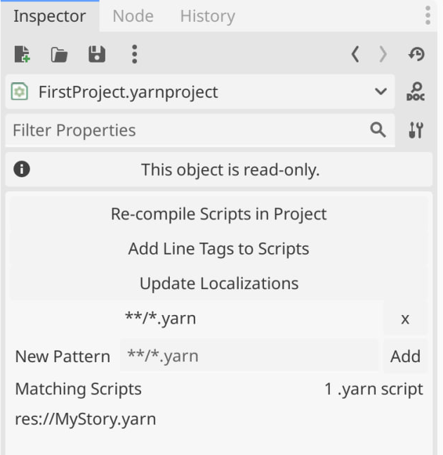
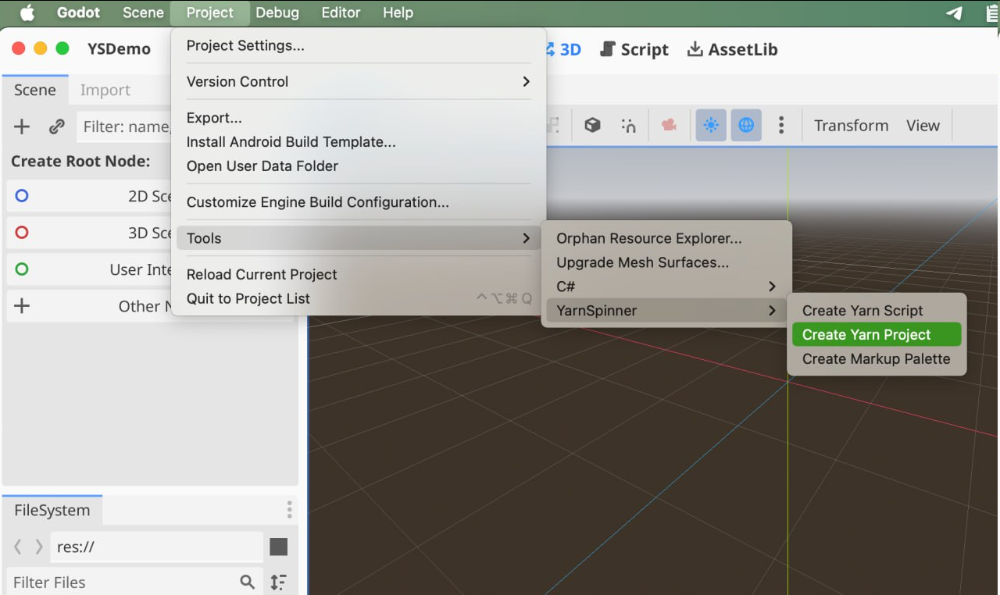
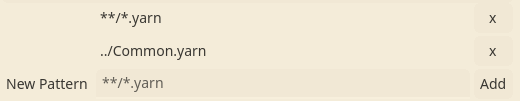
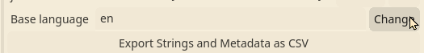

# Yarn Projects

A Yarn Project is a file that links multiple [Yarn scripts](yarn-scripts.md) together. Yarn projects are how Dialogue Runners work with your content.

## Creating a New Yarn Project

To create a new Yarn Project, follow these steps:

* Open the Project menu, and choose Tools -> YarnSpinner -> Yarn Project.
* Godot will open a dialogue where you can choose the directory your Yarn Project will be saved, and its filename. Choose a name and directory, and press the Save button.

## Adding Yarn scripts to a Yarn Project

On their own, a Yarn Project doesn't do anything. In order to be useful, you need to add Yarn scripts to it.

Yarn Projects include all Yarn Scripts that the project finds in the Source Files directory. By default, that means all Yarn Scripts in the same directory as the Yarn Project, and all of that directory's children.

When you add a Yarn Script to the same folder as a Yarn Project, it will automatically be included in the Yarn Project. When you make changes to the script, the Yarn Project will automatically be re-imported.

You can change the locations that a Yarn Project looks for Yarn Scripts by modifying the Source Files setting. Each entry in the Source Files setting is a _search pattern_.

| Pattern | Description                        | Examples                                                     |
| ------- | ---------------------------------- | ------------------------------------------------------------ |
| `*`     | any filename                       | "`*.yarn`" will find "One.yarn" and "Two.yarn".              |
| `**/*`  | any path, including subdirectories | "`**/*.yarn`" will find "One.yarn" and "Subfolder/Two.yarn". |
| `..`    | the parent folder                  | "`../*.yarn`" will find "One.yarn" in the parent folder.     |

You can add as many entries to the Source Files field as you like. If a file is matched by multiple patterns, it will only be included once.

A Yarn script can be included in more than one Yarn Project.

## Managing Localizations and Assets

When you write a Yarn script, you write it in a specific human language. This is referred to as the 'base' language of the script. It's called the base language because it's the one you start with, and the one you translate into other languages.


Unless you change it to something else, Yarn Spinner will set the base language to your computer's current locale.


You can set the base language of a Yarn Project in the Inspector by changing the Base Language setting.

If you want to translate your scripts into another language, you add a new locale code to your Yarn Project. To learn about this process, see [Adding Localizations](../localization.md).

## Using Yarn Projects with Dialogue Runners

Yarn Projects are used by Dialogue Runners. When a Dialogue Runner is told to start running dialogue, it reads it from the Yarn Project it's been provided.


If you try to start a Dialogue Runner and it doesn't have a Yarn Project, or the Yarn Project doesn't have any Yarn scripts, or if any of the Yarn scripts contain an error, the Dialogue Runner won't be able to run.


## Inspector

| Property                           | Description                                                                                                                                                                                                                                                                                                                                                 |
| ---------------------------------- | ----------------------------------------------------------------------------------------------------------------------------------------------------------------------------------------------------------------------------------------------------------------------------------------------------------------------------------------------------------- |
| Re-Compile Scripts in Project      | Manually trigger all of your .yarn scripts to be compiled.                                                                                                                                                                                                                                                                                                  |
| Add Line Tags to Scripts           | When you click this button, any line of dialogue in the Source Scripts list that doesn't have a `#line:` tag will have one added. See [Adding Localizations](../localization.md) for more information.                                                                                                                                                      |
| Update Localizations               | 
When you click this button, all <code>.csv</code> strings files that are configured in the Localization CSVs list will be updated with any lines that have been added, modified or deleted since the strings file was created.

See <a href="../localization.md">Adding Localizations</a> for more information.
                                 |
| Source Scripts                     | The list of places that this Yarn Project looks for Yarn Scripts.                                                                                                                                                                                                                                                                                           |
| Base Language                      | The [locale code](https://docs.godotengine.org/en/stable/tutorials/i18n/locales.html) for the language that the Yarn Scripts are written in.                                                                                                                                                                                                                |
| Localization CSVs                  | A mapping of [locale codes](https://docs.godotengine.org/en/stable/tutorials/i18n/locales.html) to CSV file paths, for storing localized content for your dialogue.                                                                                                                                                                                         |
| Export Strings and Metadata as CSV | When you click this button, all of the lines in the Yarn Scripts that this project uses will be written to a `.csv` file, which can be translated to other languages. A CSV file listing any metadata associated with each line will also be generated alongside the strings CSV file. See [Adding Localizations](../localization.md) for more information. |
