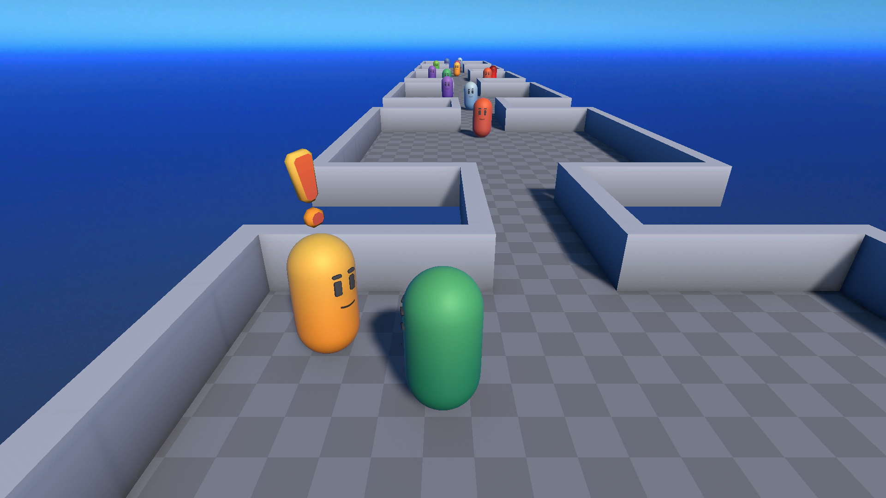
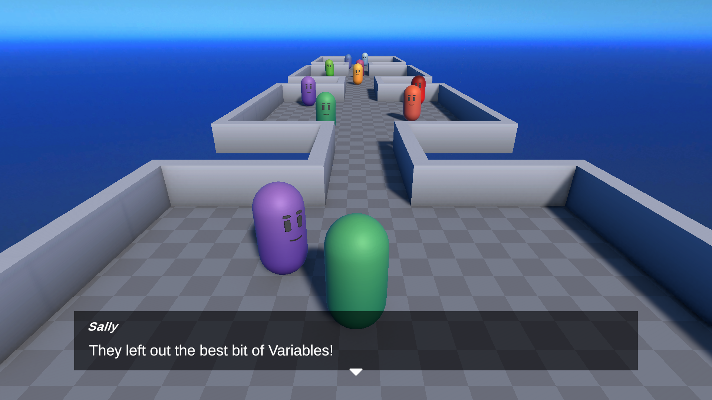
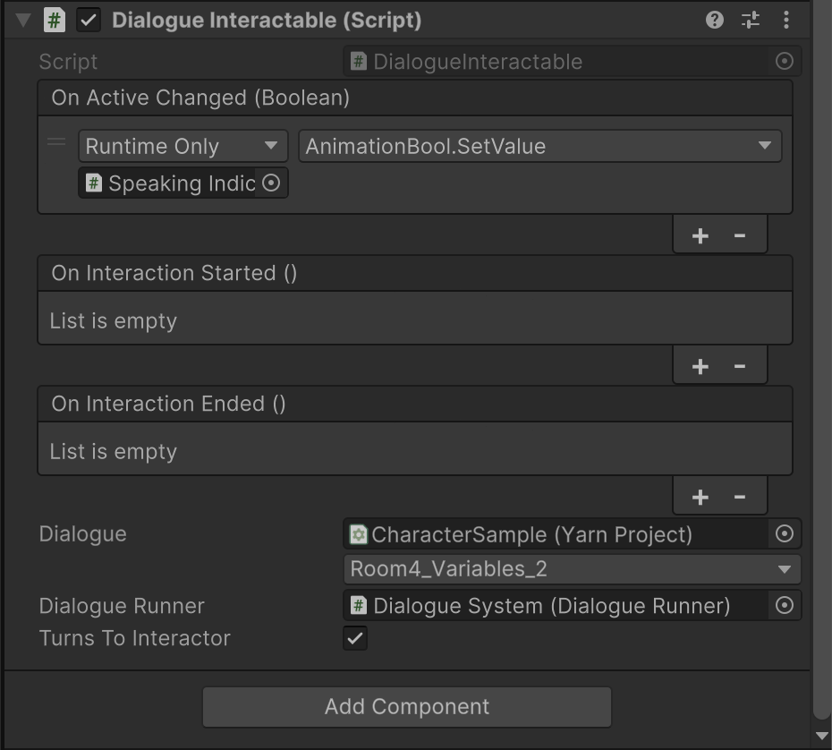

# Feature Tour

The feature tour is an ideal starting point for newcomers to Yarn Spinner. It presents a series of conversations along a corridor, each demonstrating a different capability of Yarn Spinner.

Are you ready to navigate this narrative gauntlet?

## Features Covered

* [Nodes, Lines](../../../write-yarn-scripts/syntax-basics/lines-nodes-and-options.md) and [Options](../../../write-yarn-scripts/syntax-basics/options.md)
* [Jumps](../../../write-yarn-scripts/syntax-basics/jumps.md) and [Detours](../../../write-yarn-scripts/syntax-basics/detour.md)
* [Variables and Interpolation](../../../write-yarn-scripts/syntax-basics/logic-and-variables.md)
* [Flow Control and Branching](../../../write-yarn-scripts/syntax-basics/flow-control.md)
* [Commands](../../../write-yarn-scripts/syntax-basics/commands.md) and [Functions](../../../write-yarn-scripts/syntax-basics/functions.md)
* Storylets
* The Dialogue Interactible component and node-character associations

## Tour Structure

The feature tour consists of a long corridor with multiple rooms. Each room contains one or more interactive characters, with each character showcasing a specific Yarn Spinner feature. While this sample doesn't demonstrate every Yarn Spinner capability, it covers the most commonly used ones.

### Dialogue Interactible Component

At the heart of this feature tour is the Dialogue Interactible class. This component is attached to each interactive character and associates a specific dialogue node with that character. If you're curious about how a particular feature works, you can identify which node contains that feature through this component.

For example, if you want to see which node provides dialogue for a specific character, select that character in the scene and examine the Dialogue Interactible component.

In this example, we can see the node is `Room4_Variables_2`. Since all dialogue in this sample is contained in a single file (`Tour.yarn`), you simply need to open that file and locate the node to understand its implementation.
