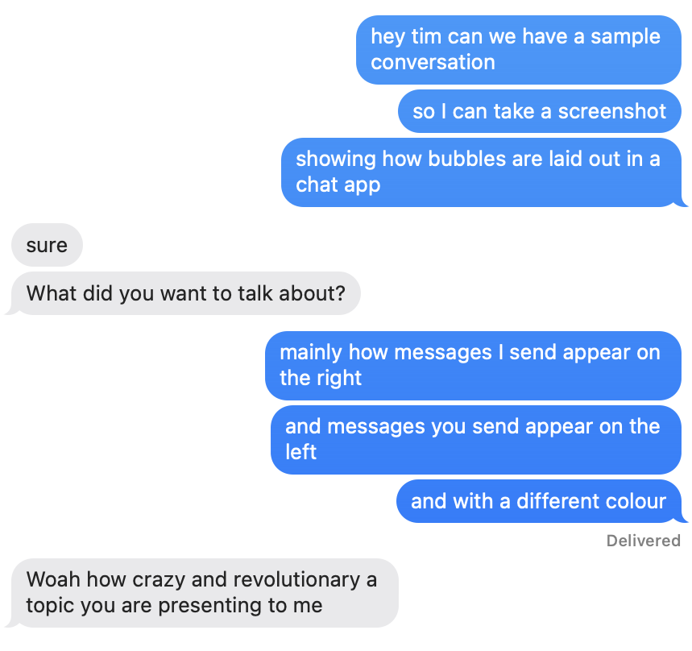
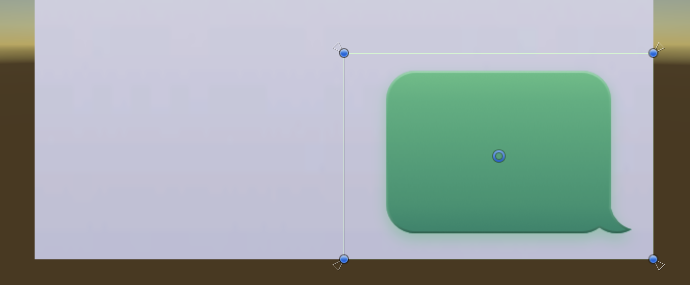
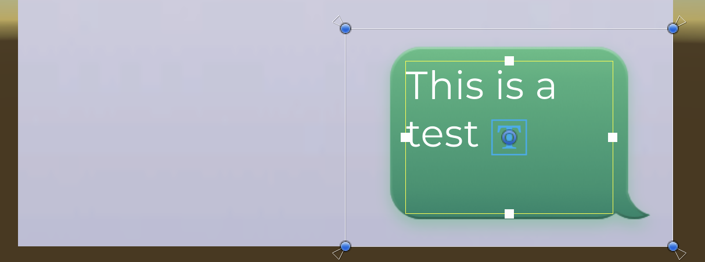
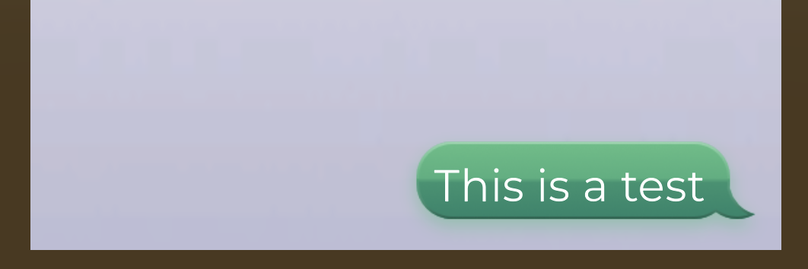
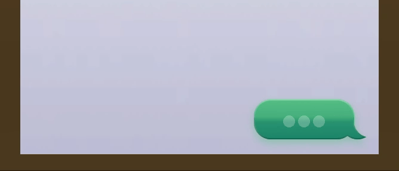
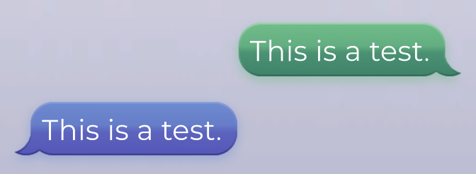
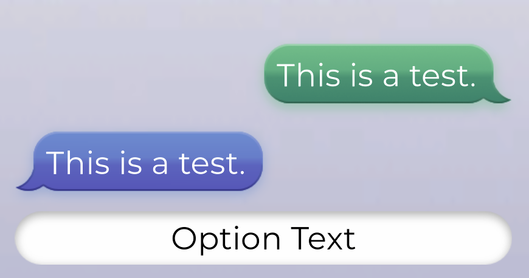

# Sample Guide: Phone Chat

## Phone Chat

The Phone Chat sample demonstrates how to create a Dialogue Presenter that shows conversations in a scrolling view, similar to how messages on a phone look. Lines of dialogue are shown as bubbles in the scrolling view, and are kept on screen after they're delivered, allowing the user to look up and see previous messages. Additionally, as lines appear, they're shown with a "typing" indicator.


While this tutorial's visuals are modelled on phone messaging user interfaces, the techniques used in it are also useful for any other situation where you want to keep an on-screen record of messages.


In this tutorial, you'll build a Dialogue Presenter that looks like this:

{% embed url="https://files.gitbook.com/v0/b/gitbook-x-prod.appspot.com/o/spaces%2F1BtiYLyfkkFBrMlsYGWS%2Fuploads%2F24KNpYh9B93zIyPi3Fyj%2Ffinished.mp4?alt=media&token=6aaef666-738c-4be3-8828-ad3dff224f7a" %}

### Creating the Project

We'll start by creating a new empty Unity project, and adding Yarn Spinner.

1. Open Unity Hub.
2. Click New Project, and create a new project. In this tutorial, we'll use the Universal 3D template, though the template itself doesn't really matter.
3. Follow the steps in [Installation for Unity](https://docs.yarnspinner.dev/using-yarnspinner-with-unity/installation-and-setup#install-from-itch.io) to install Yarn Spinner in your project.

Next, we'll download the assets needed by this tutorial.

4. Download the [assets for this tutorial](https://claude.ai/chat/PhoneChatAssets-2025-04-09.unitypackage), and import them into your project.

We're ready to start creating our scene!

### Setting Up the UI

Now that we've created the project, we'll begin by laying out the UI. We'll start from an empty scene, and build a canvas that will present the Phone Chat system.

1. Open the File menu, and choose New Scene. Select the Empty template.
2. Save the new scene somewhere in your project.

In our empty scene, we'll start by creating the camera that you view the scene with.

3. Create a new camera by opening the GameObject menu and choosing Camera.
4. Select the new camera, and in the Inspector, right click the Transform, and choose Reset.

Next, we'll create the canvas that the Phone Chat Presenter appears in.

5. Open the GameObject menu, and choose UI -> Canvas.
6. Select the new canvas in the Hierarchy, and find the Canvas Scaler component.
7. Set its UI Scale Mode to "Scale with Screen Size".
8. Set its Reference Resolution to 1920 by 1080.

### Setting Up the Scroll View

We're now ready to start building the UI itself. The most important part of a scrolling chat view is the scroll view, so let's create that!

1. Open the GameObject menu, and choose UI -> Scroll View.
2. Select the newly created Scroll View in the Hierarchy.
3. In the Inspector, find the Transform component.
4. Set the Pos X and Pos Y values to 0,0.
5. Set the Width to 600, and the Height to 900.

Our scroll view won't need any scroll-bars, so we'll get rid of them now. We'll also set up the scroll view so that it only scrolls vertically.

6. Select the Scroll View object in the Hierarchy.
7. In the Inspector, find the Scroll Rect component.
8. Select the Horizontal Scrollbar field, and press Backspace to clear it. Do the same thing for the Vertical Scrollbar field.
9. Turn off the Horizontal checkbox, so that it doesn't scroll horizontally.
10. Delete the Scrollbar Horizontal and Scrollbar Vertical objects from the scene.

Next, we'll set up the scroll view to use our background image.

11. In the Inspector, find the Image component.
12. Change the Color property to fully opaque white.
13. Change the Source Image property to the `BG-Lightmode` sprite.

Because we removed the scroll bars, we'll need to make the viewport of the scroll view fill the available area:

14. Select the Viewport object in the Hierarchy.
15. In the Transform component, set the Left, Right, Top and Bottom values all to 0.

We're almost done setting up the scroll view. The next thing to do is to make the content in the scroll view appear at the bottom of the view. We'll do this by setting up the Anchors of the Content view so that it's pinned to the bottom of its parent. This means that as bubbles get added to the Content object, the content object will grow upwards (rather than downwards).

1. Select the Scroll View -> Viewport -> Content object in the Hierarchy.
2. Find the Transform component in the Inspector.
3. Set the Anchors -> Min to X: 0, Y: 0.
4. Set the Anchors -> Max to X: 1, Y: 0.
5. Set the Pivot to X: 0.5, Y: 0.

We'll now make all of the content in the Scroll View automatically laid out in a vertical list.

5. With the Content object still selected, click Add Component at the bottom of the Inspector.
6. Search for "Vertical Layout Group", and add one to the object.
7. Set the new Vertical Layout Group's Spacing to -10.
8. Set its Child Alignment to Lower Center.
9. Check the Control Child Size -> Width and Height boxes.
10. Check the Child Force Expand -> Width box, and uncheck the Height box.

This will cause the items in the list to fill the entire width of the list. The height of each of the elements will be determined by the items themselves, using a component we'll add later.

We'll now also make the content update its own total size based on its contents.

11. Click the Add Component button at the bottom of the Inspector.
12. Search for "Content Size Fitter" and add one to the object.
13. Set the Horizontal Fit of the new Content Size Fitter to Unconstrained.
14. Set the Vertical Fit to Preferred Size.

### Creating the Bubble

Next, we'll create the bubble itself.

The goals for the bubble are that the text fits in the available width, and it takes up as much height as it needs given that width. We also want to show a speech bubble image behind the text, and we want that image to only be as wide as the text - it shouldn't take up the full width of the chat view.

This mimics the way that conversations work in popular chat apps: the speech bubble graphic doesn't take up the full width of the row that it exists in.



1. Select the Content object in the Hierarchy.
2. Open the GameObject menu, and choose Create Empty Child.
3. Name the newly created object "Message Bubble".


We'll eventually make the bubble automatically size itself, but while we're setting it up, we'll set its size manually using these Layout Element components.&#x20;


Because it's a child of the Vertical Layout Group we added earlier, it will automatically take up the full width of the list. We'll also want the bubble to have the correct height, based on the amount of text it has, but because we haven't set up the text component yet, that isn't available. In the meantime, we'll manually set up the bubble to have a fixed height, and we'll replace this later.

4. Select the Message Bubble object.
5. Add a new Layout Element component to the object.
6. Check the Min Height box, and set its value to 200.

We'll now add an object that manages the width of the bubble graphic.

8. Create a new empty child game object of the Message Bubble.
9. Name the new object "Message Content".
10. Add a Layout Element component to it, and set its Min Width to 300.
11. Add a Content Size Fitter component to it, and set its Horizontal Fit to Min Size.

Next, we'll make the bubble be right-aligned inside its content, and fill the entire height of the row.

12. With the Message Content object selected, go to the Transform component.
13. Set the Anchors -> Min to X: 1, Y: 0.
14. Set the Anchors -> Max to X: 1, Y: 1.
15. Set the Pivot to X: 1, Y: 0.5.
16. Set Pos X, Top and Bottom all to 0.

Now we'll add the bubble background image itself. We'll add a new object, set up its anchors so that they fill the parent object, and then add the image.

16. Add a new empty child object of Message Content.
17. Name the new object "Background".
18. In the Transform, set the Anchors -> Min to X: 0, Y:0.
19. Set the Anchors -> Max to X: 1, Y:1.
20. Set the Left, Top, Right and Bottom values all to 0.
21. Add a new Image component.
22. Set the Source Image of the new component to Bubble Green.

Your view should now look like this:



Now we'll add the text component, which will show the text of the image. The text object's anchors will be set up so that they're pinned to all for edges of the container, making it fill up the parent object.

22. Add a new empty child object of Message Content. Name it "Text".
23. Set its Anchors -> Min to X:0, Y:0.
24. Set its Anchors -> Max to X:1, Y:1.
25. Set its Left, Top, Right, Bottom all to 0.
26. Add a TextMeshPro - Text (UI) component to the object.
27. Set the Font to Montserrat-Regular. (This is one of the assets that you downloaded when you began this tutorial.)
28. Set the Text to something temporary, like "This is a test".
29. Scroll down to Extra Settings, and click it to expand it.
30. Set the Margins to:
    * Left: 55
    * Top: 30
    * Right: 55
    * Bottom: 35

The bubble should now look like this:



### Making The Bubble Automatically Size Itself

The bubble now has the right graphics, but its size could be improved. We'll now add some code that makes the various parts of the bubble correctly sized. To get the best result, we need to think about the overall layout here:

* The Vertical Layout group is controlling the width of the Message Bubble element, and we want to make each Message Bubble control its own height.
* Inside the Message Bubble, we also want the visible bubble to be as wide as it needs to be to show the text, but no wider than that (that is, there should be a gap on the side).

To make this work, we'll create a component that calculates the required size of the text box, and use it in two places:

* The Message Bubble will use it to calculate its _height_ (with its width being driven by the Vertical Layout Group on Content).
* The Message Content will use it to calculate its _width_ (with its height inherited from its parent).

1. Open the Assets menu, and choose Create -> MonoBehaviour Script.
2. Name the new script "UseSizeOfText".
3. Double-click the new script to open it in your text editor.
4. Delete the contents of the file and replace it with this:

```csharp
using UnityEngine;
using UnityEngine.UI;
using TMPro;

[ExecuteAlways]
[RequireComponent(typeof(RectTransform))]
public class UseSizeOfText : MonoBehaviour, ILayoutElement
{
    private TMP_Text Text => GetComponentInChildren<TMP_Text>();
    private RectTransform RectTransform => GetComponent<RectTransform>();

    float ILayoutElement.preferredHeight => minHeight;
    float ILayoutElement.preferredWidth => minWidth;

    float ILayoutElement.flexibleWidth => 0f;
    float ILayoutElement.flexibleHeight => 0f;

    public float minWidth { get; private set; } = 0f;
    public float minHeight { get; private set; } = 0f;

    int ILayoutElement.layoutPriority => 0;

    [SerializeField] float minimumWidth = 250f;
    [SerializeField] float minimumHeight = 30f;

    void ILayoutElement.CalculateLayoutInputHorizontal() { }
    void ILayoutElement.CalculateLayoutInputVertical() { }
}
```

This code implements a basic layout element, which is something that the layout system can ask questions of about what size it wants to be. - we'll now add code to it to make it derive its size from the text element.

5. Add the following method to the `UseSizeOfText` class:

```csharp
private void UpdateLayout(TMP_TextInfo info)
{
    if (info == null || info.textComponent == null || string.IsNullOrEmpty(info.textComponent.text))
    {
        minHeight = minimumHeight;
        minWidth = minimumWidth;
        return;
    }

    // Calculate the maximum width available to us by getting our
    // parent's width
    var parentWidth = RectTransform.parent.GetComponent<RectTransform>().rect.width;

    // Get the left and right margins of the text component
    var xMargin = info.textComponent.margin.x + info.textComponent.margin.z;

    // Get the total width available for drawing text
    var insetSize = parentWidth - xMargin;

    // Compute the rectangle we'd need to draw the text in, given our
    // available width and an (effectively) unlimited amount of vertical
    // space
    var size = info.textComponent.GetPreferredValues(info.textComponent.text, insetSize, float.MaxValue);

    // Our minimum width and height are now based on this (we add a
    // slight padding to the width)
    minHeight = Mathf.Max(minimumHeight, size.y);
    minWidth = Mathf.Max(minimumWidth, size.x + 5);

    // Now that we know our minimum width and height, ask the layout
    // system to rebuild our layout
    LayoutRebuilder.MarkLayoutForRebuild(RectTransform);
}
```

This method takes information describing the text in a TextMeshPro element, calculates the smallest size it needs to be given its constraints, and asks the layout system to rebuild the layout.

Lastly, we need the layout to update whenever the text changes. To do this, we'll make use of the [`OnPreRenderText`](https://docs.unity3d.com/Packages/com.unity.textmeshpro@3.0/api/TMPro.TMP_Text.html#TMPro_TMP_Text_OnPreRenderText) event, which is called immediately before the text in a TextMeshPro component is rendered as a mesh. When this happens, it's likely that our required size has changed, so we tell the layout to update.

6. Add the following methods to `UseSizeOfText`:

```csharp
protected void OnValidate() => UpdateLayout(null);

protected void OnEnable()
{
    if (Text != null)
    {
        Text.OnPreRenderText += UpdateLayout;
        UpdateLayout(Text.textInfo);
    }
}

protected void OnDisable()
{
    if (Text != null)
    {
        Text.OnPreRenderText -= UpdateLayout;
    }
}
```

Now that we've built a component that notifies the layout system of the necessary size of the text, we'll use it in our setup.

7. Select the Message Content object in the Hierarchy.
8. Remove the Layout Element component from it.
9. Add a new Use Size Of Text component.

The bubble will resize to fit the width of the text. We now need to make the row take the correct height.

7. Select the Message Bubble object in the Hierarchy.
8. Remove the Layout Element component from it.
9. Add a new Use Size Of Text component.

Your bubble should now look like this:



### Adding the Typing Indicator

When you're using a chat app, you see a typing indicator while the person on the other end is typing. Let's set up our chat bubbles so that they can show an animation for a short duration before revealing the text, as though the messages was being "typed out".

The way that the typing animation will look will be three dots, which bounce up and down in sequence.



Our first step will be to set up an object inside the Message Bubble prefab to act as our typing indicator. This object will act as a container for the three dots, so it needs to fill the entire parent object.

3. Create a new empty game object as a child of Message Content. Name it "Typing Indicator".
4. In the Inspector for the Transform component, set its Anchor Min to X:0, Y:0.
5. Set its Anchor Max to X:1, Y:1.
6. Set its Top, Left, Right, and Bottom all to 0.

Let's now add the dots themselves!

7. Add three new empty game objects as children of Typing Indicator. Name them `Dot 1`, `Dot 2`, `Dot 3`.
8. Select all three of the Dot objects you just created.
9. Add an Image component to all of them.
10. Drag and drop the Dot sprite from the downloaded assets into the Source Image slot.
11. Click on the Color value, and change the Alpha value to 128, to make it semi-transparent.
12. Set the Pos Y for all of them to 0.
13. Set the Width and Height for all of them to 20.

Now that we've set up all of their common properties, we'll lay each of them out.

14. Select Dot 1, and set its Pos X to -25.
15. Select Dot 2, and set its Pos X to 0.
16. Select Dot 3, and set its Pos X to 25.

Finally, we'll set them up so that they bounce up and down while visible.

17. Open the Assets menu, and choose Create -> Animation -> Animation Clip.
18. Name the new animation clip "Typing".
19. Select the new animation clip, and in the Inspector, turn on Loop Time.
20. Drag and drop this new clip onto the Typing Indicator object.

This will create a new Animator Controller that uses this clip, and then add an Animation component to the Loading Indicator that uses the controller.

Next, we'll set up the animation itself.

20. Open the Window menu, and choose Animation -> Animation. (You may want to dock the tab in your Unity editor window, if it isn't already.)
21. Select the Loading Indicator object.

The Animator window should be showing the Typing animation. You can check by looking at the dropdown menu at the top-left of the pane.

22. In the Animator window, Click Add Property.
23. Choose Dot 1 -> Rect Transform -> Anchored Position.
24. Repeat this process for Dot 2 and Dot 3.

By default, the newly created channels will have a keyframe at frame 0, and another at frame 60.

25. Select the keyframe at frame 60 and press Ctrl-C.
26. Move the playhead to frame 30 and press Ctrl-V, to make a copy of it.

We'll now create a new keyframe that represents the high point of each dot's bounce.

27. Move the playhead to frame 15.
28. Click the Record button at the top left of the Animation pane.
29. In the Scene view, drag all three Dot objects up so that their Pos Y is 25.
30. Click the Record button again to leave recording mode.
31. Click the Preview Play button in the Animation window and watch as they all bounce up together.

Now that the dots are moving, we'll adjust the timing so that they bounce up in sequence - first one, then two, then three.

32. Select all of the keyframes for Dot 2 and shift them 30 frames to the right.
33. Select all of the keyframes for Dot 3 and shift them 60 frames to the right.
34. Click the Preview Play button again and watch as they bounce up in sequence.

Looking good!

### Creating Bubble Prefabs

We're done with our basic bubble. Let's now create prefabs for it.

1. Drag the Message Bubble object from the Hierarchy into the Project tab, creating a Prefab.

This will be our base prefab. We'll create two variants of it: one for each of our two characters.

2. Delete the Message Bubble object from the scene.
3. Select the Message Bubble prefab you just created.
4. Open the Assets menu, and choose Create -> Prefab Variant.
5. Name the new prefab Message Bubble A.
6. Repeat the above two steps, creating a new prefab variant called Message Bubble B.
7. Drag Message Bubble A into the Content object in the hierarchy, creating an instance of it in the scene.
8. Drag Message Bubble B into the Content object as well.

In our phone chat system, we want Message Bubble A to use a green graphic and be right-aligned, and Message Bubble B to use a blue graphic and be left-aligned. Message Bubble A is already what it needs to be, so we just need to make some changes to Message Bubble B. The only things we need to change are the anchors - Bubble A is pinned to the right side, and we'll need to adjust it so that it's pinned to the left.

9. Select the Message Content object in Bubble B.
10. Change its Anchors Min to X: 0, Y:0.
11. Change its Anchors Max to X: 0, Y:1.
12. Change its Pivot to X: 0, Y:0.5.
13. Change its Pos X to 0.

The bubble will now be aligned to the left of the box, but its background image is pointing the wrong way.

14. Select the Background object in Message Bubble B.
15. In the Transform component, set its Scale X to -1.

The bubble will now be facing the right way. Lastly, we'll make the bubble use a different colour image.

16. With the Background object still selected, change the Source Image in its Image component to Bubble Blue.

The two bubbles should now look like this:



We're all done with setting up these bubbles for displaying text, though we'll return to them later at the very end of this tutorial. Let's apply these changes to the prefab overrides.

17. Select the Message Bubble B object
18. In the Inspector, click Overrides, and then click Apply All.

This will apply these changes to Bubble B prefab variant (without modifying the A variant or the base prefab).

19. Delete the Message Bubble A and Message Bubble B objects from the scene.

### Creating Option Buttons

Now that we've set up the prefabs for the line views, let's set up the UI for options. When the Dialogue Presenter needs to show options, we'll create a list of buttons that contain the text of each option.

We'll start by creating the object that will contain all of the buttons.

1. Create a new empty object under Content, and call it Options Container.
2. Add a Vertical Layout Component to it.
3. Set its Padding Top to 8, and Padding Bottom to 16.
4. Set its Spacing to 16.
5. Turn on Control Child Size Width, and Child Force Expand Width.

This will create a new item in the scrolling list that is _itself_ a vertical list. Now that we've built the layout for the options, let's create the button itself.

6. Create a new empty object under Options Container, and call it Option Button.
7. In the Transform component in its Inspector, set its Height to 60.

Now we'll add the image for the button. The button image itself will need to fill the entire parent, so we'll set up the anchors to do that.

8. Add a new empty object under Option Button, and call it Background.
9. Set its Anchor Min to X: 0, Y: 0
10. Set its Anchor Max to X: 1, Y: 1.
11. Set its Top and Bottom to 0, and its Left and Right to 20.
12. Add an Image component.
13. Set the Images component's Source Image to Option-NotSelected.

Next, the component that shows the text of the option. Again, this will fill the parent.

14. Add a new empty object under Option Button, and call it Text.
15. Set its Anchor Min to X: 0, Y: 0
16. Set its Anchor Max to X: 1, Y: 1
17. Set its Top, Bottom, Left and Right all to 0.
18. Add a TextMeshPro - Text (UI) component to the object.
19. Set its Vertex Color to black.
20. Set its Alignment to Centered Middle.
21. Set its font to Montserrat-Regular.
22. Click Extra Settings to expand it.
23. Set its Left and Right margins to 30.

We'll now configure the Text component to try to fit more text on a single line, where needed.

24. Set Text Wrapping Mode to No Wrap, and set Overflow to Ellipsis.
25. Turn on Auto Size, and set its Min Size to 24, its Max to 36, and its WD% to 10.

This will cause it to condense the font slightly if it needs the space, and to shrink the font size if it still needs more space. If it still can't fit the text, it will truncate it with an ellipsis (...) rather than overflow onto a new line. With these settings, an option's text can be about 40 characters long before it truncates.

Finally, we'll add a Button component, which will do two things: it'll make the button change its sprite as the user interacts with it, and it will also (eventually) tell the Dialogue Presenter that the user has chosen this option when clicked or tapped. We'll set up the Button component to change the sprite drawn in the Background object based on the current interaction state of the button.

26. With the Option Button selected, Add a Button component.
27. Set the Transition to Sprite Swap.
28. Drag and drop the Background object into the Target Graphic field.
29. Set Highlighted Sprite to Option-Selected.
30. Set Pressed Sprite to Option-Pressed.
31. Set Selected Sprite to Option-Selected.

Your button should now look like this:



We're all done setting up the visuals of the button. The last step is to turn it into a prefab so that we can instantiate copies of it later!

32. Drag and drop the Option Button into the Project pane to create a prefab.
33. Delete the original Option Button object from the scene.

### Writing the Code for Bubbles and Buttons

We're all set to start wiring this UI up to a Dialogue Presenter!

We'll start from the bottom up - we'll create scripts that manage the contents of the bubbles and the option buttons, and then create the Dialogue Presenter to work with these scripts.

Let's start with the code for the bubbles. This will be a simple script that can be told to show some text, or show a typing indicator.

1. Open the Assets menu, and choose Create -> MonoBehaviour Script.
2. Name the new script "ChatDialoguePresenterBubble".
3. Double-click the new script to open it, and replace its contents with the following code.

```csharp
using UnityEngine;
using UnityEngine.UI;
using TMPro;

public class ChatDialoguePresenterBubble : MonoBehaviour
{
    [SerializeField] GameObject typingIndicator;

    private TMP_Text TextView => GetComponentInChildren<TMP_Text>();

    public bool HasIndicator => typingIndicator != null;

    public void ShowTyping()
    {
        if (typingIndicator != null)
        {
            typingIndicator.SetActive(true);
        }
        if (TextView != null)
        {
            TextView.text = string.Empty;
        }
    }

    public void ShowText(string text)
    {
        if (typingIndicator != null)
        {
            typingIndicator.SetActive(false);
        }
        if (TextView != null)
        {
            TextView.text = text;
        }
    }
}
```

Now we just need to add this script to our bubbles. Because our Message Bubble A and Message Bubble B prefabs are variants, all we need to do is just add it to the base prefab, and it will appear on all of them.

3. Select the Message Bubble prefab in the Project pane.
4. Click Open at the top right of the Inspector to open the prefab for editing.
5. Add a `ChatDialoguePresenterBubble` component to the Message Bubble object.
6. Drag and drop the Typing Indicator into the Typing Indicator field.
7. Close the prefab and go back to the scene.

Next, we'll create and set up the code for the Option Button. This script needs to both show text to the user, and also notify the rest of the system that the button has been pressed.

1. Open the Assets menu, and choose Create -> MonoBehaviour Script.
2. Name the new script "ChatDialoguePresenterOptionsButton".
3. Double-click the new script to open it, and replace its contents with the following code.

```csharp
using System;
using UnityEngine;
using TMPro;

public class ChatDialoguePresenterOptionsButton : MonoBehaviour
{
    private TMP_Text TextView => GetComponentInChildren<TMP_Text>();

    public string Text
    {
        get => (TextView != null) ? TextView.text : string.Empty;
        set { if (TextView != null) { TextView.text = value; } }
    }

    public Action OnClick { get; internal set; }

    public void OnClicked()
    {
        OnClick?.Invoke();
    }
}

```

Now that the code's been written, we'll add it to the Option Button prefab.

4. Select the Option Button prefab in the Project pane.
5. Click Open at the top right of the Inspector to open the prefab for editing.
6. Add a Chat Dialogue Presenter Options Button component to the Option Button object.
7. In the Button component, add a new entry to the On Click event.
8. Drag and drop the Option Button object from the Hierarchy into the new event's object field.
9. Change the method from 'No Function' to 'ChatDialoguePresenterOptionsButton -> OnClicked()'.
10. Close the prefab and go back to the scene.

With this, our bubble and button prefabs are ready for use with the Dialogue Presenter!

### Writing the Dialogue Presenter Code

We're now finally ready to create the Dialogue Presenter itself!

1. Open the Create menu, and choose Yarn Spinner -> Dialogue Presenter Script.
2. Name the new script "ChatDialoguePresenter".
3. Double click the new script to open it in your text editor.

The default Dialogue Presenter template script contains an empty implementation of all of the necessary methods needed to be a Dialogue Presenter. We'll start adding functionality to it, piece by piece.

4. Add the following variables to the `ChatDialoguePresenter` class.

```csharp
[Header("Prefabs")]
[SerializeField] SerializableDictionary<string, ChatDialoguePresenterBubble> characters = new();

[Space, SerializeField] ChatDialoguePresenterBubble defaultBubblePrefab = null;

[SerializeField] ChatDialoguePresenterOptionsButton optionsButtonPrefab;

[Header("Containers")]
[SerializeField] RectTransform bubbleContainer;

[SerializeField] RectTransform optionsContainer;

[Header("Timing")]
[SerializeField] float delayAfterLine = 1f;

[SerializeField] float minimumTypingDelay = 0.5f;
[SerializeField] float maximumTypingDelay = 3f;
[SerializeField] float typingDelayPerCharacter = 0.05f;
[SerializeField] bool showTypingIndicators = true;
```

Our code doesn't need to take any special action when dialogue starts and ends, so we'll replace them with simple methods that just return immediately.

5. Replace the `OnDialogueStartedAsync` and `OnDialogueCompleteAsync` methods with the following code:

```csharp
public override YarnTask OnDialogueStartedAsync() => YarnTask.CompletedTask;
public override YarnTask OnDialogueCompleteAsync() => YarnTask.CompletedTask;
```

Now it's time to start building the actual behaviour. We'll implement the `RunLineAsync` method, which is called when the Dialogue Runner needs to show a line of dialogue to the user. This method will look at the line, figure out which bubble prefab needs to be used, and then adds a copy of that prefab to the list and makes the bubble show the right content.

6. Replace the `RunLineAsync` method with the following code.

```csharp
public override async YarnTask RunLineAsync(LocalizedLine line, LineCancellationToken token)
{
    // Early out if we don't have anywhere to put our bubble
    if (bubbleContainer == null)
    {
        Debug.LogWarning($"Can't show line '{line.Text.Text}': no bubble container");
        return;
    }

    // Next, we figure out what prefab to use.

    // We'll start with our default bubble. If we know about a specific
    // bubble that the character speaking the line should use, we'll use
    // that instead.
    var prefab = defaultBubblePrefab;

    if (line.CharacterName != null)
    {
        characters.TryGetValue(line.CharacterName, out prefab);
    }

    // If we don't have a bubble prefab at this point, we didn't have a
    // default prefab, and we didn't find a prefab for the specific
    // character. We can't show the line.
    if (prefab == null)
    {
        Debug.LogWarning($"Can't show line '{line.Text.Text}': no default bubble was set");
        return;
    }

    // Next, we need to show the bubble. If the options container is
    // present, insert it immediately before the container (so that the
    // options are always at the bottom of the list.) If we don't have
    // an options container, just insert it at the bottom of the list.

    int index;

    if (optionsContainer != null)
    {
        index = optionsContainer.GetSiblingIndex();
    }
    else
    {
        index = bubbleContainer.childCount - 1;
    }

    // If we're configured to show a typing indicator in the bubbles,
    // and the bubble prefab we have actually HAS a typing indicator,
    // we'll create a bubble for showing it, and wait for the
    // appropriate time before replacing it with the text.

    if (showTypingIndicators && prefab.HasIndicator)
    {
        // We create a bubble and then destroy and replace it (rather
        // than changing its size) to avoid a layout pop
        var typingBubble = Instantiate(prefab, bubbleContainer);
        typingBubble.transform.SetSiblingIndex(index);
        typingBubble.ShowTyping();

        // Calculate how long the typing indicator should appear for
        var typingDelay = Mathf.Clamp(
            line.TextWithoutCharacterName.Text.Length * typingDelayPerCharacter,
            minimumTypingDelay,
            maximumTypingDelay);

        // Wait for the required time. If our token gets cancelled in
        // the meantime, stop waiting.
        await YarnTask.Delay(System.TimeSpan.FromSeconds(typingDelay), token.HurryUpToken).SuppressCancellationThrow();

        // Remove the typing bubble. We'll replace it with the text
        // bubble in a moment.
        Destroy(typingBubble.gameObject);
    }

    // Create the bubble containing the text.
    var bubble = Instantiate(prefab, bubbleContainer);
    bubble.transform.SetSiblingIndex(index);
    bubble.ShowText(line.TextWithoutCharacterName.Text);

    // Now that the line is on screen, wait for the appropriate delay,
    // and then return. We'll leave the speech bubble we added, so that
    // it stay on screen.
    await YarnTask.Delay(System.TimeSpan.FromSeconds(delayAfterLine), token.HurryUpToken).SuppressCancellationThrow();
}
```

With this done, our Dialogue Presenter is able to show lines of dialogue in the bubble!

### Setting Up The Dialogue Runner

We'll now create the Dialogue Runner. Yarn Spinner comes with a simple menu item that creates a basic set of Dialogue Presenter, but because we've already built our own custom UI already, we don't need to use it. Instead, we'll create one from scratch.

1. Create a new empty object called "Dialogue Runner".
2. Add a Dialogue Runner component to the object.
3. Add a new empty game object as a child, and call it "Phone Chat Presenter".
4. Add a ChatDialoguePresenter component to Phone Chat Presenter.
5. Drag the Message Bubble prefab into the Default Bubble Prefab field. This will be the prefab that's used whenever there's no specific prefab to use for a character.
6. Drag the Content object into the Bubble Container field.

While we're here, we'll also set up the prefabs that will be used for options.

7. Drag the Option Button prefab into the Options Button Prefab field.
8. Drag the Options Container object into the Options Container field.

We're ready to test! Let's create some dialogue and hook it up.

### Creating Test Dialogue

We'll start by creating a Yarn Project, and a single Yarn Script containing some sample dialogue.

1. Open the Assets menu, and choose Create -> Yarn Spinner -> Yarn Project.
2. Name the new file "Phone Chat Project".
3. Open the Assets menu, and choose Create -> Yarn Spinner -> Yarn Script.
4. Name the new file "Phone Chat".

Next, let's write some dialogue.

5. Open the Phone Chat script and replace its contents with the following:

```
title: Start
---
<<wait 0.5>>
A: hey i made this chat demo
A: it's pretty cool
B: lmao nice
===
```

Finally, we'll connect this project up to the Dialogue Runner we made in the previous section.

6. Select the Dialogue Runner object in the Hierarchy.
7. Drag and drop the Phone Chat Project that you just created into the Yarn Project field.
8. Turn on Start Automatically. (Leave the Start Node as 'Start'.)

The very last step is to add our Dialogue Presenter to the Dialogue Runner, so that it receives content and shows it to the user.

10. Add a new entry in the Dialogue Presenters list.
11. Drag in the Phone Chat Presenter object into the new field.

We're finally ready to see it all in action!

12. Click the Play button at the top of the Unity window. The conversation will play out!

### Configuring Character Bubbles

This looks good, but there's some room for polish. The first thing to note is that all of the lines use the same bubble, and there's no way to tell who's saying what. Remember that we created two prefabs - the green one that we called 'A', and the blue one we called 'B'. Let's set it up so that lines spoken by character 'A' use our 'A' prefab, and likewise for 'B' and the 'B' prefab.

1. Select the Phone Chat Presenter in the Hierarchy.
2. In the Inspector, click the `+` button next to the Characters field to add an entry to the Characters dictionary.
3. Set the key of the new entry to "A", and drag the Message Bubble A prefab into the Object slot.
4. Repeat this process, creating a new entry "B" that uses the Message Bubble B prefab.
5. Play the game again.

Lines from "B" will use a different-looking bubble!

### Adding support for options

We've got lines working just fine, but we don't currently have support for options. Let's fix that! We'll start by adding some actual options to our sample dialogue, and then we'll modify our Dialogue Presenter so that it knows what to do when options arrive.

1. Open the `Phone Chat.yarn`, and replace its contents with the following:

```
title: Start
---
<<wait 0.5>>
A: hey i made this chat demo
A: it's pretty cool
B: lmao nice
B: does it support options
A: lemme see
-> A: yep
-> A: uh huh
-> A: think so
B: nice, i bet it also supports wrapping text over multiple lines
===
```

2. Open the `ChatDialoguePresenter.cs` file, and replace the `RunOptionsAsync` method with the following code:

```csharp
public override async YarnTask<DialogueOption> RunOptionsAsync(DialogueOption[] dialogueOptions, CancellationToken cancellationToken)
{
    // First things first: check to see if we have everything we need to show options.
    if (optionsContainer == null)
    {
        Debug.LogWarning($"Can't show options: no bubble container");
        return null;
    }

    if (optionsButtonPrefab == null)
    {
        Debug.LogWarning($"Can't show options: no bubble prefab");
        return null;
    }

    // Clear any previous options that might still be present.
    for (int i = 0; i < optionsContainer.childCount; i++)
    {
        Destroy(optionsContainer.GetChild(i).gameObject);
    }

    // Create a completion source, which allows the buttons to indicate
    // that an option has been selected.
    var completionSource = new YarnTaskCompletionSource<DialogueOption>();

    // Show a button for each of the options.
    foreach (var option in dialogueOptions)
    {
        // Create the button, and show the text.
        var button = Instantiate(optionsButtonPrefab, optionsContainer);
        button.Text = option.Line.TextWithoutCharacterName.Text;

        // When the button is clicked, complete the task with the
        // appropriate option.
        button.OnClick = () => completionSource.TrySetResult(option);
    }

    // Wait until an option has been selected.
    var selectedOption = await completionSource.Task;

    // Clean up by destroying all of the buttons.
    for (int i = 0; i < optionsContainer.childCount; i++)
    {
        Destroy(optionsContainer.GetChild(i).gameObject);
    }

    // Return the selected option.
    return selectedOption;
}
```

One more thing before we test it out: when the user taps on an option to select it, we'll run the contents of that option as though it had been a line. (Without this, there's no record of what the player selected, which feels strange.)

10. Select the Dialogue Runner in the Hierarchy.
11. In the Dialogue Runner component's Inspector, turn on Run Selected Option As Line.

We're all set to see it in action.

12. Play the game. After the lines appear, option buttons will run!

### Wrapping Up

We're all done with our Phone Chat Dialogue Presenter! Try writing some more complex conversations, swap out the sprites to create a new theme, create new bubbles, or use this code to create a scrolling log of messages that isn't phone themed!
