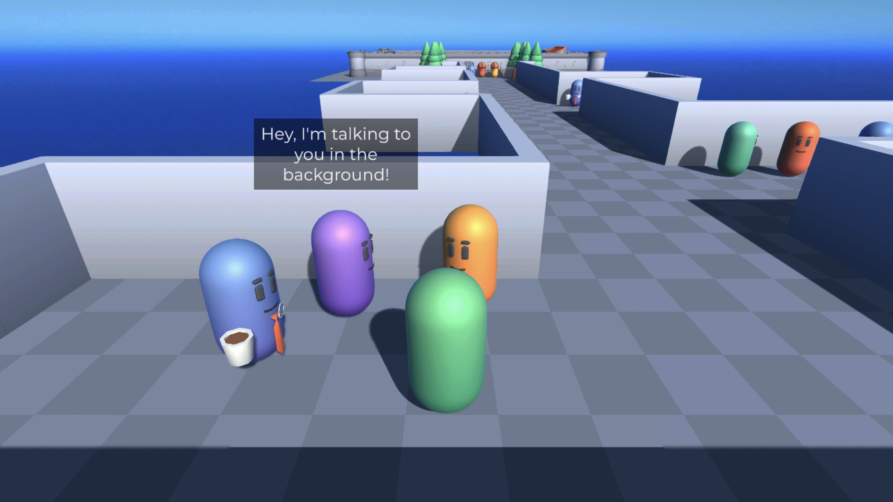
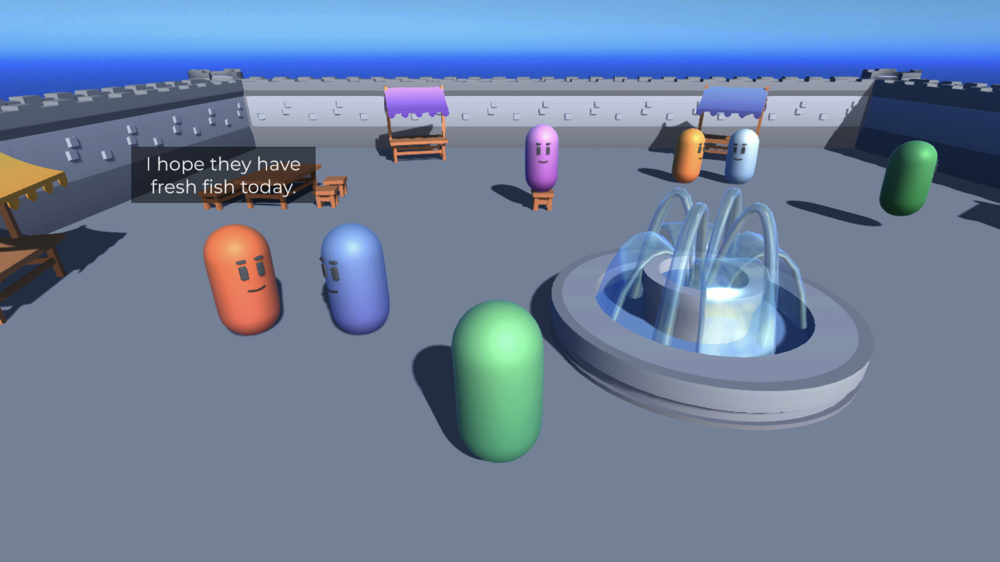

# Sample Guide: Background Chatter

One of the best ways to make a game's world come alive is to have characters engage in conversations with each other, not just with the player character. The **BackgroundChatter** sample demonstrates how you can use Yarn Spinner to create and manage these ambient conversations.

### Running Multiple Dialogue Runners

The Dialogue Runner is the core component that manages dialogue interactions in your scene. When a node runs, the Dialogue Runner sends lines and options to its Dialogue Presenters.&#x20;

The Line View and Option View presenters in the built-in prefab are designed to be _modal_ - they take center stage, assuming they have the player's full attention. During these conversations, the player is typically not moving around or performing other actions.

Background conversations, however, are _non-modal_: they happen while the player continues to explore and interact with the world. The player doesn't participate in these conversations, which proceed independently.

The most effective approach for implementing background conversations in Yarn Spinner is to create separate Dialogue Runners for each conversation. This approach offers several advantages:

* Each background Dialogue Runner can have dedicated Dialogue Presenters designed specifically for ambient conversations
* Background Dialogue Runners operate independently from the main "primary" Dialogue Runner
* You can manage multiple simultaneous background conversations as needed

All Dialogue Runners in your scene can share the same Yarn Project and Variable Storage, maintaining a consistent dialogue state.

### Designing Line Presenters for Background Conversations

Line Presenters for background conversations have different requirements than those used for primary player interactions. These presenters should:

* Make it clear that dialogue is taking place
* Remain unobtrusive enough to avoid interfering with the player's focus
* Usually avoid presenting options, since background conversations don't assume active player participation


As with all design patterns, there are exceptions. In Mass Effect 3, some background conversations between NPCs involved characters arguing over a topic. These conversations allowed the player to listen in and potentially interject, siding with one of the characters.


Since your game might feature multiple simultaneous conversations, we recommend creating one Dialogue Runner for each conversation in your scene, allowing them to run in parallel.

### The BackgroundChatter Sample

The BackgroundChatter sample demonstrates how to create an environment where the player can move freely while hearing ambient conversations in the background.

To play the sample, open the `BackgroundChatter/Main.unity` scene and press play. Use the WASD keys to move around and the Space key to initiate conversations with characters.

The sample features a sequence of background conversations, each demonstrating different aspects of this system. Explanation characters (identifiable by their ties and coffee cups) stand near each demonstration. Speaking with them provides details about what each conversation demonstrates.

#### Chatter Groups and ChatterGroupManager

In this sample, each background conversation is represented by a "Chatter Group" - a spherical volume in the game world that can trigger a specific dialogue node when the player enters it. Each Chatter Group contains:

* A Canvas with custom Line Presenters
* Text elements that float above speaking characters
* Player position tracking that cancels dialogue when the player leaves the volume

The Chatter Group Manager runs each Chatter Group on a timer, so that while the player remains within a group's volume, that group can potentially initiate dialogue.

#### Basic Background Conversation

The basic background conversation demonstrates a simple exchange between two characters. This conversation runs normally and cannot be interrupted by player actions.

#### Procedural Conversation

The procedural conversation demonstrates using two line groups to create a dynamic back-and-forth between characters. The first line group contains only questions, while the second contains generic replies that work with any question. This approach allows you to create numerous possible conversation combinations with minimal writing effort.


This conversation is inspired by the procedural conversations between stormtroopers in _Star Wars: Outlaws_, where pairs of characters would converse with one character making a statement and the second offering some form of agreement.


#### Interruptable Conversation

The interruptable conversation demonstrates how players can interrupt characters engaged in a background conversation. While these characters participate in their ambient dialogue, they remain interactable. When the player initiates interaction, the background conversation pauses to prevent overlap with the primary dialogue. After the player's conversation concludes, the background conversation resumes.

#### Player-Participating Conversation

This example shows how players can participate in what begins as a background conversation. When the player approaches the character, a conversation starts with the player as a participant. If the player leaves the Chatter Group's volume, the conversation ends and triggers an additional dialogue node. This allows the player character to deliver a parting line rather than abruptly ending the conversation.

#### Ongoing Conversation

This example demonstrates how background conversations can access variable storage and other Yarn Spinner features. When the player passes by these characters repeatedly, they progress through different parts of an ongoing conversation. This continuity is achieved by using a variable that updates each time the conversation runs.

#### Marketplace Scene

The marketplace scene showcases background conversations in a more gameplay-oriented scenario. As you explore this area, you'll encounter various types of background conversations demonstrated elsewhere in the sample.

