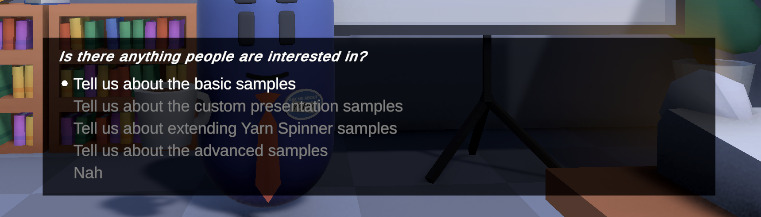

# Options Presenter

An **Options Presenter** is a [Dialogue Presenter](./) that displays options in a list, using Unity UI. When the **Dialogue Runner** encounters a set of options in your **Yarn script**, the **Options Presenter** will display them, wait for the user to select one of them, and then sends that choice back to the Dialogue Runner.

When this view receives options from the Dialogue Runner, it creates an instance of the Option Item you specify in the Option View Prefab property, and adds it as a child.


An Options Presenter only displays options, and doesn't display lines. You can use an additional Dialogue Presenter to handle these, like [Line Presenter](line-presenter.md) or a custom [Dialogue Presenter](custom-dialogue-views.md) of your own. We provide a default Line Presenter and Options Presenter.


### Inspector

| Property                 | Description                                                                                                                                                                                                   |
| ------------------------ | ------------------------------------------------------------------------------------------------------------------------------------------------------------------------------------------------------------- |
| Presenter Control             | The Canvas Group that the Options List View will control. The control will be made visible when the Options List View is displaying options, and inactive when not displaying options.                    |
| Option Parent | The node that options will be parented to. You can use a BoxContainer to automatically lay out your options. This node should ideally be a descendent of the Presenter Control so that it will be shown and hidden at the right times.|
| Option Item Prefab       | A packed scene containing an Option View. The Options List View will create an instance of this packed scene for each option that needs to be displayed.                                                      |
| Last Line Text           | A RichTextLabel node that will display the text of the last line that appeared before options appeared. If this is not set, or no line has run before options are shown, then this property will not be used. |
|Last Line Container | The CanvasItem that contains the Last Line Text. This object is set to visible when options run, a last line is available, and the last line has a character name. It is hidden when an option is selected. This field is optional, and will default to the same node as LastLineText if it is not specified.| 
| Show Unavailable Options | If this is turned on, then any options whose line condition has failed will still appear to the user, but they won't be selectable. If this is off, then these options will not appear at all.                |
| Pallete                  | An optional MarkupPallete resource. Used to represent a collection of marker names and colours.                                                                                                               |
|Use Fade Effect |If this is turned on, the alpha component of the Presenter Control's modulate color will be animated up and down when options appear, creating a fade-in and fade-out effect.                                                                  |
| Fade Up Duration                   | The amount of time that the Canvas Group will take to fade up when options appear, if Fade UI is turned on.                                                                                                          |
| Fade Down Duration                 | The amount of time that the Canvas Group will take to fade down when an option is selected, if Fade UI is turned on.                                                                                                 |