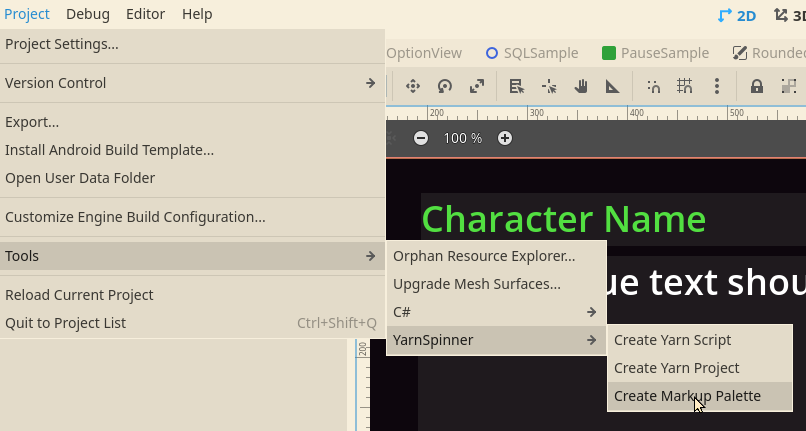
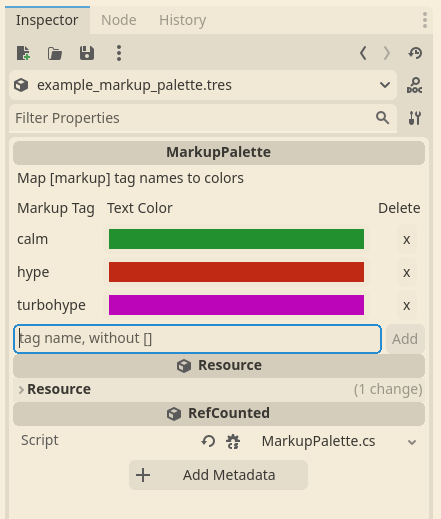
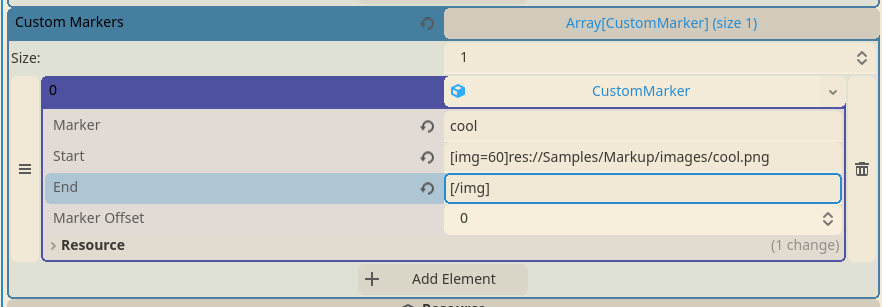
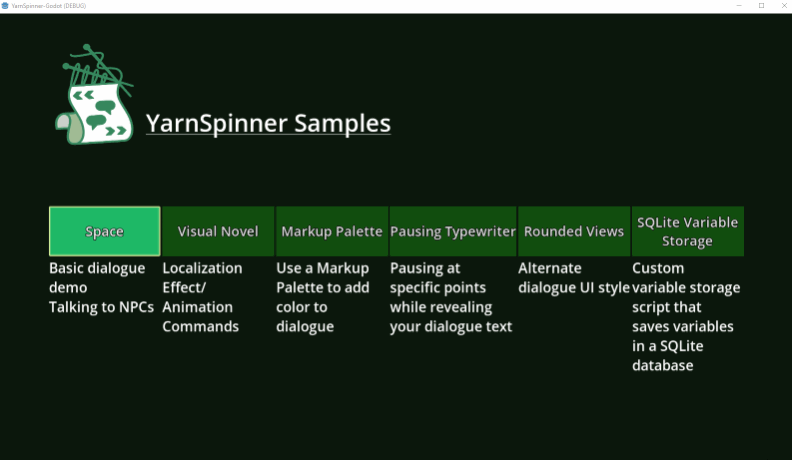

# Markup Palette

Markup Palettes provide a means of lightly theming your lines without requiring any code. Markup palettes use a script called the PaletteMarkerProcessor to replace markup with your desired content. The code for the PaletteMarkerProcessor is a good starting point for more advanced customization for your game.

In Godot, Markup Palettes are implemented as a custom C# Resource.

To get started, create a Markup Palette by selecting the menu item Project > Tools > YarnSpinner > Create Markup Palette.



Select a directory and filename to save your Markup Palette to.

Then, find your new palette in the Filesystem panel and double click it to open the inspector.




## Basic Markers 

Basic Markers in a markup palette are a shortcut to defining markup tags that change only the style of text within a markup tag, such as changing its color or whether the text is bold. These are stored in the palette in an array of `BasicMarker` C# resources.

You can add as many `BasicMarker` instances as you want to the palette's Basic Markers section, and change the Color field on the `BasicMarker` to assign the color for the tag. You can remove markers by clicking the delete button next to the BasicMarker resource.

## Custom Markers


 
The Custom Markers array in the Markup Palette holds `CustomMarker` resources which define text that will replace the beginning and end of a markup tag. Typically you will use this to insert BBCode into your line text to do things like display images or other effects. 

Custom Markers are more flexible than Basic Markers, but they require you to write the replacement content by hand rather than using configured preset options.

You can also specify a marker offset on each CustomMarker instance, which is used to compensate for inserting text into a line's content via replacement markup. If you use a CustomMarker, and other Yarn markup in the line isn't replaced quite as you expect, try setting the Marker Offset based on how many characters you are inserting into the line. 

## PaletteMarkerProcessor 

The `PaletteMarkerProcessor` is a script which takes your Markup Palette resource and uses it to replace any of your custom markup tags with your configured replacements. It reads each tag defined in Basic Markers and Custom Markers and registers replacements with your Line Provider. Since the replacement will be performed before any of your presenters receive the text, this system works with the built in Line Presenter and Options Presenter, as well as any custom presenter you might create. 

The replacements produced by the `PaletteMarkerProcessor` for both Basic Markers and Custom Markers is pre-defined and always the same for a given markup tag. If your markup replacement has to be more dynamic, or otherwise integrate with the rest of your game's code, you can use the `PaletteMarkerProcessor` as inspiration for how to write your own custom `ReplacementMarkupHandler` subclass. The `Markup` sample in the Yarn Spinner for Godot GitHub repository also contains an example of making another custom `ReplacementMarkupHandler`. 

To use your markup palette with these presenters, first add an instance of the `PaletteMarkerProcessor` node to your scene. Then, drag and drop the markup palette resource into the Palette field of the PaletteMarkerProcessor's inspector, and also set the Line Provider in its inspector to the Line Provider instance in your scene (likely a `TextLineProvider` unless you have created a custom line provider script). 

Then, when you use markup tags in your dialogue that match tags defined in your markup palette, the presenters will automatically replace your markup tags with the text styles and other replacements that you configured. 

```
M.C.: Like this. Rabbit! Wait, no. Let me try again. [pause=700/] ... [pause=300/] [rabbit/]! Nice. This one I did with a custom marker in my MarkupPalette.

Bob: does it [hype]work[/hype] with options though?

-> of [turbohype]course[/turbohype] it does
-> [calm]yes[/calm] it does
-> [hype]indeed[/hype]

Alice: [hype]neat, right?[/hype]
```

To see markup palettes in action, try out the [Markup sample](https://github.com/YarnSpinnerTool/YarnSpinner-Godot/tree/develop/Samples/Markup) in the Yarn Spinner for Godot repository.

<figure><figcaption></figcaption></figure>

This sample highlights:

* Using markup palettes to color text
* Using markup in dialogue
* Using action markup to trigger animations
* Displaying images in your presenter text via BBCode
