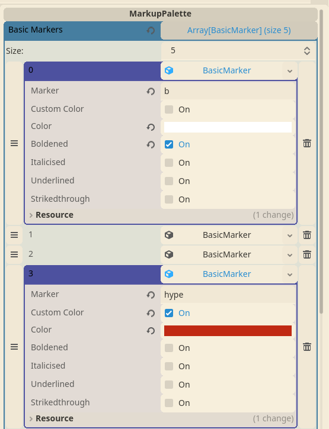

# Markup Palette

Markup Palettes provide a means of lightly theming your lines without requiring any code. The code for Markup Palettes inside of Line view present a good starting point for more advanced customization for your game.

In Godot, Markup Palettes are implemented as a custom C# Resource.

To get started, create a Markup Palette by selecting the menu item Project > Tools > YarnSpinner > Create Markup Palette.


Select a directory and filename to save your Markup Palette to.

Then, find your new palette in the Filesystem panel and double click it to open the inspector.



You can add as many tag names as you want to the palette, and click the color buttons next to each tag to assign the color for the tag. You can remove colors by clicking the X button next to the color button for the tag. You can also add additional attributes to the tag such as bold, italic, underlined, and strikethrough.

The built-in Line Presenter and Options Presenter both support the use of markup palettes to color your dialogue. To use your markup palette with these presenters, drag and drop the markup palette resource into the Palette field of the presenter's inspector.

Then, when you use markup tags in your dialogue that match tags defined in your markup palette, the presenters will automatically replace your markup tags with BBCode color tags.

```
Bob: does it [hype]work[/hype] with options though?

-> of [turbohype]course[/turbohype] it does
-> [calm]yes[/calm] it does
-> [hype]indeed[/hype]

Alice: [hype]neat, right?[/hype]
```

To see markup palettes in action, try out the [Markup Palette sample](https://github.com/YarnSpinnerTool/YarnSpinner-Godot/tree/develop/Samples/MarkupPalette) in the Yarn Spinner for Godot repository.

<figure><figcaption></figcaption></figure>

This sample highlights:

* Using markup palettes to color text
* Using markup in dialogue
