# Unreal Beta Quickstart

Welcome to Yarn Spinner for Unreal! In this tutorial, you'll build a third-person game in which the player can walk around and talk to characters.

[**Yarn Spinner for Unreal is available on GitHub**](http://github.com/YarnSpinnerTool/YarnSpinner-Unreal).


**Yarn Spinner for Unreal is in beta.**

Yarn Spinner for Unreal is currently at a beta stage of development, and there are a number of important caveats to know.

* **Windows support only.** Additional platforms will be added in future versions.
* **In-memory variable storage only.** Variables can be stored and retrieved, but they are not currently stored on disk.
* **Limited function support.**
  * The following functions are supported: `visited`, `visited_count`, `string`, `number`, `bool`.
* **String-only command dispatch.** Dispatching commands to functions is not implemented; however, when a command is run, the Dialogue Runner emits an `OnRunCommand` event that contains the command name and an array of its parameters.
* **Yarn Project importing takes longer than desired.** When you import a Yarn Project asset, it may take several seconds for the process to complete, during which time the Editor will not be responsive.
* **String tables may incorrectly cache in the Editor.** When you import a Yarn Project, the string table will be populated with its contents. If you make changes to the Yarn files and re-import the Yarn Project, the string table contents will update, but the editor may still hold the cached values from the earlier version, resulting in incorrect lines being displayed. As a workaround for this issue, play the game in Standalone mode. Quitting and relaunching the Editor will also reset this cache.


### Assumptions

This tutorial assumes the following things:

* You already know how to use Unreal Engine 5.3.
  * If you don't, Epic Games have a [very large collection of excellent introductory tutorials](https://dev.epicgames.com/community/unreal-engine/getting-started/games).
* You already know how to use Yarn Spinner.
  * If you don't, we suggest following our [Beginner's Guide](../../beginners-guide.md).

### Prerequisites

* [Unreal Engine 5.3](https://www.unrealengine.com/)
* [Visual Studio](https://www.visualstudio.com/)
* [Visual Studio Code](https://code.visualstudio.com/)
* [Yarn Spinner for Visual Studio Code](https://marketplace.visualstudio.com/items?itemName=SecretLab.yarn-spinner)
* [Demo assets](https://downloads.yarnspinner.dev/get/ue-tutorial/YarnSpinner-Unreal-Tutorial-Assets-20240308.zip)

### Create the Project

* Create a new Third Person game project.
  * Create a Blueprint project.
  * Include the Starter Content.
* Hit the play button and use WASD to run around, and spacebar to jump. Press escape when you're done.


Yarn Spinner for Unreal supports C++ projects as well, but for this tutorial, we'll use Blueprints.


### Add Yarn Spinner

* Close the Unreal Editor.
* Open your project's folder in Explorer.
* Create a new folder called "Plugins".
* Clone the [Yarn Spinner for Unreal repo](http://github.com/YarnSpinnerTool/YarnSpinner-Unreal) into the Plugins folder you just created.
* Open the project again.
  * Unreal Editor will say that the modules YarnSpinner and YarnSpinnerEditor are missing, and ask if you'd like to rebuild them. Choose Yes.
  * Wait for the editor to launch.

### Add the Yarn Content

* Unzip the demo assets into a folder on your computer.
* Drag and drop the assets into the DemoDialogue folder.


You may see a message from Unreal saying that `.yarn` files are unsupported. This is expected, and doesn't indicate a problem - the `.yarnproject` asset is what we'll be working with.


* Open the File menu, and choose Save All.

### Set Up Interaction

We'll set up the scene so that there's a character you can walk up to and talk to.

#### Create the `Interactable` Component

* In the Content Drawer, go to the DemoBlueprints folder you created earlier.
* Right click inside the folder, and create a new Blueprint Class.
  * Make it a subclass of Actor Component, and name it `AC_Interactable`.
* Open the newly created blueprint.
* Add a new variable called Yarn Node, of type Name. Make it Instance Editable.
* Compile, save, and close the blueprint.

#### Add The Interactable Character

* Open the Content Drawer, and navigate to **Characters** / **Mannequins** / **Meshes**.
* Drag SKM\_Manny into the scene.
  * Place it in front of the Player Start, and rotate it to face the Player Start.
  * Select it, and in the Details pane, set the Anim Class to ABP\_Manny.
  * The character will now be playing an idle animation.

<figure><figcaption><p>The Manny character, placed in front of the player start.</p></figcaption></figure>

* In the Details pane, click Add, and search for the `AC_Interactable` component you added earlier.
  * Add it to the actor.
  * Set the Yarn Node to 'Gary'.
* Next, select the character's SkeletalMeshComponent, and add a Capsule Collision.
  * Update the Capsule's Transform:
    * Set the Location to (0, 0, 96).
  * Update the Capsule's Shape:
    * Set the Capsule Half Height to 96.
    * Set the Capsule Radius to 48.

<figure><figcaption><p>The capsule set up on the Manny character.</p></figcaption></figure>

#### Create an 'Interact' Input Action

* In the Content Drawer, open **ThirdPerson** / **Input** / **Actions**.
* Right click, and choose Input -> Input Action.
  * Name the new action `IA_Interact`.
* Go to the **ThirdPerson** / **Input** folder, and open the IMC\_Default asset.
* In the Mappings section, click the plus button to add a new mapping.
  * In the drop-down menu that appears, select the IA\_Interact asset you just created.
  * Expand the binding, and click the Keyboard button that appears.
  * Press the `E` key, and the action will be bound to the E key on your keyboard.
* Close the window, and save all files.

#### Add Interaction to the Player Character

* In the Content Drawer, open **ThirdPerson** / **Blueprints**.
* Open the BP\_ThirdPersonCharacter blueprint.
* In the Viewport, find the Capsule Component in the Components tab.
  * Click the Add button, and choose Sphere Collision.
* Name the newly added component `InteractionSphere`.
* In the details pane, set up the sphere:
  * Set Transform -> Location to (80, 0, 20).
  * At the bottom of the Details pane, in the Events section, create events for On Component Begin Overlap and On Component End Overlap.
* Add a new variable. Name it `CurrentInteractable`, and set its type to 'AC Interactable'.
* Add another new variable. Name it `DialogueRunner`, and set its type to `DialogueRunner`. Make it Instance Editable.
* In the Event Graph, right click and search for IA\_Interact.
  * Add the IA\_Interact action to the graph.
* Update the Event Graph to find and store the Dialogue Runner in the scene. Add the following nodes to the end of the existing BeginPlay event:

<figure>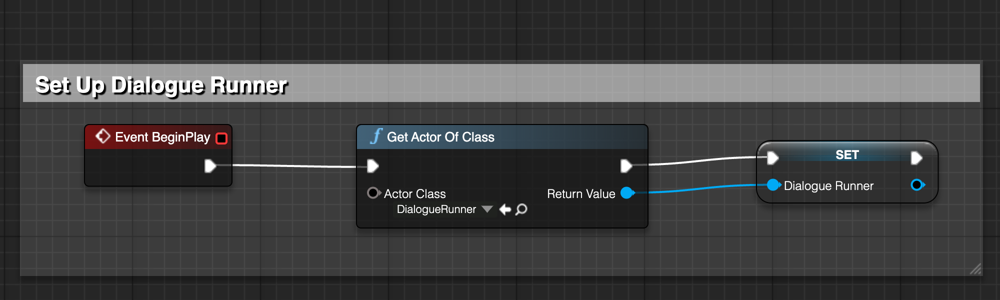<figcaption></figcaption></figure>



* Update the event graph to set and clear the CurrentInteractable variable when the player approaches an Interactable component:

<figure>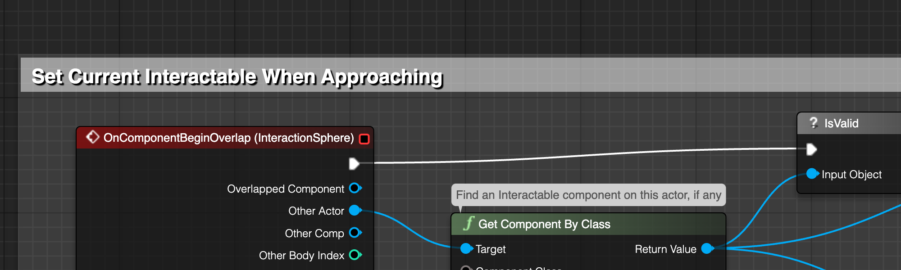<figcaption></figcaption></figure>



<figure>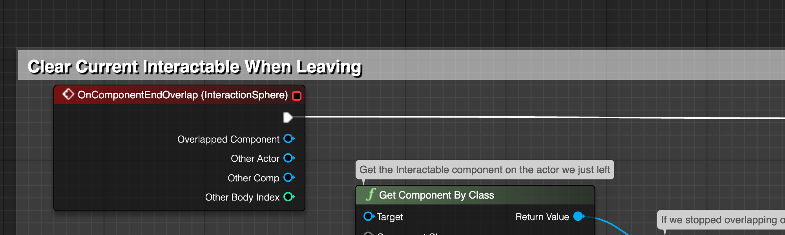<figcaption></figcaption></figure>



* Next, update the event graph to start the dialogue when the Interact key is pressed.
* You'll need to click the disclosure arrow at the bottom of the IA Interact event to reveal the Started pin.

<figure>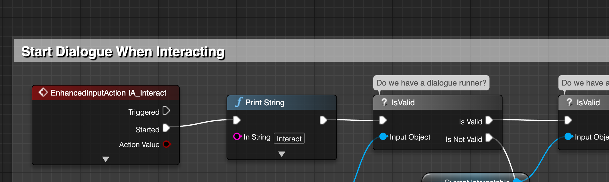<figcaption></figcaption></figure>



* Finally, compile, save and close the blueprint.

### Create The Dialogue Runner

* In the Content Drawer, open **DemoBlueprints**.
* Right click and create a new Blueprint Class.
* Expand the 'All Classes' dropdown, and search for Dialogue Runner. Select Object -> Actor -> Dialogue Runner.
* Name the new blueprint `BP_GameDialogueRunner`.
* Drag the blueprint into the scene.
* In the Content Drawer, open **DemoDialogue**.
  * Select the Dialogue Runner you just added to the scene.
  * Drag the DemoProject Yarn Project into the dialogue runner's Yarn Project field.

We can now quickly test the game to make sure that interaction is working, and that Yarn Spinner can access your dialogue.

* Click the Play button, and walk up to the interactable character.
*   Press the E key to talk to them. No lines will appear, but if you open the Output Log and scroll up, you'll see lines like this:

    ```
    Warning: DialogueRunner received line with ID "line:gary-0". Implement OnRunLine to customise its behaviour.
    ```

    This tells us that the line is sucessfully running, but we're not doing anything with it yet.

### Implement Line Delivery

When Yarn Spinner imports the Yarn Project, it reads all of the lines in that project's Yarn files, and adds them to your game's localisation string tables. It also looks for assets for the each line, like voice-over audio clips. When a Dialogue Runner runs a line, you can access the localised line text, as well as any localised lines.

In the content that you imported earlier, the lines are written in English, and each line has an audio clip containing English voice-over. We'll set up the Dialogue Runner so that when a line is run, the voice-over plays. When the voice-over is finished, the dialogue runner will proceed to the next piece of content.

* Open the BP\_GameDialogueRunner blueprint.
* Click Open Full Blueprint Editor.
* Right click the Event Graph and choose Add Event -> Dialogue Runner -> Event On Run Line.
* Add the following nodes to the event:

<figure>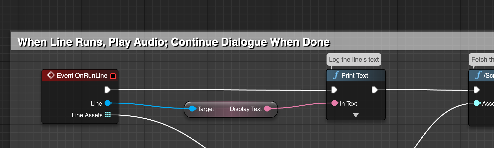<figcaption></figcaption></figure>



* We'll also add an event to handle options. This will start empty, but we'll add to it.

<figure>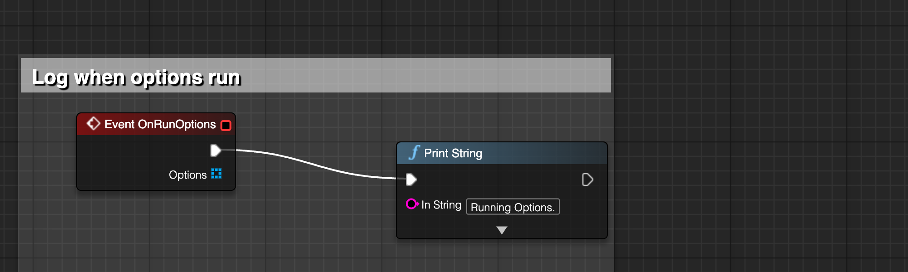<figcaption></figcaption></figure>



* Compile, save, and close the blueprint.
* Play the game.
  * Walk up to the character, and press the E key.
  * You'll hear the voice-over for the lines.

### Create The Option Selector

Next, we'll set up option selection. Because choosing an option requires some kind of user input, we'll need to build a way for the user to choose one of the available options.

In this tutorial, we'll create buttons on screen for each option, and let the user click one of them to choose the option.

#### Create the Option Button

* In the Content Drawer, go to **DemoBlueprints**.
* Right click and choose User Interface -> Widget Blueprint.
  * Click User Widget.
  * Name the new blueprint `WBP_OptionButton`
  * Double click it to open.
* Go to the Graph view.
* Add a new variable.
  * Set its name to Option, and set its type to Option.
  * In the Details pane, turn on Instance Editable, and Expose on Spawn.
* Go to the Designer view.
* Drag a new Button into the Canvas.
  * It will be huge, but that's ok - its size will be controlled by the option list.
* Drag a new Text Block into the Button.
  * Name the Text Block 'Label'.
  * In the Details panel, turn on Is Variable for the Text Block.
  * Find the Content -> Text field, and open the Bind dropdown.
    * Choose Option -> Line -> Display Text.
* Select the Button.
* In the Details panel, find the On Clicked event, and click the plus button.
* Add a new Event Dispatcher.
  * Name it On Option Selected.
  * Add a new Input to the event dispatcher.
    * Set its name to Option, and its type to Option.
* Drag the On Option Selected event dispatcher into the Event Graph, and choose 'Call' from the popup that appears.
* Connect the On Clicked event for the button to the On Option Selected call:

<figure>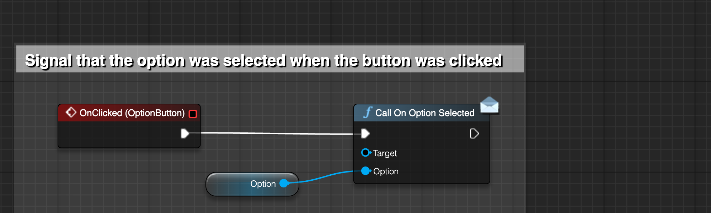<figcaption></figcaption></figure>



* Compile, save and close the blueprint.

#### Create the Option Selector

Next, we'll create the option selector. The option selector will take an array of Option objects, and create Option Button widgets for each of them. It'll also configure the Option Buttons so that when the user clicks on a button, the corresponding dialogue option will be selected. It'll _also_ make the Player Controller change to UI mode when the options are present, so that moving the mouse towards the buttons doesn't rotate the camera.

* In the Content Drawer, go to **DemoBlueprints**.
* Right click and choose User Interface -> Widget Blueprint.
  * Click User Widget.
  * Name the new blueprint `WBP_OptionSelector`
  * Double click it to open.
* Go to the Designer view.
* Drag a Scroll Box into the canvas.
  * In the Details panel, turn on Is Variable.
  * Rename the variable to 'ScrollBox'.
* Go to the Graph view.
* Add a new variable.
  * Call it PlayerController, and set its type to PlayerController.

Next, we'll create the event that runs when an option has been selected.

* Add a new Custom Event:
  * Right click the Event Graph.
  * Search for Add Custom Event, and add it to the Event Graph.
  * Name the new Custom Event `OptionSelected`.
* Add an Input to the new event named Option, with the type Option.
  * Set up the event:

<figure>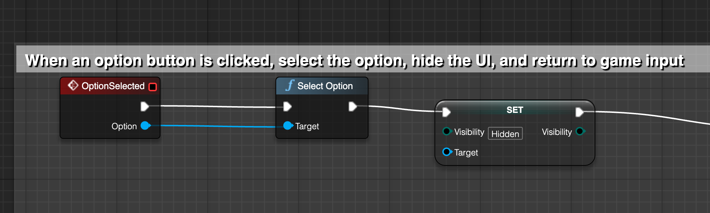<figcaption></figcaption></figure>




**Compile the blueprint before continuing!**

If you don't, you won't be able to connect the buttons you're about to create to the OptionSelected event.


* Right click the Event Graph, and create a new Custom Event called `ClearButtons`.
  * Set up the event:

<figure>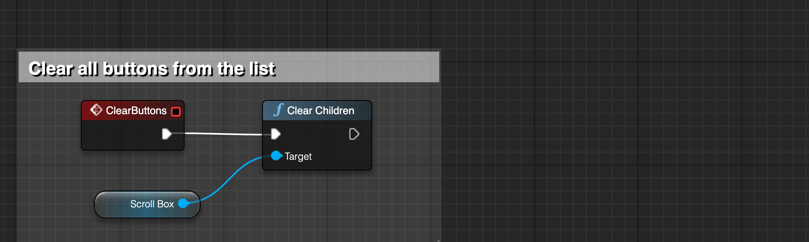<figcaption></figcaption></figure>



* Right click the Event Graph, and create a new Custom Event called CreateOptionButtons.
  * Add an Input to the new event named Options, with the type Array of Option.
  * Set up the event:

<figure>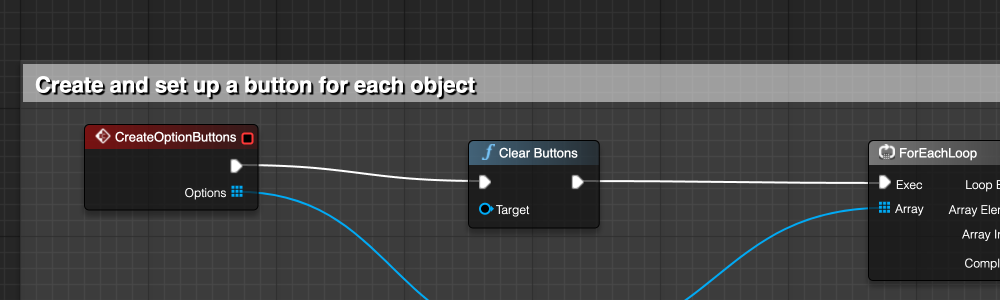<figcaption></figcaption></figure>



* Right click the Event Graph, and create a new Custom Event called `ShowOptions`.
  * Add an Input to the new event named Options, with the type Array of Option.
  * Add an Input to the new event named PlayerController, with the type PlayerController.
  * Set up the event:

<figure>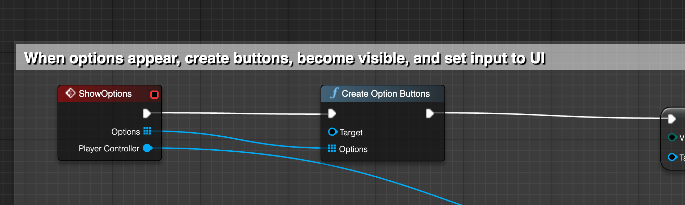<figcaption></figcaption></figure>



* Finally, right click the Event Graph, and add a Construct event (if one is not already present).
  * Set up the event:

<figure>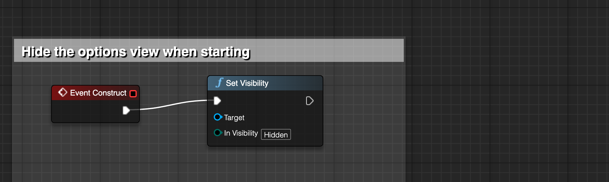<figcaption></figcaption></figure>



* Compile, save and close the blueprint.

### Use the Option Selector in the Dialogue Runner

* Open the BP\_GameDialogueRunner blueprint.
* Add a new variable.
  * Name it `OptionSelector`, and make its type `WBP_OptionSelector`.
* Right click the Event Graph, and add a `BeginPlay` event, if one isn't already present.
  * Set up the event:

<figure><figcaption></figcaption></figure>



* Delete the On Run Options event you created earlier, and replace it with a new one.
  * Set up the event:

<figure>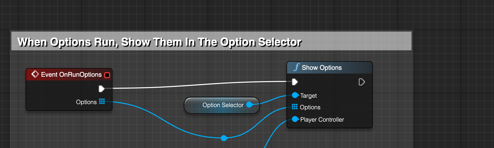<figcaption></figcaption></figure>



* Compile, save and close the blueprint.
* Play the game.
  * Walk up to the character, and press the E key to talk to them.
  * When the conversation reaches the options, buttons will appear.
  * Click on one of them to advance the conversation.
