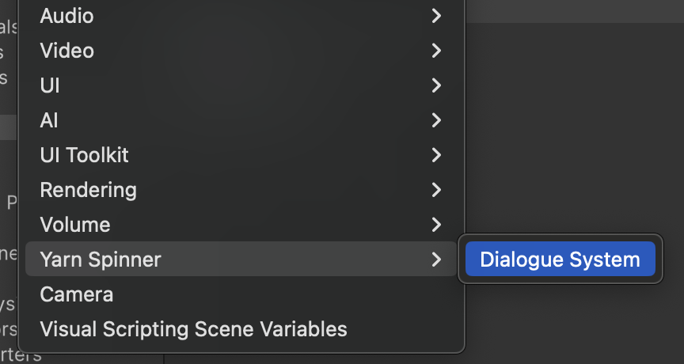

# Dialogue Runners and Systems

The **Dialogue Runner** is the bridge between the dialogue that you've written in your Yarn Spinner Scripts and the other components of your game. It's a component that's responsible for loading, running and managing the contents of a [Yarn Project](../yarn-projects.md), and for delivering the content of your Yarn Spinner Scripts to the other parts of your game, such as your user interface.

You can easily add a **Dialogue Runner** to your scene as part of a prefab that we supply named **Dialogue System**.

## Adding a Dialogue System to a Unity Scene

Adding a Dialogue System is the first step in adding Yarn Spinner-powered dialogue to a Scene in Unity.&#x20;

To use a Dialogue System, you add it to a game object in your scene, connect it to Dialogue Presenters, and provide it with a [Yarn Project](../yarn-projects.md) to run.&#x20;

With the [Yarn Spinner for Unity installed](../installation-and-setup/) in your Unity project, you can add a Dialogue System to your Unity Scene by choosing the **GameObject menu -> Yarn Spinner -> Dialogue System** or by right-clicking in the Hierarchy and choosing **Yarn Spinner -> Dialogue System**.

<figure><figcaption>
Adding a Dialogue System to the Scene.
</figcaption></figure>

With the Dialogue System added to the Scene, you'll find it in the Hierarchy:

<figure><figcaption>
A Dialogue System in the Hierarchy.
</figcaption></figure>

We'll discuss the other components and GameObjects that are provided inside our Dialogue System shortly, as the Component you need to understand first is the Dialogue Runner itself.&#x20;

If you select the Dialogue System in the Hierarchy and look at the Inspector, you'll find the parameters for the Dialogue Runner.&#x20;

To function, the Dialogue Runner needs one primary thing: a Yarn Project.

<figure><figcaption>
The Inspector, showing the Dialogue Runner component of the Dialogue System.
</figcaption></figure>

When you want to start running the dialogue in your game, you call the Dialogue Runner's StartDialogue method. When you do this, the Dialogue Runner will begin delivering lines, options and commands to its Dialogue Views.

You can also tell it to start automatically by choosing the relevant checkbox in the Inspector.

The Dialogue Runner is designed to work with other components of Yarn Spinner for Unity:

* The contents of your dialogue are delivered to your [Dialogue Presenters](dialogue-view/).
* The values of [variables](../../write-yarn-scripts/scripting-fundamentals/logic-and-variables/) are stored and retrieved using the Dialogue Presenter's [Variable Storage](../../yarn-spinner-for-other-engines/godot/components/variable-storage/).
* Content that users should see, including the text in their current language, voice over clips, and other assets, are retrieved using the Dialogue Runner's [Line Provider](line-provider/).


The bare-bones minimum that a Dialogue Runner needs in order to work is a Yarn Project and at least one Dialogue Presenter.&#x20;

If you don't set up a Variable Storage or a Line Provider, the Dialogue Runner will use temporary placeholders.

If your game is using the [Unity Localization system](../assets-and-localization/unity-localization.md), your Dialogue Runner must use a [Unity Localised Line Provider](line-provider/unity-localised-line-provider.md).


### Inspector

| Property                      | Description                                                                                                                                                                                                                                                                                                                                                                                     |
| ----------------------------- | ----------------------------------------------------------------------------------------------------------------------------------------------------------------------------------------------------------------------------------------------------------------------------------------------------------------------------------------------------------------------------------------------- |
| Yarn Project                  | The [Yarn Project](../yarn-projects.md) that this Dialogue Runner is running.                                                                                                                                                                                                                                                                                                                   |
| Variable Storage              | The [Variable Storage](../../yarn-spinner-for-other-engines/godot/components/variable-storage/) to store and retrieve variable data from. If you do not set this, the Dialogue Runner will create an [In Memory Variable Storage](variable-storage/in-memory-variable-storage.md) for you at runtime.                                                                                           |
| Line Provider                 | The [Line Provider](line-provider/) to use to get user-facing content for each line. If you do not set this, the Dialogue Runner will create a [Text Line Provider](line-provider/text-line-provider.md) for you at runtime.                                                                                                                                                                    |
| Dialogue Presenters           | The [Dialogue Presenters](dialogue-view/) to send lines, options and commands to.                                                                                                                                                                                                                                                                                                               |
| Start Automatically           | 
If this is turned on, the Dialogue Runner will start running the node named Start Node when the scene starts. 

If this is not turned on, you will need to call <a href="../../api/csharp/yarn.unity/dialoguerunner/dialoguerunner.startdialogue-system.string.md">StartDialogue</a> to start running.
                                                                       |
| Start Node                    | If Start Automatically is turned on, the Dialogue Runner will start running this node when the scene starts. (If your Yarn Project does not contain a node with this name, an error will be reported.)                                                                                                                                                                                          |
| Run Selected Options as Lines | If this is turned on, when the user chooses an option, the Dialogue Runner will run the selected option as if it were a Line.                                                                                                                                                                                                                                                                   |
| Verbose Logging               | If this is turned on, the Dialogue Runner will log information about the state of each line to the Console as it's run.                                                                                                                                                                                                                                                                         |
| On Node Start                 | A Unity Event that's fired when the Dialogue Runner begins running a new node. This may be fired multiple times during a dialogue run.                                                                                                                                                                                                                                                          |
| On Node Complete              | A Unity Event that's fired when the Dialogue Runner reaches the end of a node. This may be fired multiple times during a dialogue run.                                                                                                                                                                                                                                                          |
| On Dialogue Complete          | A Unity Event that's fired when the Dialogue Runner stops running dialogue.                                                                                                                                                                                                                                                                                                                     |
| On Command                    | A Unity Event that's fired when a Command is encountered. This will only be called if no other part of the system has already handled the command, such as command handlers registered via [YarnCommand](../../api/csharp/yarn.unity/yarncommandattribute/) or [AddCommandHandler](../../api/csharp/yarn.unity/dialoguerunner/dialoguerunner.addcommandhandler-system.string-system.action.md). |
