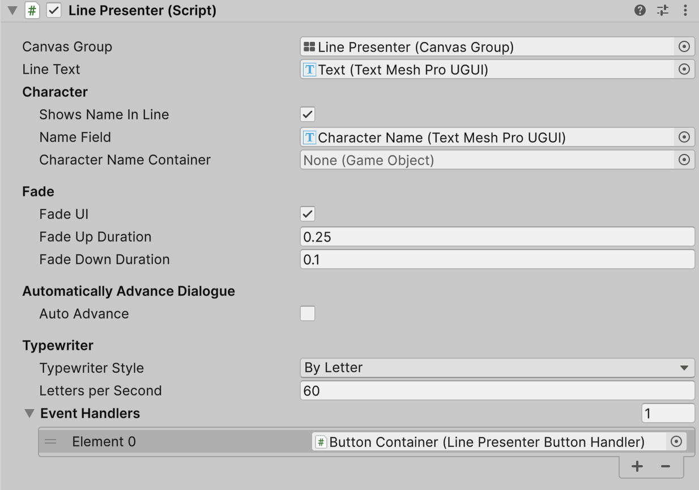

# Line Presenter

A **Line Presenter** is a [Dialogue Presenter](./) that displays a single line of dialogue inside a Unity UI canvas. When the **Dialogue Runner** encounters a line in your **Yarn Script**, the **Line Presenter** will display it, wait for the user to indicate they're done reading it, and then dismiss it.


A Line Presenter only displays lines, and doesn't display options. You can use an additional Dialogue Presenter to handle these, like [Options Presenter](options-presenter.md) or a custom [Dialogue Presenter](custom-dialogue-views.md) of your own. We provide a default Line Presenter and Options Presenter.


### Showing the Character's Name

If a line contains a character's name at the start, a Line Presenter can be configured to show the name in a separate text view to the line text itself. If the Character Name Text property is connected to a TextMeshPro Text object, then the character's name will appear in this object.

<figure><figcaption></figcaption></figure>

If you don't attach a Text object to the Character Name Text property, you can choose to either show the character name as part of the line (that is, in the Line Text view), or don't show it all.

### Presenting Lines with Visual Effects

A Line Presenter can be configured to use visual effects when presenting lines.

* You can choose to have the Line Presenter fade in when a line appears, and fade out when the line is dismissed.
* You can choose to have the text of the line appear, one letter at a time, with a "typewriter" effect.

<figure><figcaption></figcaption></figure>

### Continuing to the Next Line

The Dialogue Runner will automatically proceed to the next piece of content once all Dialogue Presenters have reported that they've finished with a line.

If the 'Auto Advance' option on a Line Presenter is turned on, then the Line Presenter will signal that it's done with a line as soon as all visual effects have finished.

If 'Auto Advance' is turned off, then the Line Presenter will not signal that it's done when the effects have finished, and the line's delivery will stop.

To make the Line Presenter finish up, you can call `RequestHurryUpLine` on the Dialogue Runner. This will not end the current line, but will send a signal to all Line Presenters that it should finish displaying its content quickly. To move onto the next line, you can call the method `RequestNextLine` on the Dialogue Runner.

The supplied Line Presenter has an arrow button at the bottom. Clicking this will call `RequestNextLine` on the Dialogue Runner:

<figure><figcaption></figcaption></figure>

### Inspector

| Property | Description |
| -------------------------------- | ----------------------------------------------------------------------------------------------------------------------------------------------------------------------------------------------------------------------------------------------------------------------------------------------------------------------- |
| Canvas Group | The Canvas Group that the Line Presenter will control. The Canvas Group will be made active when the Line Presenter is displaying a line, and inactive when not displaying a line. |
| Line Text | A TextMeshPro Text object that the text of the line will be displayed in. |
| Character: Shows Name In Line | If this is turned on, lines that contain a character's name will display the name in the Line Text section. If it is turned off, character names will not be shown in the Line Text. |
| Character: Name Field|A TextMeshPro Text object that will display the name of the character currently speaking the line.|
| Character: Character Name Container|A game object that will be made active when a line contains a character name, and inactive when it doesn't. The Name Field should be a child of this object.|
| Fade: Fade UI | If this is turned on, the Line Presenter will fade the opacity of the Canvas Group from 0% to 100% opacity when lines appear, and fade back to 0% when lines are dismissed. |
| Fade: Fade Up Duration | The duration of the Fade effect when fading a new line in, in seconds. If this is zero, the line will appear immediately. |
| Fade: Fade Down Duration | The duration of the Fade effect when fading a line out, in seconds. If this is zero, the line will disappear immediately. |
| Auto Advance | If this is turned off, the Line Presenter will finish presenting the line, and then wait. This is useful for games where the user has control over the timing of lines of dialogue. If this is turned on, the Line Presenter will signal to the Dialogue Runner that it's done showing the line once all animations are complete. |
| Delay before Advancing | If Auto Advance is turned on, the Line Presenter will wait this many seconds after all animations are complete before signalling that it's done showing the line. This option is only available when Auto Advance is turned on. |
| Typewriter Style| Controls the way that the typewriter will present the text of the line.<ul><li>**Instant:** The text will appear all at once.</li><li>**By Letter:** The text will appear at a fixed rate of letters per second. You can configure the speed by adjusting the Letters Per Second rate that appears when the typewriter is in this style.</li><li>**By Word:** The text will appear one word at a time, at a fixed rate of words per second. You can configure the speed by adjusting the Words Per Second rate that appears when the typewriter is in this style.</li><li>**Custom:** You can provide a game object that has a component that implements the [`IAsyncTypewriter`](/docs/api/csharp/yarn.unity.iasynctypewriter.md) interface, for full control over how the typewriter works.</ul>
|Event Handlers|A list of [ActionMarkupHandler](/docs/api/csharp/yarn.unity.actionmarkuphandler.md) objects that will be notified when certain events (like the typewriter starting, characters appearing, and the typewriter finishing) occur. |
