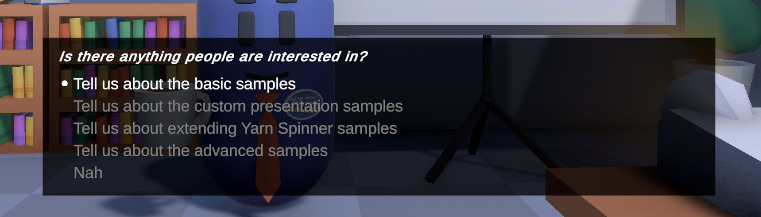
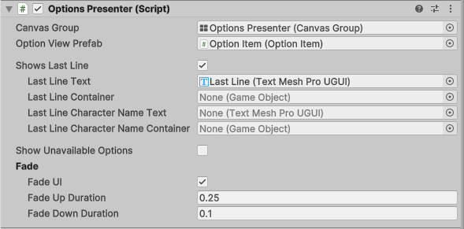

# Options Presenter

An **Options Presenter** is a [Dialogue Presenter](./) that displays options in a list, using Unity UI. When the **Dialogue Runner** encounters a set of options in your **Yarn script**, the **Options Presenter** will display them, wait for the user to select one of them, and then sends that choice back to the Dialogue Runner.

When this view receives options from the Dialogue Runner, it creates an instance of the Option Item you specify in the Option View Prefab property, and adds it as a child.


An Options Presenter only displays options, and doesn't display lines. You can use an additional Dialogue Presenter to handle these, like [Line Presenter](line-presenter.md) or a custom [Dialogue Presenter](custom-dialogue-views.md) of your own. We provide a default Line Presenter and Options Presenter.


### Inspector

| Property                           | Description                                                                                                                                                                                                          |
| ---------------------------------- | -------------------------------------------------------------------------------------------------------------------------------------------------------------------------------------------------------------------- |
| Canvas Group                       | The Canvas Group that the Options List View will control. The Canvas Group will be made active when the Options List View is displaying options, and inactive when not displaying options.                           |
| Option View Prefab                 | A prefab containing an Option View. The Options List View will create an instance of this prefab for each option that needs to be displayed.                                                                         |
| Shows Last Line                    | If this is turned on, the Options Presenter will show the text of the last line that ran before options appeared. This can be useful when you want to give context to a collection of options.                       |
| Last Line Text                     | A TextMeshPro Text object that will display the text of the last line that appeared before options appeared. This field only appears when Shows Last Line is enabled.                                                |
| Last Line Container                | The game object that contains the Last Line Text. This object is set to active when options run and a last line is available, and is set to inactive when an option is selected.                                     |
| Last Line Character Name Text      | A TextMeshPro Text object that will display the character name found in the last line, if one is available.                                                                                                          |
| Last Line Character Name Container | The game object that contains the Last Line Text. This object is set to active when options run, a last line is available, and the last line has a character name. It is set to inactive when an option is selected. |
| Show Unavailable Options           | If this is turned on, then any options whose line condition has failed will still appear to the user, but they won't be selectable. If this is off, then these options will not appear at all.                       |
| Fade UI                            | If this is turned on, the alpha value of the Canvas Group will be animated up and down when options appear, creating a fade-in and fade-out effect.                                                                  |
| Fade Up Duration                   | The amount of time that the Canvas Group will take to fade up when options appear, if Fade UI is turned on.                                                                                                          |
| Fade Down Duration                 | The amount of time that the Canvas Group will take to fade down when an option is selected, if Fade UI is turned on.                                                                                                 |
