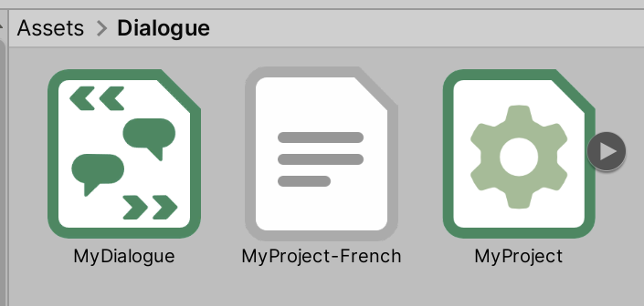

# Importing Yarn Files

There are two important kinds of files you'll use when working with Yarn Spinner for Unity:

* [Yarn Projects](yarn-projects.md) are files that link your Yarn Scripts together, and are used by the Dialogue Runner.
* [Yarn Scripts](yarn-scripts.md) are files that contain your written dialogue.

