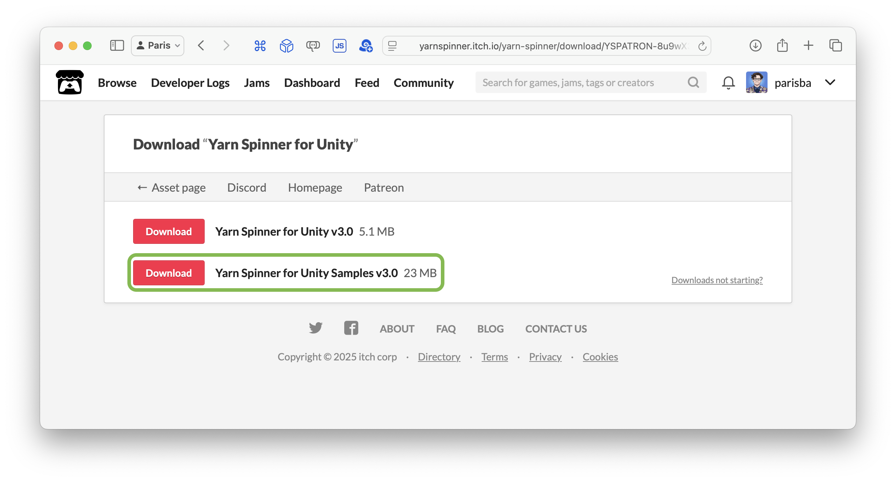

# Samples

Yarn Spinner for Unity ships with a range of samples covering common patterns for things you might want to do in your game.


From Yarn Spinner 3, the samples have been removed from the main repository and made a standalone package, so you'll need to manually install their package.

We did this because as the samples were growing they were becoming a larger and larger portion of the install, this was essentially bloating an install of Yarn Spinner while at the same time making development slower and more annoying.

The samples are a necessary element of Yarn Spinner, so instead of being treated like an afterthought they have been spun out into their own thing. Now they can be developed, improved, tested, have their own dependancies, and share a common sample codebase without needing to impact the rest of Yarn Spinner, meaning more—and better—samples than in the past.


<figure><figcaption></figcaption></figure>

## Adding the Samples Package to a Project

To install the Yarn Spinner for Unity Samples, you'll need to have a Unity project with Yarn Spinner for Unity installed, so head over to [installation-and-setup](../installation-and-setup/ "mention") first.&#x20;

**Once** **Yarn Spinner for Unity is installed, you can install the Yarn Spinner for Unity Samples Package**.

The best way to install the samples is to use the **Samples button** on the inspector of any Dialogue Runner, Yarn Project, or Yarn Script, or by choosing the Window menu -> Yarn Spinner -> and clicking **Install Samples Package**.

Clicking on this will work out the best way to install the samples depending on how you installed Yarn Spinner itself.


The samples may take a little while to install as they are quite large.


### Manually Installing the Samples

While the best way to install samples is the above, depending on your environment and device setup this might not be possible. In those circumstances you will need to manually install the samples, which is what this section is about.

How you manually install the Samples depends on how you installed Yarn Spinner:



The Yarn Spinner Samples are another Unity Asset Store asset.

This package is free but does have a dependancy on the main Yarn Spinner for Unity asset.

1. Open your browser and navigate to [https://assetstore.unity.com/packages/slug/319418](https://assetstore.unity.com/packages/slug/319418)
2. Click on the "Add to My Assets" button.

Your browser should now offer a popup asking if you want to open the samples in Unity.

3. Click on the Open in Unity button.

The asset store will now bounce you back to Unity and start installing the samples.



The Yarn Spinner Samples are available on Itch as part of the Yarn Spinner for Unity asset.

1. Open your browser and navigation to https://yarnspinner.itch.io/yarn-spinner

At the top of the page you should see a little section telling you you own the asset and offering a "Download" button.

2. Click on the "Download" button and it will take you to the Download page.

3. Click on the "Download" button for the second bundle and save it some where convenient.
4. Open the downloaded `unitypackage` and import the package into your Unity project.




The samples are just a standard unity package so if you have a workflow around packages you can adopt the samples packages to that workflow.


1. Inside your browser navigate to the samples site: https://github.com/YarnSpinnerTool/YarnSpinner-Unity-Samples
2. Click on the Code button and from the dropdown select the Download Zip option

3. Save this zip somewhere useful and unzip it

This folder now contains the samples package and it's time to add it to your Unity project.

4. Back inside Unity open the package manager from the menu `Windows -> Package Manager`
5. In the top left corner press the `+` button and from the dropdown that appears select `Install package from disk`

6. Navigate to where you downloaded and unzipped the samples and select the `package.json` file inside that folder

Unity will now install the samples project after a little while.\
Once it is done you can now browse and install the samples directly from the package manager.

7. select the samples package in the middle column and click on the Samples tab in the main window.

And just like that you can now install and explore the samples!




Adding the Yarn Spinner Samplesfor Unity package to your Unity project **does not give you access to the samples**. You must install the Samples you want after adding the Yarn Spinner


Once the Yarn Spinner Samples package is installed in your project, you can install each individual Sample by opening the Unity Package Manager through the Window menu -> Package Manaing, locating the Yarn Spinner Samples package, and switching to the Samples tab:

<figure><figcaption>
Locating the Yarn Spinner Samples in the Unity Package Manager, after installing the Yarn Spinner Samples Package into a project.
</figcaption></figure>

## Accessing a Sample

To work with each individual Yarn Spinner for Unity Sample, click the Import button next to the Sample that you want to install, inside the Unity Package Manager. For example, to add the [Feature Tour](feature-tour.md) sample to the project, click its Import button:

<figure><figcaption>
Click the Import button next to the Sample you want to install.
</figcaption></figure>

You'll find the Sample in the Project pane:

<figure><figcaption></figcaption></figure>

You can open the Unity Scene (in this case `Main`) to explore the sample.

## List of Yarn Spinner for Unity Samples

* [Welcome](intro.md) - a small scene in which a character explains Yarn Spinner's inbuilt samples and what each of the others include.
* [Feature Tour](feature-tour.md) - walks through the various major features of Yarn Spinner.
* [Basics Storylets and Saliency](basics-storylets-and-saliency.md) - demonstrates the creation of pools of lines or nodes which can be drawn from based on current game state to deliver dynamic, contextual content.
* [Theming Default Views](theming-default-views.md) - demonstrates basic customisation of dialogue views with a custom font, view background, and continue button texture.
* [Create a Phone Chat View](page-1.md) - demonstrates more elaborate customisation of dialogue views such that they are styled like a text message conversation on a phone screen. This includes how to add lines or options to the screen when a new line is received, as opposed to the default view which replaces the previous line or options.
* [Make Options That Timeout](make-options-timeout.md) - demonstrates creation of custom options view and behaviour such that the player is given only a limited amount of time to choose once dialogue options are presented.
* [Voice Over and Localisation](sample-guide-voice-over-and-localisation.md) - demonstrates localising a dialogue view
* [Background Chatter](background-chatter.md) - demonstrates the use of multiple Dialogue Runners to allow different types of NPC background conversations simultaneously with each other or during primary dialogue.
* [Inline Events](inline-events.md) - demonstrates the use of Action Markup to insert command-like triggers in the middle of dialogue line delivery.
* [Replacement Markup](replacement-markup.md) - demonstrates the use of Replacement Markup to insert text styling or dynamic content into dialogue lines as they are presented.
* [Custom Saliency Strategies](custom-saliency-strategies.md) - demonstrates the creation of a custom way to score and choose between content in node or line groups at runtime.
* [Advanced Saliency](advanced-saliency.md) - demonstrates the use of node groups, line groups, and dynamic line content together to make a fully dynamic scene.
