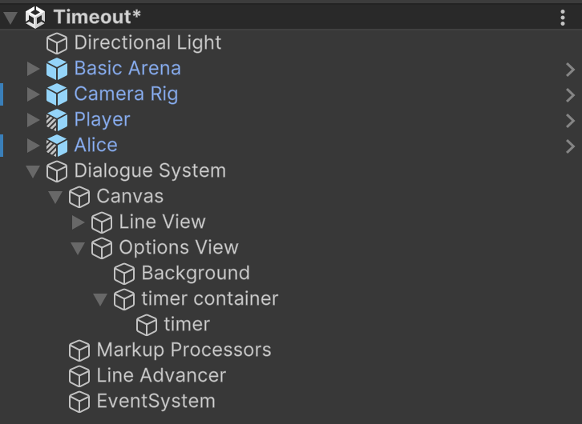
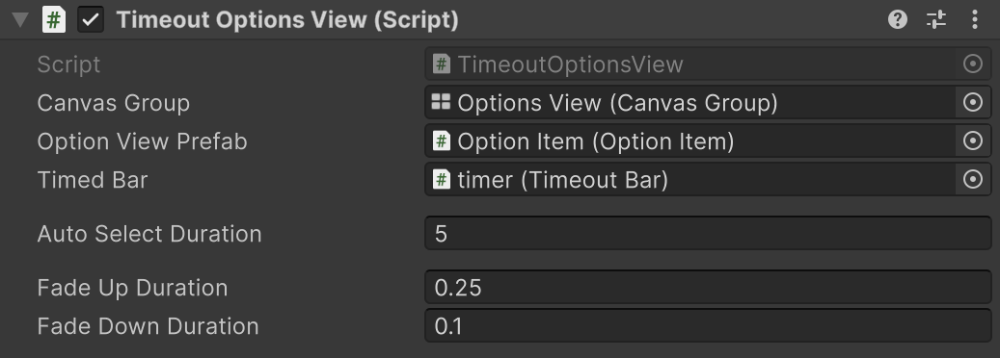

# Make Options Timeout

This sample demonstrates how to create a custom dialogue presenter where dialogue options include a timeout bar. When options are presented, the timeout bar gradually shrinks. If the player doesn't select an option before the timer expires, the system automatically selects one for them.

The sample supports three variations of this functionality:

* A hidden option that gets selected when time runs out
* A visible option designated as the default that gets selected when time runs out
* The currently highlighted option gets selected when time runs out

For simplicity, this guide focuses on implementing the first approach. To explore the other methods, check out the full sample.

### What we'll be covering

* Custom Dialogue Presenters
* Using Metadata to control views
* The nightmare hellscape that is Unity UI

If you want to see a finished version of this go to **PATH TO SAMPLE**.

### Building the scene

If you haven't already install Yarn Spinner **link to install guide**. Once installed we will start by building out a basic scene.

1. Make a new scene in Unity.
2. From `Samples/Shared Assets/Prefabs` drag the Basic Arena into the scene
3. From `Samples/Shared Assets/Prefabs` add a Camera Rig into the scene
4. From `Samples/Shared Assets/Prefabs` drag a Player prefab into the scene
5. From `Samples/Shared Assets/Prefabs` drag an NPC prefab into the scene and rename it to be `Alice`
6. Add a default dialogue system to the scene, in the Hierarchy right click `Yarn Spinner -> Dialogue Runner`
7. Create a new Yarn Spinner project `Assets -> Create -> Yarn Spinner -> Yarn Project` and name it `Timeout Dialogues`
8. Create a new Yarn script `Assets -> Create -> Yarn Spinner -> Yarn Script` and name it `Alice`
9. Delete the previous camera called `Main Camera`

#### The Dialogue

Replace the contents of the Alice Yarn script with the following:

```yarn
title: Alice
---
Alice: Hello, this is the fallback timeout sample

-> Option 1?
    Alice: option 1 was selected
-> Option 2?
    Alice: option 2 was selected
-> Option 3? #fallback
    Alice: option 3 was selected despite not being visible
===
```

This script contains a single node with three options. Only the first two will be visible to the player. The third option (marked with the `#fallback` metadata) will be hidden but selected automatically if the timer expires before the player makes a choice.

#### Configuring the scene

1. Select the Camera Rig and in the inspector drag the Player into the target field
2. Select Alice and in the Inspector set the Dialogue field to use the new `Timeout Dialogues` project
3. Select Alice and in the Inspector select the Alice node in the dropdown
4. Select Alice and in the Dialogue Runner field drag in the Dialogue System object from the hierarchy
5. Select the Dialogue System and in the Inspector set the Yarn Project to use the `Timeout Dialogues` project


### Making a Custom Options Presenter

At this point, you can talk to Alice and go through the dialogue, but the timeout functionality isn't implemented yet. Now we'll create our custom presenter by building a UI bar that shrinks over time, then develop a custom dialogue presenter that uses it.

#### Making the Bar UI

First, we'll create the UI elements for our timer by modifying the existing canvas from the Dialogue System prefab.


If you want to see what this looks like as you go, you might want to set the alpha of the canvas group to 1. Just make sure to put it back to 0 before you play the scene!


1. Right click on the Dialogue System in the hierarchy and choose `Prefab -> Unpack Completely` This will disconnect this from being a prefab but will otherwise leave it in the state we want.
2. Expand the Dialogue System out in the hierarchy so we can see all the individual components we are interested in the children and grandchildren of the Option View gameobject.
3. Select the Last Line game object and delete it. While we could handle also showing the last line it would just add more logic to our view while not actually showing off the main feature of this sample. So instead we'll just drop it.
4. Add a new empty child gameobject to the Options View and name it `timer container`, this will be what holds our timer bar. By default it will have inherited a slew of position and size properties from it's parent's vertical layout group, which is mostly what we want, but we do need it to have a specific height.
5. In the inspector add a new Layout Element component to the timer container.
6. Tick the Preferred Height field and set it to have a height of `30`. Now this element will tell it's parent layout group that it is going to be 30 units high which is perfect.
7. Add a new empty gameobject to the timer container and name it `timer bar`.
8. Give the bar an image component.
9. Change the bars rectangle widget to be centre-aligned + vertical stretch.
10. Set the width to be whatever you like the look of, we found that 1480 units was a nice value.

This bar will shrink as the time to select an option runs out.


Our UI work is now complete. Next, we'll write the code to make the bar shrink over time.



11. Create a new monobehaviour script and name it `TimeoutBar.cs`
12. Open up the new file and replace the imports with the following:

```csharp
using System.Threading;
using UnityEngine;
using Yarn.Unity;
```

13. Add the following fields to the class:

```csharp
[SerializeField] RectTransform bar;
private float originalSize = 0f;
```

These fields represent the bar UI element and its original size, which we'll use to reset it between option sets.

13. Replace the `Start` method with the following:

```csharp
void Start()
{
    if (bar != null)
    {
        originalSize = bar.sizeDelta.x;
    }
}
```

When Unity initializes the component, we store the default bar size in `originalSize` for later reference.

14. Add the following new method:

```csharp
public void ResetBar()
{
    if (bar != null)
    {
        bar.SetSizeWithCurrentAnchors(RectTransform.Axis.Horizontal, originalSize);
    }
}
```

This method resets the bar to its original size. There are several ways to accomplish this, but using `SetSizeWithCurrentAnchors` is straightforward and lets Unity handle the rectangle's final dimensions.

15. Add the following new method:

```csharp
public async YarnTask Shrink(float duration, CancellationToken cancellationToken)
{
    if (bar == null)
    {
        return;
    }

    float accumulator = 0;
    var currentSize = bar.sizeDelta.x;

    while (accumulator < duration && !cancellationToken.IsCancellationRequested)
    {
        accumulator += Time.deltaTime;
        var newSize = Mathf.Lerp(currentSize, 0, accumulator / duration);
        bar.SetSizeWithCurrentAnchors(RectTransform.Axis.Horizontal, newSize);
        await YarnTask.Yield();
    }
    bar.SetSizeWithCurrentAnchors(RectTransform.Axis.Horizontal, 0);
}
```

This method gradually shrinks the bar over the specified duration. It first verifies that the bar exists, then enters a loop that continues until either the duration elapses or cancellation is requested. Each iteration updates the bar size using linear interpolation from its current size toward zero. After the loop, we ensure the bar is fully shrunk regardless of how it exited the loop.


For this tutorial we are using `YarnTask` as our underlying awaitable infrastructure. This is because we need it to work with any of the supported awaitable structures. If you are adapting this tutorial for your own projects it would be better to use the same awaitable type everywhere.


16. Add that class as a component to our bar
17. Drag the bar gameobject into the Bar field in the TimeoutBar inspector and now the bar is done.



To see a complete version of this check out **path to the file in the samples.**


If you would like to verify that the shrinking and resetting is working you can set the alpha of the canvas group to be 1. And then call the `Shrink` method (give it a duration of `1`, and a `CancellationToken.None` for the cancellation token parameter) it will over one second shrink the bar from full size to 0. Then if you call `ResetBar` method you will see it instantly pop back up to full size. The aasiest way to do this is in `Update` and direct keybind polling.


#### Making the custom presenter

Now we'll create the custom dialogue presenter subclass. Since this involves substantial code, we'll approach it in sections.

1. Create a new presenter subclass `Assets -> Create -> Yarn Spinner -> Create -> Dialogue View Script`and name it `TimeoutOptionsView`. This creates a stubbed out subclass with all the necessary methods for a custom view.
2. Replace the imports with the following:

```csharp
using System.Threading;
using System.Collections.Generic;
using UnityEngine;
using Yarn.Unity;
```

3. Add the following fields to the class:

```csharp
[SerializeField] CanvasGroup canvasGroup;
[SerializeField] OptionItem optionViewPrefab;
[SerializeField] TimeoutBar timedBar;
private List<OptionItem> optionViews = new List<OptionItem>();
```

These fields reference the UI elements we need to manage: the canvas group for fade effects, the option item prefab, the timer bar, and a list to cache option items. Other than `timedBar`, these are similar to what you'd find in the default options presenter.

4. Add the following fields to the class:

```csharp
public float autoSelectDuration = 10f;
public float fadeUpDuration = 0.25f;
public float fadeDownDuration = 0.1f;
```

These fields control the timing aspects: how long the player has to select an option before timeout, and the duration of fade-in and fade-out animations.

5. Add the following field to the class:

```csharp
private const string HiddenFallback = "fallback";
```

This constant identifies the option that should be selected when the timer expires. We'll use it later when examining option metadata.

6. Replace `OnDialogueStartedAsync` with the following:

```csharp
public override YarnTask OnDialogueStartedAsync()
{
    if (canvasGroup != null)
    {
        canvasGroup.alpha = 0;
        canvasGroup.interactable = false;
        canvasGroup.blocksRaycasts = false;
    }

    return YarnTask.CompletedTask;
}
```

7. Replace `OnDialogueCompleteAsync` with the following:

```csharp
public override YarnTask OnDialogueCompleteAsync()
{
    if (canvasGroup != null)
    {
        canvasGroup.alpha = 0;
        canvasGroup.interactable = false;
        canvasGroup.blocksRaycasts = false;
    }

    return YarnTask.CompletedTask;
}
```

These methods are called by the dialogue runner at the beginning and end of dialogue. Both hide and disable the options UI, then return a completed task.


You might notice that we aren't awaiting any work in these methods. And we've even said in the method declaration we aren't asynchronous. As such we need to return a completed nothing task, or else Unity will complain at us for having asynchronous methods that don't do anything asynchronously.


8. Replace `RunLineAsync` method with the following:

```csharp
public override YarnTask RunLineAsync(LocalizedLine line, LineCancellationToken token)
{
    return YarnTask.CompletedTask;
}
```

Since this presenter only handles options, we can return immediately when asked to run a normal line.

9. Replace `Start` with the following:

```csharp
void Start()
{
    if (canvasGroup != null)
    {
        canvasGroup.alpha = 0;
        canvasGroup.interactable = false;
        canvasGroup.blocksRaycasts = false;
    }
}
```

Similar to the dialogue event handlers, we initialize the UI as hidden and non-interactive.

Finally add a new internal enum to the class:

```csharp
enum TimeOutOptionType
{
    None, HiddenFallback,
}
```

This enum identifies which timeout behavior we're using. The default is `None`, meaning no timeout is needed for the current option set.

#### Determining the Timeout Type

Now we'll implement the `RunOptionsAsync` method, starting with determining which timeout option to use and validating the option group.


There is quite a lot of code we are about to add to the `RunOptionsAsync` method. We are going to be adding it piece by piece, with each section to be added below the previous one.


1. Inside the `RunOptionsAsync` method add the following code:

```csharp
int hasTimeOutMetadata = 0;
TimeOutOptionType defaultOptionType = TimeOutOptionType.None;
DialogueOption defaultOption = null;
```

These variables will track whether we need a timeout and which option should be selected if timeout occurs.

2. Add the following code:

```csharp
// we run through all the options quickly to see if there are any that are configured for timeouts
foreach (var option in dialogueOptions)
{
    foreach (var metadata in option.Line.Metadata)
    {
        if (metadata == HiddenFallback)
        {
            // if the hidden fallback option has failed it's condition then we don't want it to impact the rest of the option group
            if (!option.IsAvailable)
            {
                continue;
            }

            defaultOptionType = TimeOutOptionType.HiddenFallback;
            defaultOption = option;
            hasTimeOutMetadata += 1;

            break;
        }
    }
}
```

This code examines all the options to find any with the `fallback` metadata tag. If it finds one that's available, it marks that option as the hidden fallback to be selected when the timer expires. We also count how many tagged options we've seen for validation purposes.

3. Add the following code:

```csharp
// now we do some error checking
// it is possible there are multiple options flagged as the fallback which we don't want
if (defaultOptionType == TimeOutOptionType.HiddenFallback)
{
    // this means we need to have only found one default tagged line 
    if (hasTimeOutMetadata != 1)
    {
        Debug.LogError("Encountered more than one option with timeout tags");

        // we return
        return await DialogueRunner.NoOptionSelected;
    }
    // and we need to have the defaultOption value be not null
    if (defaultOption == null)
    {
        Debug.LogError("Encountered have an option tagged as a fallback but have no option value set.");

        // we return
        return await DialogueRunner.NoOptionSelected;
    }
}
```

This validation ensures that if we're using a hidden fallback, we have exactly one option tagged as such, and we've successfully identified which option it is. If either condition fails, we log an error and tell the dialogue runner that no option was selected.

#### Handling Cancellation and Completion

Next, we'll set up the infrastructure to handle completion and cancellation. These mechanisms will be provided to the option items later.

1. Add the following code to create our completion source:

```csharp
// A completion source that represents the selected option.
YarnTaskCompletionSource<DialogueOption> selectedOptionCompletionSource = new YarnTaskCompletionSource<DialogueOption>();
```

2. Add the following code to create our cancellation source:

```csharp
// A cancellation token source that becomes cancelled when any option item is selected, or when this entire option view is cancelled
var completionCancellationSource = CancellationTokenSource.CreateLinkedTokenSource(cancellationToken);
```

These sources work together to handle the two possible outcomes: the player selects an option, or the dialogue is cancelled. Now we'll implement the cancellation handling:

3. Add the following encapsulated method:

```csharp
async YarnTask CancelSourceWhenDialogueCancelled()
{
    await YarnTask.WaitUntilCanceled(completionCancellationSource.Token);

    if (cancellationToken.IsCancellationRequested == true)
    {
        // The overall cancellation token was fired, not just our internal 'something was selected' cancellation token.
        // This means that the dialogue view has been informed that any value it returns will not be used.
        // Set a 'null' result on our completion source so that that we can get out of here as quickly as possible.
        selectedOptionCompletionSource.TrySetResult(null);
    }
}

// Start waiting 
CancelSourceWhenDialogueCancelled().Forget();
```

This task monitors for dialogue cancellation and ensures proper cleanup by setting a null result on the completion source if needed. This connects the two sources: if dialogue is cancelled, this function sets the completion value on `selectedOptionCompletionSource`.

#### Creating and Configuring the Option Items

Now we'll create and configure the option items to display to the user:

1. Add the following code to instantiate new option items as needed:

```csharp
if (optionViews.Count < dialogueOptions.Length)
{
    // we want to create as many new options as the difference between the current cached ones we have and the size of the option group
    var newViews = dialogueOptions.Length - optionViews.Count;
    for (int i = 0; i < newViews; i++)
    {
        var option = CreateNewOptionView();
        optionViews.Add(option);
    }
}
```

This creates just enough option item prefab instances to handle the current option group, reusing any we've already created. The `CreateNewOptionView` method will be implemented later.

2. Add the following code to configure the option items:

```csharp
// configuring all the dialogue items
for (int i = 0; i < dialogueOptions.Length; i++)
{
    var optionView = optionViews[i];
    var option = dialogueOptions[i];

    if (option.IsAvailable == false)
    {
        // option is unavailable, skip it
        continue;
    }

    // if we are set to have a hidden fallback option
    // and that option is THIS option we are configuring the view for
    // we want to skip over it, it will be visually represented by the timer bar
    if (defaultOptionType == TimeOutOptionType.HiddenFallback && defaultOption != null && option.DialogueOptionID == defaultOption.DialogueOptionID)
    {
        continue;
    }

    optionView.gameObject.SetActive(true);
    optionView.Option = option;

    optionView.OnOptionSelected = selectedOptionCompletionSource;
    optionView.completionToken = completionCancellationSource.Token;
}

// There is a bug that can happen where multiple options can be flagged as highlighted at once
// so if one is already selected then we use that, otherwise we highlight the first non-disabled option
int optionIndexToSelect = -1;
for (int i = 0; i < optionViews.Count; i++)
{
    var view = optionViews[i];
    if (!view.isActiveAndEnabled)
    {
        continue;
    }

    if (view.IsHighlighted)
    {
        optionIndexToSelect = i;
        break;
    }

    // ok at this point the view is enabled
    // but not highlighted
    // so if we haven't already decreed we have found one to select
    // we select this one
    if (optionIndexToSelect == -1)
    {
        optionIndexToSelect = i;
    }
}
if (optionIndexToSelect > -1)
{
    optionViews[optionIndexToSelect].Select();
}
```

This code configures each option view with its corresponding option data, skipping any that are unavailable or marked as hidden fallbacks. It then selects the first valid option to be highlighted initially.

3. Add the following code to enable or disable the timer bar:

```csharp
// now we add in the timer bar if necessary or turn it off if it isn't needed
if (defaultOptionType == TimeOutOptionType.None)
{
    if (timedBar != null)
    {
        timedBar.gameObject.SetActive(false);
    }
}
else
{
    // we always want it at the bottom regardless of how many option item views there are
    if (timedBar != null)
    {
        timedBar.gameObject.SetActive(true);
        timedBar.ResetBar();
        timedBar.transform.parent.SetAsLastSibling();
    }
}
```

This activates the timer bar only if we're using a timeout option, resetting it to full size and ensuring it appears at the bottom of the option list.

#### Fading it all in

Now we'll display the UI to the player:

1. Add the following code to fade in the UI:

```csharp
// fade up the UI now
await Effects.FadeAlphaAsync(canvasGroup, 0, 1, fadeUpDuration, cancellationToken);

// allow interactivity and wait for an option to be selected
if (canvasGroup != null)
{
    canvasGroup.interactable = true;
    canvasGroup.blocksRaycasts = true;
}
```

This fades in the UI and enables user interaction once the fade is complete.

2. Add the following code to start the timeout bar if needed:

```csharp
// now we kick off the timer bar if needed
if (defaultOptionType == TimeOutOptionType.HiddenFallback)
{
    BeginDefaultSelectTimeout(selectedOptionCompletionSource, defaultOption, completionCancellationSource.Token).Forget();
}
```

If we're using a hidden fallback option, this starts the timer that will eventually select it. The `BeginDefaultSelectTimeout` method will be implemented later.

3. Add the following wait code:

```csharp
// Wait for a selection to be made, or for the task to be completed.
var completedTask = await selectedOptionCompletionSource.Task;
```

This suspends execution until the player selects an option, the timer expires, or dialogue is cancelled.

#### Fading it all out

After a selection is made, we need to clean up and exit:

1. Add the following code:

```csharp
completionCancellationSource.Cancel();

// now one of the option items has been selected so we do cleanup
if (canvasGroup != null)
{
    canvasGroup.interactable = false;
    canvasGroup.blocksRaycasts = false;
}
```

This cancels the completion source to prevent further selections and disables UI interaction.

2. Add the following code to fade out the UI:

```csharp
// fade down
await Effects.FadeAlphaAsync(canvasGroup, 1, 0, fadeDownDuration, cancellationToken);

// disabling ALL the options views now
foreach (var optionView in optionViews)
{
    optionView.gameObject.SetActive(false);
}
```

This fades out the UI and hides all option views, though they remain cached for future use.

3. Add the following code to return the selected option:

```csharp
// if we are cancelled we still need to return but we don't want to have a selection, so we return no selected option
if (cancellationToken.IsCancellationRequested)
{
    return await DialogueRunner.NoOptionSelected;
}

// finally we return the selected option
return completedTask;
```

This returns the selected option to the dialogue runner, or indicates that no option was selected if dialogue was cancelled.

#### Missing Methods

Now we need to implement the methods we've referenced but haven't defined yet:

1. Add the following new method:

```csharp
private OptionItem CreateNewOptionView()
{
    var optionView = Instantiate(optionViewPrefab);

    var targetTransform = canvasGroup != null ? canvasGroup.transform : this.transform;

    if (optionView == null)
    {
        throw new System.InvalidOperationException($"Can't create new option view: {nameof(optionView)} is null");
    }

    optionView.transform.SetParent(targetTransform.transform, false);
    optionView.transform.SetAsLastSibling();
    optionView.gameObject.SetActive(false);

    return optionView;
}
```

This creates a new option item instance, adds it to the canvas group, positions it at the end of the list, and disables it by default.

2. Add the `BeginDefaultSelectTimeout` method:

```csharp
internal async YarnTask BeginDefaultSelectTimeout(YarnTaskCompletionSource<DialogueOption> selectedOptionCompletionSource, DialogueOption option, CancellationToken cancellationToken)
{
    if (timedBar == null)
    {
        return;
    }

    await timedBar.Shrink(autoSelectDuration, cancellationToken);

    if (!cancellationToken.IsCancellationRequested)
    {
        selectedOptionCompletionSource.TrySetResult(option);
    }
}
```

This method initiates the timer bar shrinking animation. When complete (if not cancelled), it sets the designated fallback option as the selected choice.

### Drawing the rest of the owl

Finally, let's hook everything up in Unity:

1. Move back over to Unity and select the Options View in the hierarchy.
2. Add the `TimeoutOptionsView.cs` script as a new component to the Option View gameobject.
3. Delete the `Options Presenter` component.
4. Select the Options View gameobject and in the Canvas Group field drag the Options View into this field.
5. From `Packages/Yarn Spinner/Prefabs` folder drag the Option Item prefab into the Option View Prefab field.
6. Drag the timer gameobject into the Timed Bar field.
7. Pick a duration for the Auto Select, Fade Up, and Fade Down durations.


Now we need to tell the dialogue runner about our custom presenter:

8. Select the Dialogue System game object in the hierarchy.
9. Remove the old (now missing) Options Presenter from the Dialogue Views field.
10. Add the new timeout options view into it's place.


11. Take it for a spin!

Congratulations! You've created a custom options presenter that supports timed dialogue choices. When the timer expires, the system automatically selects a predefined fallback option, adding a sense of urgency to dialogue interactions.
