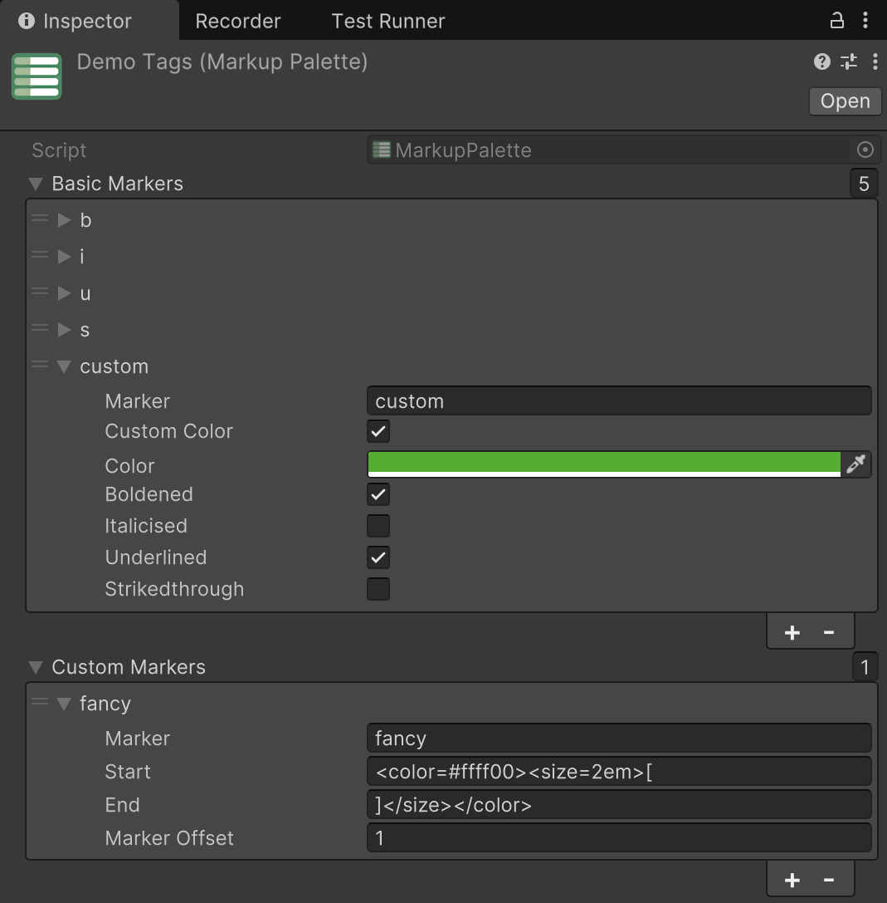
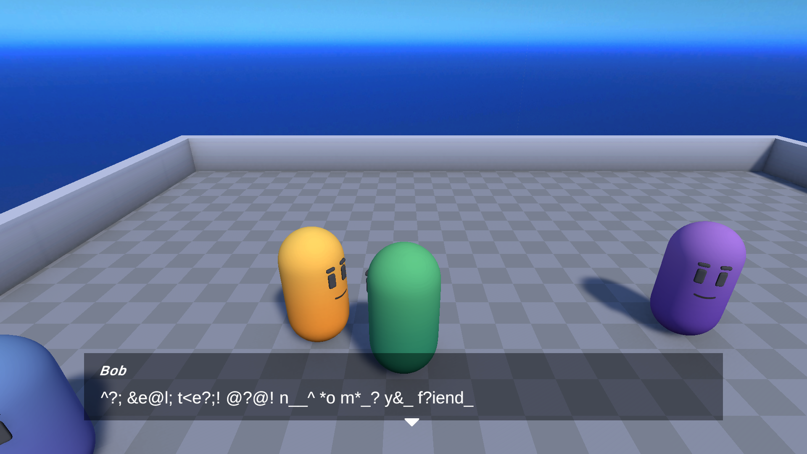
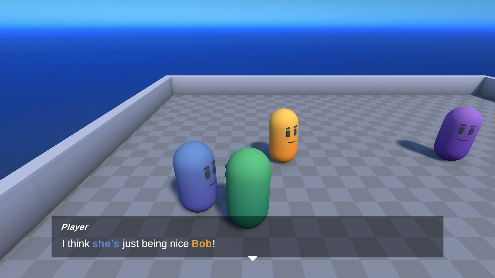
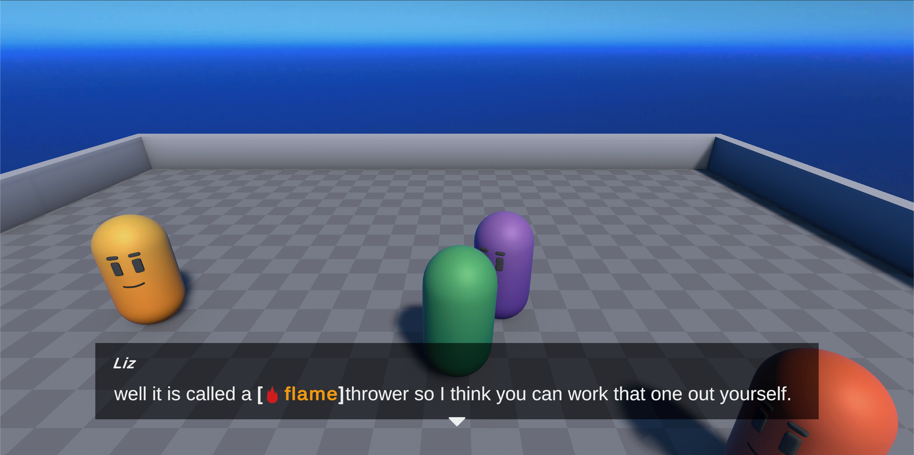

# Replacement Markup

## Replacement Markup

Yarn Spinner version 3 introduces a new system for performing in-line text replacements using markers. Previously, text replacement based on markers was entirely handled by the view displaying the line. In v3, we've implemented a cleaner approach with `IAttributeMarkerProcessor` and the related `ReplacementMarkupHandler`.

These components connect directly to the line provider, allowing replacements to occur before the line reaches the views. This simplifies your code architecture and creates a clearer separation of responsibilities. This sample demonstrates four different applications of replacement markup:

1. Built-in common replacements and marker palettes
2. Dynamic markup that changes with each presentation to obscure text
3. Named replacement for in-line content highlighting
4. Injecting sprites and additional text content into a line


### What we'll be covering

* Using Replacement Markup through `IAttributeMarkerProcessor` and `ReplacementMarkupHandler`
* Markup Palettes and the built-in replacement processors
* Dynamically replacing text
* Offsetting non-replacement markup attributes
* TMP Sprites and adding elements to a line

### The Attribute Marker Processor

The `IAttributeMarkerProcessor` interface is the primary mechanism for creating replacement markup. At its core, replacement markup works by registering with the line provider to handle specific markup tags. During line presentation, when the dialogue runner requests a line from the line provider, the provider calls its registered `IAttributeMarkerProcessor` instances to process the line.

Whenever a line provider encounters markup for which it has a registered processor, it calls the `ProcessReplacementMarker` method on that processor. This method receives four parameters:

1. `marker`: The marker being processed, containing position, range, and properties
2. `childBuilder`: A StringBuilder containing the text content of all child nodes, which you'll typically modify by adding text to the beginning and end
3. `childAttributes`: A list of markup inside your markup's children, which you can modify, offset, or even delete as part of your replacement
4. `localeCode`: The code for the current locale in which the line will be presented

The method returns a list of `LineParser.MarkupDiagnostic` objects, which identify any unresolvable errors in the markup. These diagnostics can be displayed in the editor, facilitating easier debugging of invalid markup.

For convenience, we provide an abstract class `ReplacementMarkupHandler`, a MonoBehaviour that implements the `IAttributeMarkerProcessor` interface. This class includes a static `ReplacementMarkupHandler.NoDiagnostics` list for when your processor completes successfully without errors.

#### How we process replacement markup

Understanding how markup processing works internally can be helpful when creating your own replacement markers. Consider this line in Yarn:

```
This is [b]my line[/b] with [b][i]some[/i] markup within[/b] of it.
```

We would expect three markers:

* `b` marker at position 8, with a range of 7
* `b` marker at position 21, with a range of 18
* `i` marker at position 21, with a range of 4

Yarn Spinner first models this as a tree, nesting the `i` marker inside the second `b` marker:

```
root
│
├─ "This is "
│
├─ b
│  └─ "my line"
│
├─ " with "
│
├─ b
│  ├─ i
│  │  └─ "some"
│  └─ "markup within"
│
└─ " of it."
```

This tree structure simplifies manipulation for replacements without manual index and range adjustments. If markup is incorrectly nested, we can rewrite the tree to maintain a valid structure while preserving the same ranges.


When rewriting the tree to fix nested markup, we try to maintain the semantic meaning. For example, if you have misnested Yarn markup like: `this [b]is[i] some [/b]malformed[/i] markup`, it gets rewritten to the equivalent of `this [b]is[i] some [/i][/b][i]malformed[/i] markup`.


To flatten this tree while performing replacements, we traverse it depth-first. When we encounter a markup node with a registered replacement handler, we process it and continue to the next sibling. This ensures that when a replacement processor is called, all of its children have already been processed.

A key benefit of this approach is that each replacement processor can assume its indices start at 0. Since all children have been processed, and the root node handles final assembly and position offsetting, you don't need to know your exact position in the tree. You can trust that your children have been handled, and your siblings' positions will be managed later during final assembly.

As we traverse back up the tree, each completed branch has its siblings' text and markup attributes merged, creating a progressively flattened line.

Once the root node is processed, all replacements are complete and the tree structure becomes irrelevant. The root node simply appends all its children's text into a single line, merges all markup into a single list, and delivers it to the dialogue runner for presentation.

### The Samples

The sample scene includes four different examples, each NPC demonstrating a different aspect of replacement markup.

#### Built In Markup Replacement


This example showcases the two built-in markup replacement systems - the only ones in this sample that don't require custom code. It uses markup palettes for basic line styling and the style replacement system for TextMeshPro (TMP) styles.

The Markup Palette provides a straightforward way to add styling to lines. It's a scriptable object that connects a marker name to styling information, allowing you to write Yarn like: `Player: Hello, I want this to be [fancy]important looking[/fancy].`

Which translates to TMP tags: `Player: Hello, I want this to be <color=#00ff00><b>important looking</b></color>.`



Markup Palettes support common styles like color, bold, and italics, or you can define custom start and end tags, including offset information for child attributes. You can create your own palettes from `Assets -> Create -> Yarn Spinner -> Markup Palette`. The dialogue system prefab includes common tags like `[b]` for bold, `[u]` for underline, `[i]` for italics, and `[s]` for strikethrough.

The code that processes markup palettes is in `PaletteMarkerProcessor.cs`. It works by creating the appropriate TMP rich text tags based on the palette, prepending opening tags to the `childBuilder` parameter, and appending closing tags at the end.

The other built-in replacer handles TMP styles. This adds support for any styles defined in a TMP stylesheet. Since we don't know style names in advance, the Yarn syntax looks like: `Player: Hello, I want this to be [style=h1]important looking[/style].`

The code in `StyleMarkerProcessor.cs` translates this into appropriate `<style>` TMP tags.


TMP styles may add _visible_ characters to the line, which would offset child attributes' positions. The `StyleMarkerProcessor` can't handle this automatically because TMP doesn't provide a way to interrogate styles ahead of time. If you need to add visible characters, we recommend either creating a custom replacer or using the Palette system with a `MarkerOffset` to correctly shift attribute positions.&#x20;


#### Dynamic Replacement



This example demonstrates using markup with variables to dynamically obscure text. Each time you talk to the character, the amount of obscured text decreases until you can understand the entire line. The obscurity level changes via a Yarn variable interpolated into the markup:

```yarn
Bob: [obscurity = {$obscurity}]Why hello there, it's nice to meet you friend.[/obscurity]
```

The implementation is in `ObscurityMarkupProcessor.cs`, which randomly replaces characters with punctuation symbols based on the obscurity level. The processor retrieves the current level from the marker:

```csharp
marker.TryGetProperty("obscurity", out int value)
```

In this sample, we defined four obscurity levels: fully obscured, two-thirds obscured, one-quarter obscured, and no obscuration. The code checks if the value is `0`, `1`, or `2`, with any other value resulting in no obscuration.

The actual obscuring happens in the `Obscure` method, which:

1. Collects the index of every non-whitespace character
2. Shuffles these indices (so different characters are revealed as obscurity decreases)
3. Uses the obscurity factor to determine which characters to replace with random punctuation

#### Named Replacement



This example demonstrates replacement markup where the replacement is based on the child text rather than the markup itself. The processor reads the child text inside a marker and uses it to determine what color to apply to that section.

The design philosophy is that the writer has already included the context for highlighting - the character's name. This allows writing:

```yarn
Player: Hey there [name]Alice[/name], what up?
```

Instead of needing to specify:

```yarn
Player: Hey there [name=alice]Alice[/name], what up?
```

Of course, there are cases where an explicit property is needed:

```yarn
Player: I think [name=alice]she's[/name] just being nice [name]Bob[/name]!
```

The implementation is in `EntityColourer.cs`. The processor handles both cases by first checking for an explicit property:

```csharp
marker.TryGetProperty("name", out string value)
```

If none exists, it uses the child text content:

```csharp
childBuilder.ToString().ToLower()
```

With the name determined, it performs a lookup in a name-to-color mapping and applies TMP color tags:

```csharp
childBuilder.Insert(0, $"<color=#{UnityEngine.ColorUtility.ToHtmlStringRGBA(entity.colour)}><b>");
childBuilder.Append("</b></color>");
```

#### Adding Elements



This example shows how to add new text and elements (specifically sprites) to a line. Marked regions are flagged as a specific type, gaining both a sprite and color when processed:

```yarn
Liz: well it is called a [fire]flame[/fire]thrower so I think you can work that one out yourself.
```

The implementation in `SpriteReplacmentMarkerProcessor.cs` is quite straightforward. It defines format strings for TMP rich tags:

```csharp
var start = "<b>[<color=#{0}><sprite=\"effects\" name=\"{1}\">";
var end = "</color>]</b>";
```

It then uses a switch statement on the marker name to fill in the format strings:

```csharp
case "fire":
    childBuilder.Insert(0, string.Format(start, ColorUtility.ToHtmlStringRGB(debuff), "fire"));
    childBuilder.Append(end);
    break;
```

Since this adds visible elements at the start of the markup text (the sprite and `[` character), the processor must offset any attributes within that markup:

```csharp
for (int i = 0; i < childAttributes.Count; i++)
{
    childAttributes[i] = childAttributes[i].Shift(2);
}
```

This shifts attributes down by two positions to accommodate the added characters.
