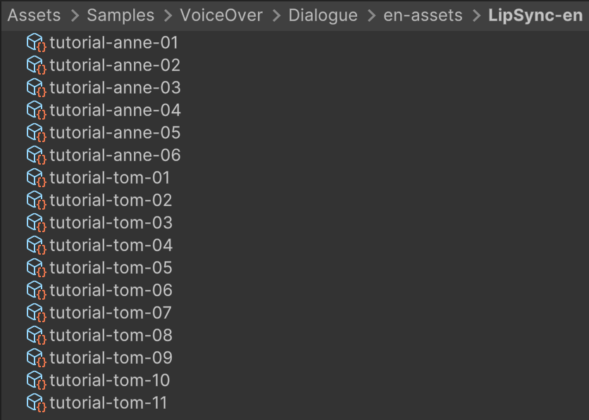
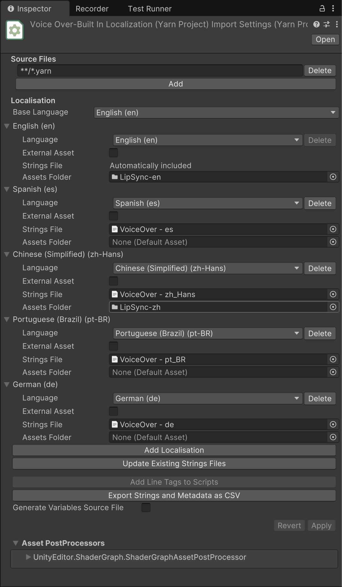
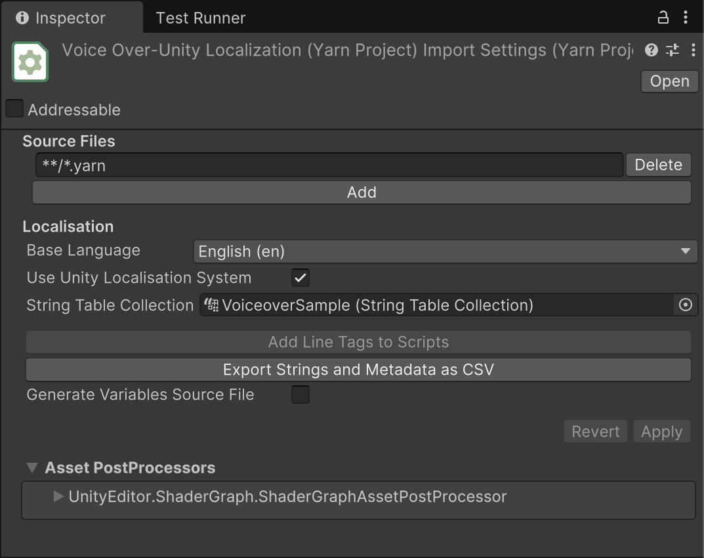

# Voice Over and Localisation

Dialogue in games often extends beyond simple text on screen. Many projects incorporate voice acting alongside written dialogue, and sometimes even more complex assets. This raises important questions about handling localisation—as the number of assets per line increases, so does the complexity of ensuring everything works together seamlessly.

This sample demonstrates Yarn Spinner's approach to localisation, asset association, and audio playback in a cohesive system.



The scene features a character floating in space, conversing with a disembodied voice. The main character's dialogue includes synchronized audio that drives lip movement animations. Unlike most samples, this one includes two identical scenes that differ only in their localisation implementation: one uses Yarn Spinner's built-in localisation system, while the other leverages Unity's Localisation package.


Note this isn't a lip-sync sample, we are just using lip-sync data as a way to demonstrate multiple non-out-of-the-box assets associated with a line.


### What we'll be covering

* Associating and playing audio with dialogue lines
* Implementing custom line assets with lip-sync data and audio
* Understanding the Built-in and Unity Localisation line providers
* Localising both text and associated assets

### Line Providers and the Ineffable Issue of Asset Association

The line provider is the component responsible for managing assets associated with dialogue. It supplies the content of each line—both text and related assets—to the various presenters in your game. Any object that implements the `ILineProvider` interface can serve as a line provider, and the dialogue runner consults this provider when it's time to present a line.

The dialogue runner itself doesn't know the actual content of lines—it only knows which line to run via the line's ID. When a line needs to be displayed, the line provider retrieves the content from the strings table, parses any markup, and collects any associated assets. If you need custom modifications or behaviors that apply to multiple lines, creating a custom line provider is generally the most effective approach.

Yarn Spinner includes two line providers out of the box:

1. The built-in localised line provider (`BuiltinLocalisedLineProvider`) for projects without specific localisation workflows
2. The Unity localised line provider (`UnityLocalisedLineProvider`) for projects using Unity's localisation system

While these providers function differently internally, they present the same interface to Yarn Spinner, so you can generally use whichever best fits your workflow without worrying about the implementation details.


You might notice both of these are based around your localisation approach and be wondering why. A line of text is _intrinsically_ tied to localisation. Even if you aren't intending on translating or supporting more than your language, the work for a line provider to support one language is the same as supporting multiple languages. So we take a localisation first approach, even if you have only one localisation.


#### Asset Association

When the dialogue runner passes a line to your presenters, the `LocalizedLine` includes an optional `Asset` property that can contain any Unity Object (or null). Asset association is based on line ID, connecting relevant resources to specific dialogue lines.


If you have different needs for assets you'll have to create your own line provider which knows how to link the disparate pieces together and give it to the line as the assset for the line.


**Built In Localisation**

The built-in localisation system requires two components for each language:

1. **String Table**: Essential for displaying lines. The base localisation (typically English) is automatically configured.
2. **Assets Folder** (optional): Contains resources for that localisation.

The system searches the assets folder and matches assets to line IDs in the project. For this sample, we have a folder named `LipSync-en` containing the lip-sync data for English localisation.

**CALLOUT**: This isn't a lip-sync sample so for now they know it's a scriptable object that conforms to the `IAssetProvider` interface. It has a list of visemes and timeframes for when to show that viseme. It also has a reference to the audio file that this lip-sync event is connected to. For more details check out `LipSyncedVoiceLine.cs`.

The Yarn Project has this folder connected as the `Assets` folder for the English locale:

This connection ensures that when a presenter requests an asset (as the voice over presenter does), it receives the lip-sync asset with the same name as the line ID.

**Unity Localisation**

The Unity Localisation approach differs significantly. Instead of referencing files on disk, it uses tables to manage content. The sample scene includes preconfigured string and asset tables, which the Unity Localisation Line Provider references.


We assume you are already fairly comfortable with using Unity localisation. For information on how to get started with it if you are new to it, check out the [official Unity docs](https://docs.unity3d.com/Packages/com.unity.localization@1.5/manual/QuickStartGuideWithVariants.html).


Rather than maintaining a list of locales, the project simply references a table collection:

Similarly, the Unity Localisation Line Provider doesn't configure the current language—it simply references the necessary string and asset tables:

The base locale's string table column automatically populates with values from the Yarn files. For additional languages, you'll need to add content to the table manually, typically using one of Unity's importers. This differs from the built-in localisation, where you manually associate a string table in the project.

Asset association also works differently with Unity Localisation. Since asset tables handle this functionality, Yarn Spinner provides a wizard accessible via `Window -> Yarn Spinner -> Add Assets To Table Collection`:

This wizard automatically detects locales from global settings. You'll need to:

1. Connect the asset table to the `Asset Table Collection` field
2. Set the asset type
3. Drag asset folders for each locale into the appropriate slots

The system still matches assets to lines based on filename-to-line-ID mapping. After running the wizard, you can verify the configuration by examining the asset table:

At runtime, the Unity Localisation line provider uses these tables to find both text content and associated assets (like lip-sync data) for each line. The presenters receive complete, ready-to-use lines without needing to understand how the provider works.

**IAssetProvider**

The `IAssetProvider` interface addresses the challenge of handling unknown asset types. Default presenters (including the voice over presenter) are designed to work both independently and in combination, so they can't make assumptions about what kinds of assets they'll receive.

While most often the asset will be an audio file, many situations require something more complex. In this sample, we use a custom `LipSyncedVoiceLine` scriptable object that implements `IAssetProvider`. This object contains both an audio file and viseme timing data.

Through the `IAssetProvider` interface, different presenters can request specific asset types in a consistent way without worrying about implementation details. Conforming to this interface requires implementing just two methods: `TryGetAsset<T>` and `GetAssetsOfType<T>`.

If you're not using default presenters and don't need interoperability between assets and views, you can use whatever asset types you prefer. However, if you want compatibility between custom and default presenters, implementing `IAssetProvider` is highly recommended.

### Play back

The remaining components of the sample are more straightforward, as the localisation and line providers handle most of the complexity. Two presenters are particularly relevant:

#### Voice Over Presenter

This presenter requires an audio asset to function. It first checks if the line has an associated asset, and whether that asset is audio. If so, it plays the audio directly.

If the asset isn't audio but implements `IAssetProvider` (as in this sample), the presenter requests an audio asset from the provider and then plays it. This demonstrates the primary purpose of the `IAssetProvider` interface—allowing different types of data to be bundled into a single container.

#### TextureLipSyncView

This component has a more straightforward implementation. Since we know the asset type in this sample, we can skip some checks and directly request lip-sync timing data from the `IAssetProvider`. With this data, the component modifies the character's face to match the appropriate visemes at the correct times during audio playback.
