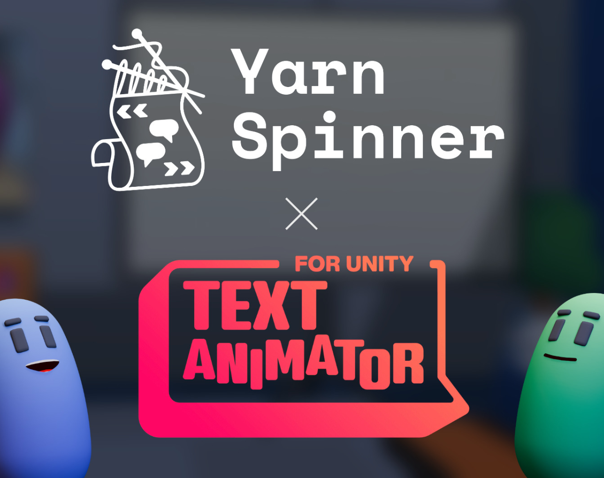

# Unity Add-Ons

<figure><figcaption></figcaption></figure> <figure><figcaption></figcaption></figure> <figure><figcaption></figcaption></figure>


You can purchase these add-ons at [the Yarn Spinner Itch Store](https://yarnspinnertool.itch.io) or via the [Unity Asset Store](https://assetstore.unity.com/publishers/91946). Purchasing Yarn Spinner, or a Yarn Spinner Add-on is the best way to help support Yarn Spinner, and the team behind it.


Yarn Spinner is **always** free and open source. To help offset the costs of designing, building, and supporting Yarn Spinner, we provide a number of add-ons as paid extras to make implementing Yarn Spinner in your games easier for you.

At the moment, these include:

* [Text Animator for Yarn Spinner](text-animator/)
* [Dialogue Wheel for Yarn Spinner](dialogue-wheel/)
* [Speech Bubbles for Yarn Spinner](speech-bubbles/)

Text Animator for Yarn Spinner is included in the Itch.io and Asset Store versions of Yarn Spinner for Unity. Dialogue Wheel and Speech Bubbles for Yarn Spinner are individual purchases, and can be used with the free version of Yarn Spinner for Unity.

Dialogue Wheel and Speech Bubbles are available as separate purchases on the [Yarn Spinner Itch.io Store](https://yarnspinner.itch.io/) or via the [Unity Asset Store](https://assetstore.unity.com/publishers/91946).


This documentation is a work-in-progress as we get ready for Yarn Spinner 3.1. While this documentation refers to being able to get Text Animator for Yarn Spinner as part of the paid version of Yarn Spinner, this is not currently available. It will be available when Yarn Spinner 3.1 launches!


This section of the Yarn Spinner documentation provides guides for the available add-ons.
