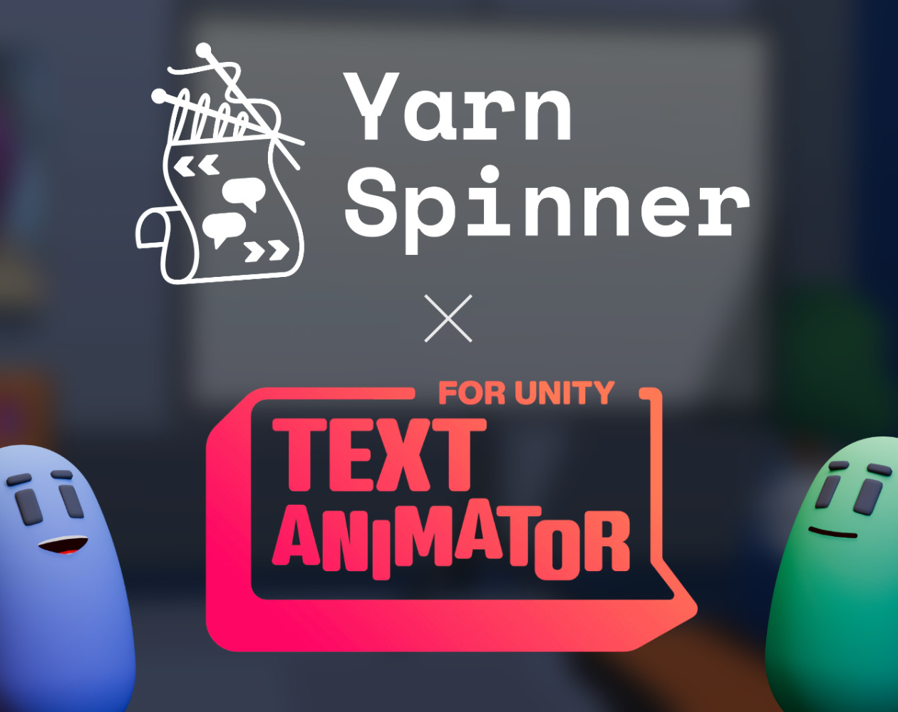

# Unity Add-Ons

<figure><figcaption></figcaption></figure> <figure><figcaption></figcaption></figure> <figure><figcaption></figcaption></figure>


You can purchase these add-ons at [the Yarn Spinner Itch Store](https://yarnspinnertool.itch.io) or via the [Unity Asset Store](https://assetstore.unity.com/publishers/91946). Purchasing Yarn Spinner, or a Yarn Spinner Add-on is the best way to help support Yarn Spinner, and the team behind it.


Yarn Spinner is **always** free and open source. To help offset the costs of designing, building, and supporting Yarn Spinner, we provide a number of add-ons as paid extras to make implementing Yarn Spinner in your games easier for you.

At the moment, these include:

* [Text Animator for Yarn Spinner](text-animator/)
* [Dialogue Wheel for Yarn Spinner](dialogue-wheel/)
* [Speech Bubbles for Yarn Spinner](speech-bubbles/)
* [Snaaake for Yarn Spinner](snaaake.md)
* [Classic RPG for Yarn Spinner](classic-rpg.md)

Text Animator for Yarn Spinner, Snaaake for Yarn Spinner and Classic RPG for Yarn Spinner. are all included in the Itch.io and Asset Store versions of Yarn Spinner for Unity.&#x20;

Dialogue Wheel and Speech Bubbles are available as separate purchases on the [Yarn Spinner Itch.io Store](https://yarnspinner.itch.io/) or via the [Unity Asset Store](https://assetstore.unity.com/publishers/91946). They can be used with the free or paid versions of Yarn Spinner.

This section of the Yarn Spinner documentation provides guides for the available add-ons.
