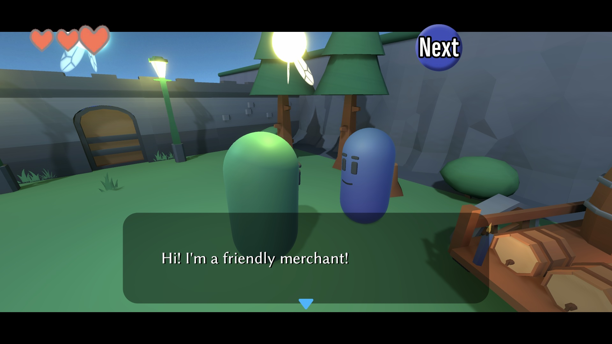

# Classic RPG

**Classic RPG** is a dialogue presenter for Yarn Spinner that pays homage to the dialogue systems used in old school RPGs.

It shows a text box at the bottom of the screen that hosts lines of dialogue and choices. Text is shown with a character-by-character 'typewriter' effect, and the typewriter supports changing its speed or pausing. When the player hits the 'skip' input, the typewriter speeds up, and starts automatically skipping lines until it hits a stopping point. The presenter also has two different styles of box background, and lines can also have an icon associated with them. It also works with Cinemachine to re-position the camera when dialogue is running.

<figure><figcaption></figcaption></figure>

### Getting Classic RPG

Classic RPG is included in [Yarn Spinner+](https://yarnspinner.dev/install/#unity), which is available on [itch.io](https://yarnspinner.itch.io/yarn-spinner) and the [Unity Asset Store](https://assetstore.unity.com/packages/tools/behavior-ai/yarn-spinner-for-unity-the-friendly-dialogue-and-narrative-tool-267061).

### Try it out!

Test out the Classic RPG presenter by installing the sample:

1. Open the Package Manager by choosing Window -> Packages -> Package Manager.
2. Select the 'Classic RPG for Yarn Spinner' package.
3. Select the 'Samples' tab.
4. Install the 'Classic RPG' sample. The sample will be copied into your project's Assets folder.
5. Inside the 'Scenes' folder that was copied over, open the 'ClassicRPG' scene, and hit Play. Use the `WASD` keys to move the character, and press the spacebar to talk to a character.

### How To Use Classic RPG

To use Classic RPG in your game's dialogue, follow these steps.

* In the Project tab, find the 'Classic RPG for Yarn Spinner' package, and navigate to 'Runtime/Prefabs'.
* Drag the 'Classic RPG Dialogue System' prefab into your scene.
* Add your Yarn Project to the dialogue system, turn on Start Automatically, and choose a node.
* Hit play, and enjoy your dialogue!

### Using Classic RPG's features

The central component to Classic RPG is the `RPGDialoguePresenter`, which manages the dialogue box, the typewriter, options, and most other parts of the presentation. You can find this component in the `Classic RPG Dialogue System` prefab, under `Canvas` -> `Dialogue Presenter`.

Many of the features of the `RPGDialoguePresenter` can be enabled and disabled via the use of feature flags, which are shown at the bottom of the component's Inspector.

#### Line control hashtags

Classic RPG for Yarn Spinner uses several hashtags that affect the way that dialogue is shown.

**`#end`**

The `#end` hashtag signals that this line is the final line, and makes the 'next' button appear as a square. This tells the player that they've reached the end of the conversation and that something other than more dialogue is about to happen.

**`noskip`**

The `#noskip` hashtag signals that the line should not allow skipping, and should interrupt any skipping that is already taking place. See 'Skipping' below for more information.

**`#icon:`**

The `#icon:` hashtag signals that this line of dialogue should have an icon shown next to it. See 'Icons' below for more information.

**`#lastline`**

The `#lastline` hashtag signals that the next piece of content will be options, and that the dialogue presenter should show the content in the options view.

**`center`**

The `#center` hashtag signals that the text should be shown centered in the dialogue box, rather than the default of left-aligned.

#### Audio

The dialogue presenter plays audio when the dialogue is interacted with. You can associate an audio clip with the following events:

* **Next Line**: Played when the player advances to the next line.
* **End Dialogue**: Played when the dialogue box finishes displaying a line of dialogue that is marked with the `#end` hashtag.
* **Leave Dialogue**: Played when the player advances past a line of dialogue that is marked with the `#end` hashtag.
* **Change Option:** Played when the player changes which option is currently highlighted.

#### Options

Options are shown in the dialogue box, alongside the preceding line of dialogue. The box has room for 3-4 choices, depending on the length of the preceding line.

If you want to use a different dialogue presenter to handle your options, you can turn off the 'Use Options' feature. When the feature is off the dialogue presenter won't handle options.

#### Icons

You can show an icon in the dialogue box through the use of the `#icon:` hashtag.

To show an icon, place a sprite in a folder named `Resources`. The folder can be anywhere in your project. The name of the sprite can also be anything you like, but can't include spaces or any punctuation that isn't a hyphen `-` or underscore `_`.

When the sprite is in the folder, you can use it in the dialogue box. For example, the demo scene has a sprite called `IconStick`, and it's used in the script like this:

```
You now own this fantastic stick! This wasn't a great investment. #icon:ItemStick
```

#### Appearance Animation

The dialogue box appears on screen with a scaling-up animation that slightly overshoots before settling back down to normal size. You can adjust the timing of this animation in the Inspector, or disable the animation entirely.

#### Action Button

The Action Button is a user interface element that appears at the top of the screen that indicates what action will be performed when the player performs the Interact input action. The dialogue presenter shows several verbs in the action button, such as 'Next' or 'Decide'. You can adjust the text that's shown by modifying the labels in the Inspector.

The action button can be shared between different systems. In the demo scene, the action button is also used by the character controller to show verbs like "Speak" when the player approaches a character.

#### Letterbox

When dialogue starts, two black bars slide in from the top and bottom of the screen. These are simple black `Image` components that are layered below the other UI elements, which create more of a cinematic look. You can adjust the timing of the letterbox by selecting the Letterbox object and adjusting its Time property.

#### Skipping

The `RPGDialoguePresenter` listens for an action from the Unity Input System that notifies that the user wants to start skipping dialogue. In the sample scene, this is bound to the `UI/Cancel` action that comes with the Yarn Spinner samples, and players generally expect it to be the "B" button on the Xbox and Switch controllers, the Circle button on a PlayStation controller, and the Escape key on a keyboard.

When the action is performed, the presenter tells the typewriter effect to start displaying text faster, and to automatically advance to the next line when it reaches the end. Once skipping has started, it continues until any of the following:

* A line of dialogue with the hashtag `#end` is reached.
* A line of dialogue with the hashtag `#noskip` is reached.
* Choices are displayed.

#### Hiding the Dialogue Box

The dialogue box will automatically close when dialogue is complete. You might also want to hide the dialogue box in the middle of your dialogue; for example, if you want to show a custscene. To hide the box, use the `<<hide_dialogue>>` command:

```
<<hide_dialogue>>
```

This will close the box with an animation.

#### Background styles

You can customise the image that the dialogue box uses to display its content. Out of the box, the presenter has two styles: `normal` (a semitransparent black box with rounded corners and hard edges), and `blue` (a semitransparent blurred blue box with soft edges.)

To define your own custom styles, add them to the Background Styles list.

To change the box's style in your Yarn Spinner script, use the `<<set_dialogue_style>>` command:

```
<<set_dialogue_style blue>>
```

**Note:** Generally, you'll want to dismiss the dialogue box with `<<hide_dialogue>>` before changing the dialogue style. If you don't, the box will change its style immediately, which can look jarring.

#### Camera control

The camera control seen in the sample scene isn't actually part of the dialogue presenter, but instead are Unity events fired when dialogue starts and ends. These events signal to a `DialogueCameraManager` script to enable or disable a Cinemachine camera that has higher priority, which causes the camera to transition to the closer 'over-the-shoulder' view.

#### Speed and Pausing

The dialogue box displays its content with a typewriter effect, which reveals the text gradually. You can adjust the speed of this typewriter in the Inspector by changing the Default Characters Per Second value. If the skipping feature is enabled, you can also adjust the speed that the typewriter runs at while skipping content.

**Adjusting Speed**

You can also modify the speed of the dialogue in the middle of a line, using the `[speed]` markup. This allows you to define a range that customises the number of characters that are shown per second.

```
I'm speaking [speed=5]slowly...[/speed] [speed=200]And now I'm speaking quickly![/speed]
```

If you set the `speed` value to 0, the characters within the markers will appear all at once.

If the dialogue box is skipping content (see 'Skipping' above), then `speed` markers are ignored.

**Pausing**

You can add pauses in the middle of the typewriter, using `[pause]` markup. This marker instructs the typewriter to pause for a given number of milliseconds before continuing.

```
It's time for the dramatic reveal... [pause /] classic RPGs are back!
```

If the dialogue box is skipping content (see 'Skipping' above), then `pause` markers are ignored.

#### Colours

The dialogue box uses a Palette Marker Processor to allow adjusting the colour of text using markup. This is a feature that ships with Yarn Spinner; in the prefab that ships with Classic RPG for Yarn Spinner, we define three colours: `c0`, `c1` and `c2`, which are red, green and blue respectively.

```
I'm [c0]speaking[/c0] [c1]in[/c1] [c2]technicolour[/c2]!
```

To use your own colours and markers, create a new Palette asset by opening the Assets menu and choosing Yarn Spinner -> Markup Palette. Add the entries you want, and then select the Markup Processors object in the Classic RPG Dialogue System. Drag the Palette you just created into the Palette Marker Processor's 'Palette' field.

### Getting Support

We hope you enjoy using Classic RPG for Yarn Spinner, and can't wait to see what you make with it.

If you need help with Classic RPG for Yarn Spinner, or have feedback, join the Yarn Spinner Discord, or email us at `hello@yarnspinner.dev`.

Thanks! 💚
