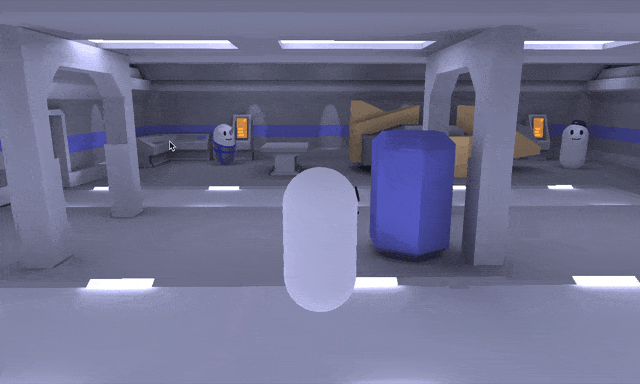

# Dialogue Wheel Examples

Dialogue Wheel for Yarn Spinner ships with two example scenes, showcasing the flexibiltiy of the Dialogue Wheel.

### Automatic-Layout Dialogue Wheel Example

{% embed url="https://files.gitbook.com/v0/b/gitbook-x-prod.appspot.com/o/spaces%2F1BtiYLyfkkFBrMlsYGWS%2Fuploads%2FFb7Jmu3W82zU55hDkz1f%2Fautomatic-wheel-demo.mp4?alt=media&token=8cb58cf4-09c8-483c-a515-8267a0c8d782" %}
The Automatic-Layout Dialogue Wheel example


This example shows off the Automatic-Layout Dialogue Wheel, with an ever-increasing number of options being displayed. Once you've installed the package, find this example in `Dialogue Wheel for Yarn Spinner/Examples/Automatic Layout Example`.

### Image Dialogue Wheel Example

<figure><figcaption></figcaption></figure>

This example shows the Image Wheel in action, with a very simple third-person sci-fi game. Once you've installed the package, find this example in `Dialogue Wheel for Yarn Spinner/Examples/Image Wheel Example`.
