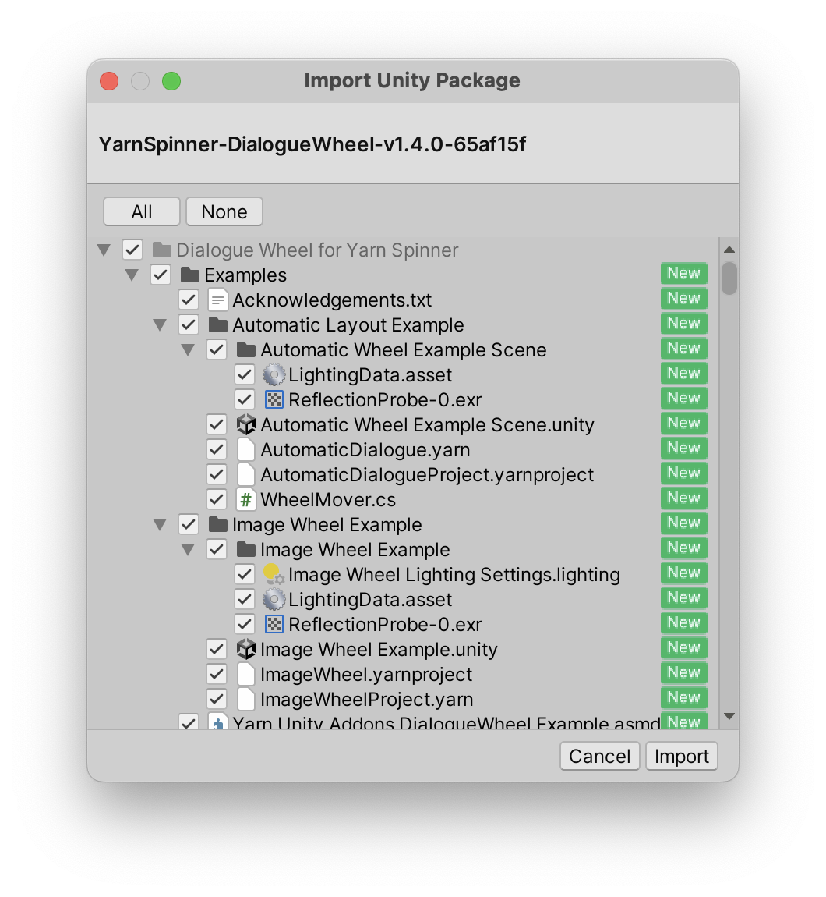

# Installing Dialogue Wheel

You can purchase Dialogue Wheel for Yarn Spinner from the [Yarn Spinner Itch Store](https://yarnspinnertool.itch.io) or the [Unity Asset Store](https://assetstore.unity.com/packages/tools/gui/dialogue-wheels-for-yarn-spinner-276025).


To use the Dialogue Wheel for Yarn Spinner package in Unity, you'll also need to make sure you've got the Yarn Spinner for Unity package [installed](../../installation-and-setup/).


Once you've purchased it, download the package from the store. It will be in the form of a `.unitypackage` file. To install the package, open the Unity project that you want to add it to, and open the the Assets menu -> Import Package -> Custom Package...

You'll then be able to select the `.unitypackage` file for Dialogue Wheel for Yarn Spinner on your file system, and click Open. This will present the Import Unity Package window:

<figure><figcaption></figcaption></figure>

Click the Import button, and Dialogue Wheel for Yarn Spinner will be imported into your project.

The Dialogue Wheel add-on comes has two packages inside the unitypackage, one for the wheels themselves, and one for the Yarn Spinner Samples. The samples contain necessary resources for the two wheel examples but if you already have the [samples installed](../../samples/) you do not need to add them again.

Next, check out the guides on [Using Image Wheel](using-six-segment-wheel.md), or [Using Auto-Layout Dialogue Wheel](using-auto-layout-wheel.md).
