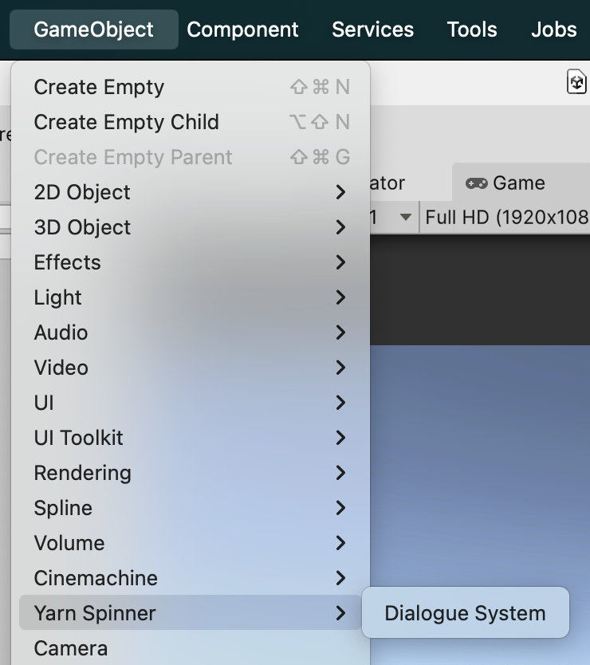
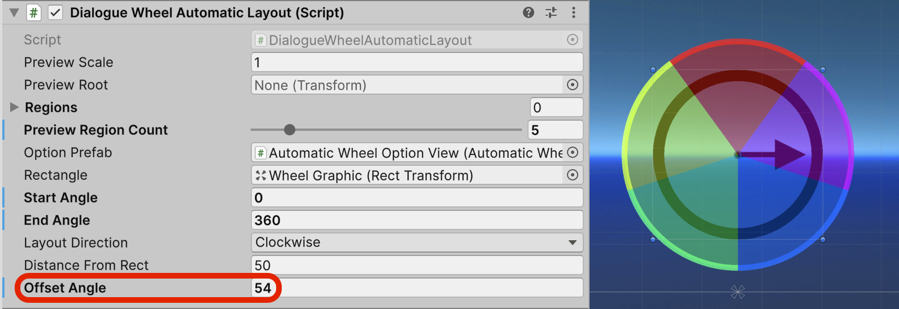

# Using Auto-Layout Wheel

The Automatic-Layout Dialogue Wheel provides a dialogue wheel with a simple graphical appearance, and can—theoretically—support as many options as you'd like, automatically adjusting to display them.


The reason we say theoretically as many options as you like is because even though the code doesn't care about the number of options, if you have too many things are gonna start looking weird.


The Automatic-Layout Dialogue Wheel works by diving up a circle into a number of regions. The number of regions is determined on-the-fly by the number of options that need to be displayed, the size of each region is determined by diving up the available space on the circle evenly by the number of options, so if you have three options each region will be 120 degrees wide. Each region then gets given a single option to show and that option is placed within the centre edge of the region, coiling around circle in a counter-clockwise fashion. The wheel can also have a deadzone set which is a section of the circle where options can't appear, this is mostly to ensure wheels near the bottom of the screen don't have their options cut off, but can be used for other effects. The deadzone is determined by a start and end angle, anything within this range is a valid spot for options. Anything outside of it, is not. The range inside the example is a start of -30 and and end of 210 degrees, meaning a wedge at the bottom is not available for options. The deadzone angles, the coiling direction, and angle offset of each region can be controlled and customised.

## Using the Automatic-Layout Dialogue Wheel

To use the Automatic-Layout Dialogue Wheel [make sure your Unity project has the Yarn Spinner package installed](../../installation-and-setup/), and the [install the Dialogue Wheel for Yarn Spinner package](installing-dialogue-wheel.md).

Then, create a new Dialogue System in your Hierarchy:

<figure><figcaption><p>Adding a new Dialogue System to your scene.</p></figcaption></figure>

Then, in the Project pane, create a new Yarn Project asset:

<figure><figcaption><p>Creating a new Yarn Project asset in the Project pane.</p></figcaption></figure>

And create a new Yarn Script to use:

<figure><figcaption><p>Creating a new Yarn Script asset in the Project pane.</p></figcaption></figure>

Open the Yarn script to write your story. Then save the Yarn script and return to Unity.

We've provided an initial sample story here, if you want to test things out.

<details>

<summary>Initial sample story for Automatic-Layout Dialogue Wheel</summary>


```xml
title: Start
---
Narrator: What brings to the pool?
-> Cleaning
    I have come to clean the pool.
    Narrator: Ah, just as I thought.
        -> I'm a pool cleaner
            Narrator: I know.
            <<jump End>>
        -> I was actually lying.
            Narrator: Oh, I see.
            <<jump End>>
-> Treasure 
    I am looking for the lost treasure of... the pool.
    Narrator: There is no treasure in the pool.
        -> WHAT!?
            WHAT?! WHY NOT? I WAS TOLD THERE WAS TREASURE HERE!
            Narrator: Nope. 
            <<jump End>>
        -> Oh, okay.
            Oh, well, I guess I'll go.
            Narrator: OK, bye!
            <<jump End>>
        -> I know.
            I know, I just wanted a swim.
            Narrator: In you get, then!
            <<jump End>>
-> No reason
    I have a fetish for pool cleaning equipment.
    Narrator: Whatever floats your boat...
        -> Thanks.
            Narrator: Uh uh.
            <<jump End>>
-> Commerce
    I'd like to buy a pool.
    Narrator: Well, it's not for sale.
    Narrator: Go away.
    <<jump End>>
-> Swimming
    I'm here to go for a swim. 
    Narrator: Well, you can't.
    <<jump End>>
===

title: End
---
Narrator: Anyway...
Narrator: Have a nice day!
<<stop>>
===
```


</details>

With the Dialogue Runner selected in the Hierarchy, drag the Yarn Project that you created from the Project pane into the Yarn Project slot in the Dialogue System's Inspector:

<figure><figcaption><p>Assigning your Yarn Project to the Dialogue System.</p></figcaption></figure>

Next, locate the Automatic-Layout Dialogue Wheel prefab, supplied with this add-on, and drag it from the Project pane, so it's below the Canvas in the Hierarchy:

<figure><figcaption><p>The Automatic-Layout Dialogue View, added below the Canvas of the unpacked Dialogue System.</p></figcaption></figure>

Right-click on the Options Presenter in the Hierarchy, and choose Delete. You won't need that presenter, as you'll be displaying a wheel, instead of a list. To make the Dialogue System aware of the Automatic-Layout Dialogue Wheel, select it (the Dialogue System) in the Hierarchy, and drag the Automatic-Layout Dialogue View from the Hierarchy into the Element 2 slot of the Dialogue Presenters section in the Inspector:

<figure><figcaption><p>Adding the Automatic-Layout Dialogue Wheel to the Dialogue System.</p></figcaption></figure>

Click on the Start Automatically toggle on the Dialogue Runner Inspector and from the Start Node drop down pick `Start`.

<figure><figcaption><p>Configuring the automatic start node.</p></figcaption></figure>

If you save your scene and run it, your Automatic-Layout Dialogue Wheel should now be working!

{% embed url="https://files.gitbook.com/v0/b/gitbook-x-prod.appspot.com/o/spaces%2F1BtiYLyfkkFBrMlsYGWS%2Fuploads%2FKLtkMKm1XSdsNucALLVL%2Fauto-wheel-using-1.mp4?alt=media&token=a9b67e81-c5a9-45e4-8e34-212bd15d15a3" %}
The Automatic-Layout Dialogue Wheel in action.


### Automatic Layout Commands

There are three commands which let you adjust how the wheel works during dialogue. To see these in action check out the [example](dialogue-wheel-examples.md).

#### Layout Direction

`<<set_layout_direction wheel-name direction>>` has two parameters, the name of the wheel game object, and the direction. This determines which way around the wheel options should be placed, either clockwise or counter-clockwise. Allowed values for the `direction` parameter to place options clockwise include: `clockwise`, `sunwise`, `cw`. Allowed values for the `direction` parameter to place options counter-clockwise include: `counterclockwise`, `counter-clockwise`, `widdershins`, `ccw`.

#### Deadzone Adjustment

`<<set_option_zone wheel-name start-angle end-angle>>` has three parameters, the name of the wheel game object, and two angles for the start and end region. If you want to have the entire circle you would set `start-angle` to `0` and `end-angle` to `360`, if you only wanted the top half of the wheel you would set them to `0` and `180` respectively. For the wheel in the example the wheel can place options from -30 to 210 degrees, leaving a wedge at the bottom where options can't be placed.

#### Region Offset

The wheel divides up it's available space (so 360 degrees unless a deadzone is set) evenly based on how many options there are. If we have 180 degrees available to place options and we have three options that means each option gets 60 degrees to be placed and will be placed in the centre of that 60 degree wedge. Meaning we'd have one option at 30 degrees (top right), another at 90 (center), and the third at 150 degrees (top left). You can offset the angle to change this behaviour.

`<<set_offset_angle wheel-name angle>>` has two parameters, the name of the wheel game object, and the offset angle. Changing this will rotate the option regions by the `angle` given.

## Customising the Automatic-Layout Dialogue Wheel

### Customising the Wheel

To customise the supplied wheel, select the Wheel Graphic in the Hierarchy:

<div data-full-width="true"><figure><figcaption><p>The Wheel Graphic selected, inside the Automatic-Layout Dialogue View.</p></figcaption></figure></div>

And look to the Inspector:

<figure><figcaption><p>The Inspector for the Wheel Graphic.</p></figcaption></figure>

Here, on the Wheel Graphic component, you can customise a variety of things, such as the material, color, inner radius, and density of the wheel. For example, if you set the Density field to 6, as we did above, your wheel will become a hexagon:

<figure><figcaption><p>The wheel, customised to display as a hexagon, via a modification to the Density field of the Wheel Graphic.</p></figcaption></figure>

### Customising the Options

To customise the way each option is displayed around the wheel, select the Automatic Wheel Option View under Automatic-Layout Dialogue Wheel prefab:

<figure><figcaption><p>The Automatic Wheel Option View selected.</p></figcaption></figure>

And look to the Inspector:

<figure><figcaption><p>The Inspector for the Automatic Wheel Option View.</p></figcaption></figure>

You can tweak some of the fields here to customise the options that are displayed around the wheel. Specifically, you might want to customise the following.

On the Automatic Wheel Option View:

* Normal Color — the color of each option that's not currently highlighted or disabled
* Disabled Color — the color of each option that's displayed, but cannot be chosen
* Highlighted Color — the color of the option that's currently selected (but not yet chosen)
* Text/Graphic Highlight Mode — whether each option is immediately highlighted when it's selected, or whether they crossfade between
* Crossfade Duration — the duration of the crossfade, if crossfading

On the Wheel Option Graphic:

* Material — the Material used for circle graphic displayed near each option
* Width — the size of the circle graphic displayed near each option

For example, if you wanted to highlight selected options in green, and crossfade between them, you could set the following:

<figure><figcaption><p>Tweaks to the Automatic Wheel Option View, to customise the way options are displayed around the wheel.</p></figcaption></figure>

Which would result in something like this:

{% embed url="https://files.gitbook.com/v0/b/gitbook-x-prod.appspot.com/o/spaces%2F1BtiYLyfkkFBrMlsYGWS%2Fuploads%2FqUFDE3nh47d5yabrUma5%2Fauto-wheel-using-2.mp4?alt=media&token=fc27d473-b25a-4fb8-a851-ee6c73195613" %}
The customised options in action.


### Customising the Option Placement

The Inspector for the wheel has an in-editor visualiser to help you see where options will end up placed around the circle based on your settings. Here you can control the number of regions being previewed, see the effect of changing the start and end angles for the deadzone, and change the region offset angles.

<figure><figcaption><p>The default wheel settings and their preview.</p></figcaption></figure>

If we wanted the entire wheel to be in use we could change the start and end angles.

<figure><figcaption><p>The wheel now previewing two regions across the entire .</p></figcaption></figure>

If we were curious to see the regions if we had five options.

<figure><figcaption><p>The wheel previewing five options.</p></figcaption></figure>

Or perhaps we wanted the first one at the top, so change the offset angle for the regions.

<figure><figcaption><p>The wheel with a 54 degree angle offset.</p></figcaption></figure>

And that's everything you need to know to use the Automatic-Layout Dialogue Wheel! Review the [Dialogue Wheel Examples](dialogue-wheel-examples.md) for more.
