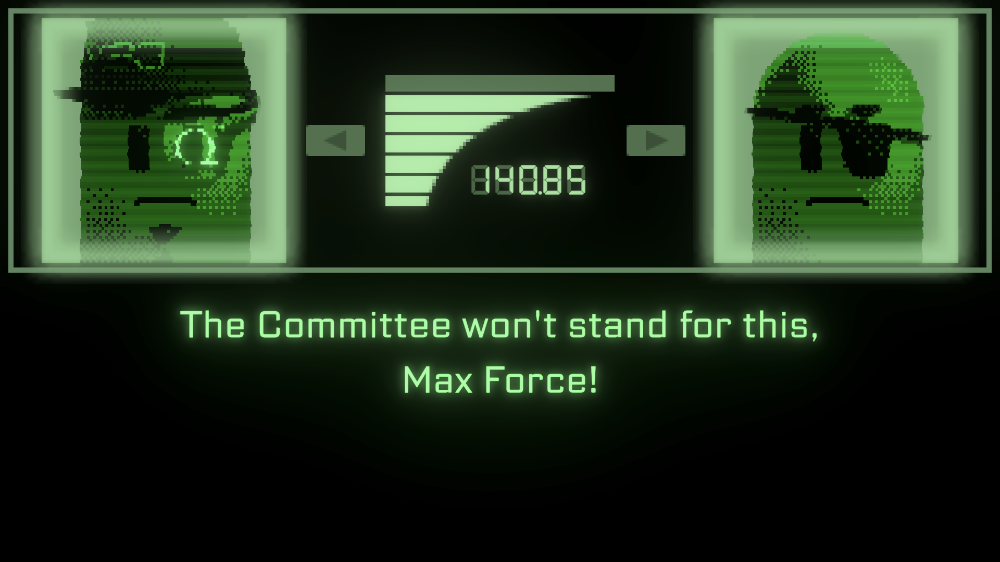

# Snaaake

**Snaaake** is a dialogue presenter for Yarn Spinner that pays homage to the dialogue in classic action games. It shows two characters in a 'radio' view, with retro effect. As characters speak their voice-over lines, the characters play a talking animation, and a subtitle view shows the corresponding text. An animated 'signal level' graphic appears between them during the conversation.

<figure><figcaption></figcaption></figure>

### Getting Snaaake

Snaaake is included in the paid [itch.io](https://yarnspinner.itch.io/yarn-spinner) and [Unity Asset Store](https://assetstore.unity.com/packages/tools/behavior-ai/yarn-spinner-for-unity-the-friendly-dialogue-and-narrative-tool-267061) and versions of Yarn Spinner.

### Try it out!

Test out the Snaaake presenter by installing the sample:

1. Open the Package Manager by choosing Window -> Packages -> Package Manager.
2. Select the 'Snaaake for Yarn Spinner' package.
3. Select the 'Samples' tab.
4. Install the 'Snaaake' sample. The sample will be copied into your project's Assets folder.
5. Open the 'Snaaake' scene that was copied over, and hit Play.

### How To Use Snaaake

To use Snaaake in your game's dialogue, follow these steps.

* In the Project tab, find the 'Snaaake for Yarn Spinner' package, and navigate to 'Runtime/Prefabs'.
* Drag the 'Snaaake Dialogue System' prefab into your scene.
* Add your Yarn Project to the dialogue system, turn on Start Automatically, and choose a node.
* Hit play, and enjoy your dialogue!

### Structure

The Snaaake dialogue presenter is composed of several components.

#### Talking Head Character

A `TalkingHeadCharacter` is a ScriptableObject that contains a number of sprites. The first sprite will be used as the 'idle' frame, and the rest will be used while talking.

#### Talking Head Character View

A `TalkingHeadCharacterView` presents sprites from a `TalkingHeadCharacter`, and can be signalled whether the speaking animation should be playing or not.

#### Talking Head Dialogue Presenter

The `TalkingHeadDialoguePresenter` manages a collection of named `TalkingHeadCharacterView`s, a collection of available \`TalkingHead and keeps track of which character is being presented in which view, and which character is speaking the current line. It also monitors an AudioSource's volume levels; when the level is over a threshold, the view that's showing the currently speaking character is signalled to show a speaking animation.

#### Subtitle Dialogue Presenter

The `SubtitleDialoguePresenter` is a simple presenter that shows the text of the current line in a TextMeshPro text view.

#### VO Dialogue Presenter

The Snaaake dialogue presenter includes a Yarn Spinner `VoiceOverDialoguePresenter` that plays the audio associated with the line. (This component is built-in to Yarn Spinner, and is made use of by this custom presenter.)

### Defining Characters

To define a character, create a new `TalkingHeadCharacter` object by opening Assets menu and choosing Create -> Yarn Spinner -> Snaaake -> Talking Head Character. Name it whatever you like, and add the sprites you want to use.

**Note:** The sprites you use can be any resolution, but they _must_ be square in order for the pixellation effect to work correctly.

Next, select the Snaaake Dialogue Presenter, find the Talking Heads Dialogue Presenter component, and click the `+` button next to the Characters list. Set the name of the character to the value you use to refer to them in your Yarn Spinner script, and set the value to the `TalkingHeadCharacter` asset you just created.

### Using Characters in Dialogue

To make a character appear in a slot, use the `set_slot` command in your scripts. The prefab that comes with Snaaake has two slots: left, and right. You can define your own slots, or add more slots, by modifying the Character Slots list in the Talking Heads Dialogue Presenter.

```
// Put the TalkingHeadsCharacter named 'Player' in the 'left' slot.
<<set_slot Player left>>
```

You can change which character is in which slot at any time. Make sure to assign characters to slots before any of their lines play, or the system won't know where to show them.

### Notes

* Snaaake expects all lines to have an audio file. When the audio for a line finishes, the next line will play. If a line doesn't have audio, it will be skipped.
* You can adjust the style of the retro effect by creating a custom material that uses the retro shader. Simply create a new Material, set its shader to 'Yarn Spinner/Snaaake Retro', and assign it to the Material of the Image on the Character. You can adjust the tint colour, pixellation, dither amount, posterisation, and more.
* To make post-processing effects like Bloom work, you'll need to assign your camera to the canvas. To do this, open the 'Snaaake Dialogue System' prefab in your scene, and find the 'Snaaake Dialogue Presenter -> Canvas' object. Drag your scene's main camera into the Camera slot. (Make sure that your Camera has post-processing enabled!)
