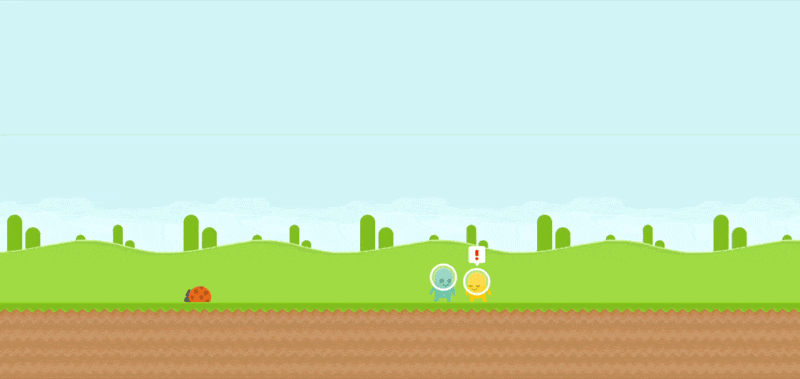

# Speech Bubble Examples

Speech Bubbles for Yarn Spinner ships with two example scenes, showcasing the flexibility of the Speech Bubbles.

### 2D Sidescroller

<figure><figcaption></figcaption></figure>

The 2D Sidescroller Example showcases the flexibility of the Speech Bubble in a variety of contexts, including both the Formal Bubble, and the Casual Bubble. Once you've installed the package, find this example in `Speech Bubbles for Yarn Spinner/Examples/2D Sidescroller`.

### 3D Top-Down

{% embed url="https://files.gitbook.com/v0/b/gitbook-x-prod.appspot.com/o/spaces%2F1BtiYLyfkkFBrMlsYGWS%2Fuploads%2FWmG2kbg8JE82JyEbSPzg%2Fbubble-3d-preview.mp4?alt=media&token=7ea439c2-f781-4ced-b143-177edf2937aa" %}

The 3D Top-Down Example showcases the Speech Bubbles in a 3D environment, with a variety of small customisations. Once you've installed the package, find this example in `Speech Bubbles for Yarn Spinner/Examples/3D Top-Down`.
