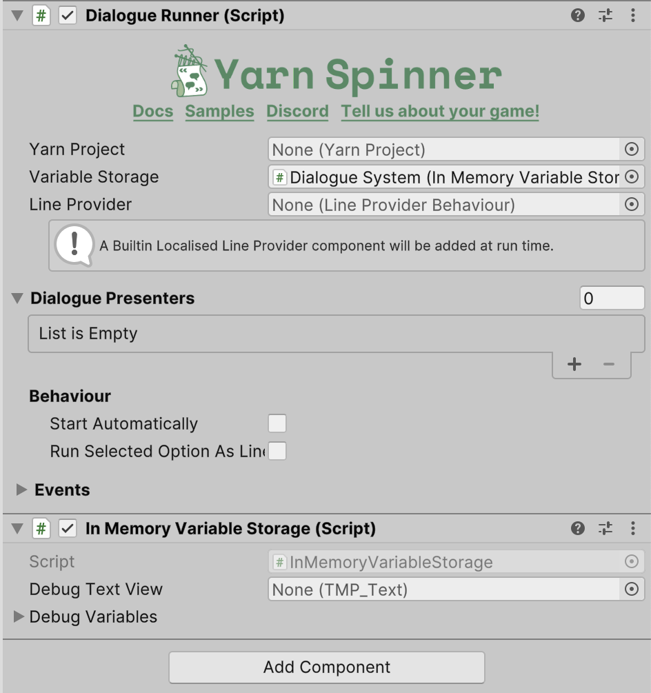
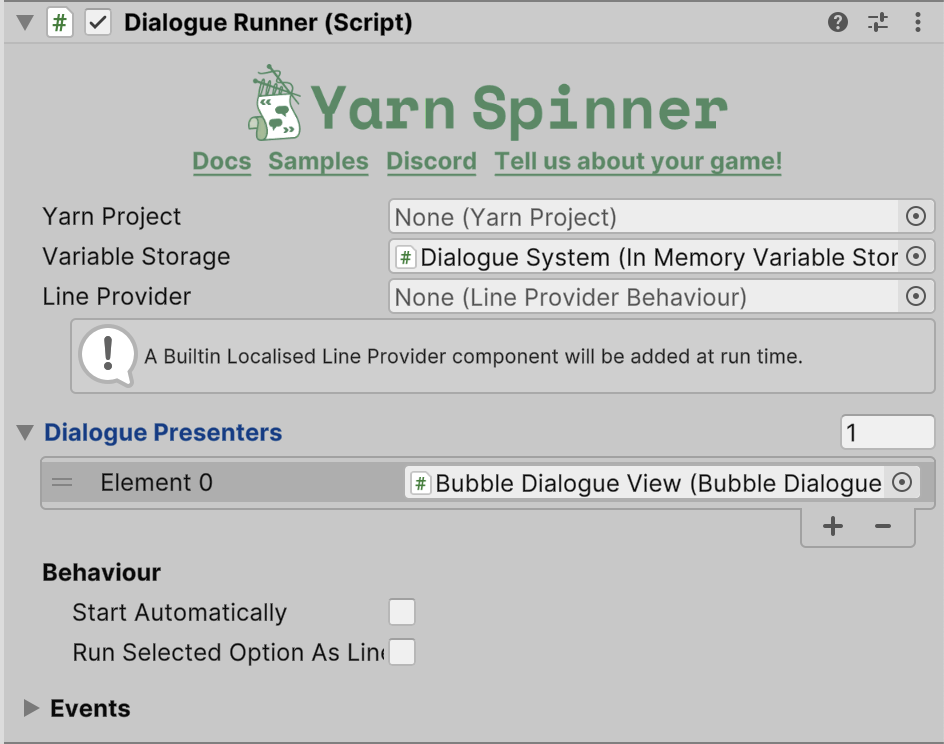

# Using Speech Bubbles

The Speech Bubbles Add-On provides a flexible speech bubble system with a variety of possible customisations. Here, you'll learn how to implement it in a Unity project by looking at a _super simple_ side-scrolling game.

## Terminology

There are a few different pieces to the speech bubbles which are worth just quickly clarifying.\
First is the bubble dialogue view which is the code that talks to Yarn Spinner and handles the interaction with the dialogue side of things.

Next is the bubble, this handles the positional and tracking code for where the bubble lives on the screen.\
As part of the bubble is it's anchor, this is the point that the stem of the bubble will reach outwards towards.

Finally is the bubble content, this represents the actual displayed elements that live inside of the bubble such as it's shape, the text it shows, and any other visual elements that you want to have seen when a line comes in.

This splitting of the code was done to make it easy to make your own bubble variants.\
Instead of having to deal with dialogue events or tracking code most of the time to make your own bubbles you can make your own bubble content subclass.

We ship one bubble content subclass called Basic Bubble Content that shows off many features and also supports customisation.\
It is a highly flexible bubble content subclass that supports different visual elements including nameplates, text colours, and typewriting text.\
This guide and the add-on examples all use the Basic Bubble Content.

## Setting up for Speech Bubbles


This guide covers building out a scene using the speech bubbles from scratch, if you just want to see an already working scene in action check our provided [Speech Bubble Examples](speech-bubble-examples.md).


To use Speech Bubbles for Yarn Spinner, you'll need to create a new Unity project and [install the Yarn Spinner package](../../installation-and-setup/), and then [install the Speech Bubbles for Yarn Spinner package](installing-speech-bubbles.md).

For this guide, we'll assume you've made a simple 2D side-scrolling environment, much like this:

<figure><figcaption></figcaption></figure>

Our environment is nothing more than some sprites (from the GameObject menu -> 2D Object -> Sprites)—a Square, resized to be the floor, and two capsules—and a simple player movement script.

With a project ready, [install the Speech Bubbles for Yarn Spinner package](installing-speech-bubbles.md), and install TextMesh Pro (TMP) if prompted. You'll also need to install the Unity Input System Package.


You can find the Unity Input System Package in the Unity Package Manager, found in the Window menu -> Package Manager. For further guidance, visit [the Unity documentation](https://docs.unity3d.com/Packages/com.unity.inputsystem@1.7/manual/Installation.html#installing-the-package).


#### Creating a Dialogue Runner

Add an empty GameObject to your Hierarchy, and name it `Dialogue System`. Use the Add Component button in the Inspector to add a Dialogue Runner component and an In Memory Variable Storage component to it and add the In Memory Variable Storage into the Variable Storage slot in the inspector:

<figure><figcaption></figcaption></figure>

Then, in the Hierarchy, add a Canvas as a child object, as well as a new empty GameObject named `Bubble View`. Select the `Bubble View` and use the Add Component button in its Inspector to add a Bubble Dialogue View component:

<figure><figcaption></figcaption></figure>

Next, make a new Yarn project in the Assets pane, give it a Yarn Script, and add the new project to the Dialogue Runner in the Inspector.

Our demonstration here uses the following `.yarn` script:

<details>

<summary>Simple Yarn Script</summary>

```
title: Start
---
Orange: Hello!
    -> Hi!
        Orange: Hello.
    -> Who are you?
        Orange: I'm Orange.
    -> You're orange.
        Orange: Yep.
===

```

</details>

Make sure the Start Node in the Dialogue System's Inspector is set to `Start`, and that Start Automatically is chosen.

Next, expand the Dialogue Presenters section of the Dialogue System's Inspector, set the number of Dialogue Presenters to `1`, and drag the BubbleView GameObject from the Hierarchy (it should be a child of the Dialogue System) into the slot:

<figure><figcaption></figcaption></figure>

### Adding Bubbles to Characters

Our simple 2D side-scrolling environment has two characters in it: a Player Character, and a Orange NPC. In this case, we want things that the player can choose from to come out of bubbles attached to the Player Character, and we want the NPCs responses to come out of the NPC.

To allow this to happen, we must specify the position that the bubbles will be anchored to, for each character. To do this for the Orange NPC, select them in the Hierarchy, and add an empty GameObject as a child. Name it Bubble Anchor:

<figure><figcaption></figcaption></figure>

Select the BubbleAnchor in the Hierarchy, and position it above the character, wherever you want the bubble to be anchored:

<figure><figcaption></figcaption></figure>

Evry character will need an anchor otherwise the speech bubbles won't know where to position the bubble when it comes time for that character to speak.\
This is the case even if the character won't be moving anywhere.

Next, create a new Basic Character Bubble Data asset, in the Project pane:

<figure><figcaption></figcaption></figure>

Name the new asset Bubble Data.\
The Bubble Data is how we support customisation of the Basic Bubble Content.\
While we could add in a variety of configurations in this case we will go with just having a white background, no nameplate, and black text.\
Select the Bubble Data asset, and use the Inspector to set the Text Color to black.\
Then, select the Character in the Hierarchy and use its Inspector's Add Component button to add a Character Bubble Anchor component:

<figure><figcaption></figcaption></figure>

Use the Inspector on the Orange NPC to set the Character Name (ours is called "Orange"), drag the Bubble Anchor child object from Hierarchy to the Bubble Position slot, and drag the Bubble Data asset from the Project pane to the Character Bubble Data slot:

<figure><figcaption></figcaption></figure>

Now when Orange says a line the character anchor will let the bubble dialogue view know that the Bubble Data should be used for that character and shown at this position.

Add a Bubble Anchor child object to the Player Character as well, and position it appropriately. Then, use the Add Component button in the Player Character's Inspector to add three components: a _Character Bubble Anchor_ component, a _Sample Bubble Option_ Input component, and a _Player Input_ component.

Set the Character Name to something appropriate (in the case of the Player Character, "Player" is a good idea), assign the Player Character's Bubble Anchor to the Bubble Position slot, and assign the same Bubble Data asset you used for the Orange NPC to the Character Bubble Data slot:

<figure><figcaption></figcaption></figure>

In this case we are using the same configuration data for both the player and the NPC, but if you wanted them to look different you could make a new Basic Bubble Content data for the player.

To allow the input to be controlled by the player, create an [Input Actions Asset](https://docs.unity3d.com/Packages/com.unity.inputsystem@0.9/manual/ActionAssets.html), name it Dialogue Actions, and double-click it to bring up Action Editor. Use the Action Editor to create an Action Map for Dialogue, and then add an Action called `ActionDialogue`, and bind it to something appropriate (such as the Space key):

<figure><figcaption></figcaption></figure>


You can learn more about Input Actions [in the Unity documentation](https://docs.unity3d.com/Packages/com.unity.inputsystem@0.9/manual/ActionAssets.html).


Expand the new asset in the Project pane so you can see the specific action that you just made:

<figure><figcaption></figcaption></figure>

In the Sample Bubble Option Input component, assign the Advance Dialogue action to the Advance Dialogue Action slot (by dragging it from the expanded Input Actions Asset in the Project pane), and drag the Bubble View from the Dialogue System (in the Hiearachy) into the Bubble Dialogue View slot:

<figure><figcaption></figcaption></figure>


The Sample Bubble Option Input script comes with Speech Bubbles for Yarn Spinner. You can find it in`Speech Bubbles for Yarn Spinner/Examples/Shared Example Resources`. The script gives you basic input handling to allow the player to select and change options for their dialogue. It's not intended to be used or even subclassed, and is solely provided for samples and examples. In a game, your game's input system should handle this but this shows off a starting point for integrating this functionality into your games input system.


In the Player Input component, drag the overall Dialogue Actions asset from the Project pane into the Actions slot, and drag your camera from the Hierarchy into the Camera slot, and set the Behavior dropdown to Invoke C Sharp Events:

<figure><figcaption></figcaption></figure>

The Player Input component needs to have its behavior setting changed to _Invoke C Sharp Events_ because Yarn Spinner uses C# Events, rather than Unity's own event system.


The Player Input component is part of Unity's Input System. You can learn more about it [in the Unity documentation](https://docs.unity3d.com/Packages/com.unity.inputsystem@1.7/manual/PlayerInput.html).


## Playing with Bubbles

With that, you can play your project and see the Speech Bubbles in action:

<figure><figcaption></figcaption></figure>

Next check our provided [Speech Bubble Examples](speech-bubble-examples.md).
