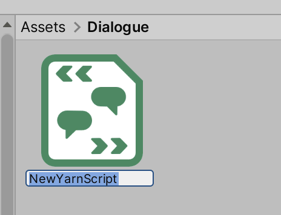
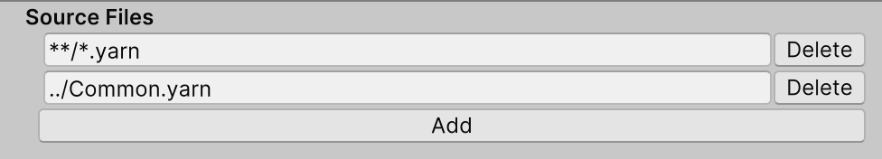

# Unity Projects + Yarn Spinner

Yarn Spinner Scripts are just like any other kind of asset you might work with in your Unity Projects: they live in your `Assets/` folder.&#x20;

When you're building a project in Unity that use Yarn Spinner, there are two main kinds of files (which become Assets, in Unity terminology) you'll use when working with Yarn Spinner for Unity:

* **Yarn Scripts**—`.yarn` files that contain your written dialogue.
* **Yarn Projects**—a special file that groups a set of Yarn Scripts together.

In this document, we'll learn how these pieces fit together in Unity.

## Yarn Spinner Scripts

A Yarn Spinner Script is a text file containing your dialogue. You spent a lot of time writing `.yarn` files, which are Yarn Spinner Scripts, using Yarn Spinner for Visual Studio Code in the [writing-yarn-in-vs-code.md](../write-yarn-scripts/yarn-spinner-editor/writing-yarn-in-vs-code.md "mention") section of the documentation.


Yarn scripts need to be part of a [Yarn Project](yarn-projects.md) in order to be used in your game. You'll learn what Yarn Projects are later on in this document.


There are two main methods of getting your Yarn Spinner Scripts into your Unity project:

* you can move the `.yarn` Yarn Scripts into the `Assets/` folder of your project, using your computer's file manager or terminal;
* you can can create new `.yarn` Yarn Scripts inside Unity.

### Creating a New Yarn Scripts inside Unity

To create a new Yarn script in Unity, follow these steps:

* Open the Assets menu, and choose Yarn Spinner -> Yarn Script.
* Unity will create a new file. Type in a name for the file, and press return.

The new file that you've just created will contain a single [node](../write-yarn-scripts/scripting-fundamentals/lines-nodes-and-options.md#writing-nodes-in-plain-text), which has the same name as the file.


Creating a Yarn Script in Unity is exactly the same as creating a `.yarn` file externally (i.e. in macOS Finder or Windows Explorer), and dragging it into the Assets folder of your Unity project, or directly into the Project pane (where the new Yarn Script we created through the process above appeared) in Unity.


## Editing Yarn Scripts

To edit a Yarn script, double-click it in Unity. The file will open in your editor. When you save your changes and return to Unity, it will be re-compiled. Learn about editing Yarn Spinner Scripts using the [yarn-spinner-editor](../write-yarn-scripts/yarn-spinner-editor/ "mention").

## Yarn Projects

A Yarn Project is a file that links multiple Yarn Spinner Scripts together.

## Creating a New Yarn Project

To create a new Yarn Project, follow these steps:

* Open the Assets menu, and choose Yarn Spinner -> Yarn Project.
* Unity will create a new file. Type in a name for the file, and press return.

## Adding Yarn scripts to a Yarn Project

On their own, a Yarn Project doesn't do anything. In order to be useful, you need to add Yarn scripts to it.

Yarn Projects include all Yarn Scripts that the project finds in the Source Files directory. By default, that means all Yarn Scripts in the same directory as the Yarn Project, and all of that directory's children.

When you add a Yarn Script to the same folder as a Yarn Project, it will automatically be included in the Yarn Project. When you make changes to the script, the Yarn Project will automatically be re-imported.

You can change the locations that a Yarn Project looks for Yarn Scripts by modifying the Source Files setting. Each entry in the Source Files setting is a _search pattern_.

| Pattern | Description                        | Examples                                                     |
| ------- | ---------------------------------- | ------------------------------------------------------------ |
| `*`     | any filename                       | "`*.yarn`" will find "One.yarn" and "Two.yarn".              |
| `**/*`  | any path, including subdirectories | "`**/*.yarn`" will find "One.yarn" and "Subfolder/Two.yarn". |
| ..      | the parent folder                  | "`../*.yarn`" will find "One.yarn" in the parent folder.     |

You can add as many entries to the Source Files field as you like. If a file is matched by multiple patterns, it will only be included once.

A Yarn script can be included in more than one Yarn Project.

### Creating a Project from a Script

You can create a new Yarn Project from a script. To do this, follow these steps:

* Select the Yarn script in the Project pane.
* In the Inspector, click the Create New Yarn Project button.

* Clicking this button does two things:
  * A new Yarn Project will be created next to the Yarn script.
  * The new Yarn Project will include the Yarn script you created it from in its list of source scripts.

## Managing Variables

A Yarn Project's inspector shows information about every [variable](../write-yarn-scripts/scripting-fundamentals/logic-and-variables/) that are used in the Yarn scripts. This section of the Inspector shows the name, type, description, and default value of each variable.

The Inspector will show information about every variable in the project. If you use a `declare` statement to declare a variable, you can control the initial value of a variable, as well as its description.&#x20;

If you don't declare a variable, Yarn Spinner will attempt to figure the variable's type out based on how it's used, and won't be able to provide a description.

## Managing Localisations and Assets

When you write a Yarn script, you write it in a specific human language. This is referred to as the 'base' language of the script. It's called the base language because it's the one you start with, and the one you translate into other languages.


Unless you change it to something else, Yarn Spinner will set the base language to your computer's current locale.


You can set the base language of a Yarn Project in the Inspector by changing the Base Language setting.

If you want to translate your scripts into another language, or if you want to associate each line with assets (like voice over audio clips), you create a new Localisation. To learn about this process, see [Adding Localizations and Assets to Projects](assets-and-localization/).

## Using Yarn Projects with Dialogue Runners

Yarn Projects are used by Dialogue Runners. When a Dialogue Runner is told to start running dialogue, it reads it from the Yarn Project it's been provided.


If you try to start a Dialogue Runner and it doesn't have a Yarn Project, or the Yarn Project doesn't have any Yarn scripts, or if any of the Yarn scripts contain an error, the Dialogue Runner won't be able to run.


## Inspector

| Property                        | Description                                                                                                                                                                                                                                                                                                                                                                                                                                                |
| ------------------------------- | ---------------------------------------------------------------------------------------------------------------------------------------------------------------------------------------------------------------------------------------------------------------------------------------------------------------------------------------------------------------------------------------------------------------------------------------------------------- |
| Source Scripts                  | The list of places that this Yarn Project looks for Yarn Scripts.                                                                                                                                                                                                                                                                                                                                                                                          |
| Base Language                   | The language that the Yarn Scripts are written in.                                                                                                                                                                                                                                                                                                                                                                                                         |
| Localisations                   | 
A mapping of languages to string tables and associated assets.

This list will only appear if the project is not using the Unity Localisation system. See <a href="assets-and-localization/">Adding Localizations and Assets to Projects</a> for more information.
                                                                                                                                                                             |
| Use Addressable Assets          | 
If this is turned on, the Yarn Project will be set up to tell other parts of the game that localised assets like audio files should be fetched using the <a href="https://docs.unity3d.com/Packages/com.unity.addressables@latest/index.html">Addressable Assets</a> system.

This checkbox will only appear if the Addressable Assets package is installed in your project, and if the project is not using the Unity Localisation System.
    |
| Use Unity Localisation System   | 
If this is turned on, the Yarn Project will use the Unity Localisation System to store line data in.

This checkbox will only appear if the Localisation package is installed in your project.
                                                                                                                                                                                                                                                 |
| Unity Localisation String Table | 
The String Table Collection that the Yarn Project uses. When the project is imported or reimported, this String Table will be filled with line content that comes from the project's Yarn Scripts.

This field will only appear if project is using the Unity Localisation system.
                                                                                                                                                             |
| Export Strings as CSV           | When you click this button, all of the lines in the Yarn Scripts that this project uses will be written to a `.csv` file, which can be translated to other languages. See [Adding Localizations and Assets to Projects](assets-and-localization/) for more information.                                                                                                                                                                                    |
| Update Existing Strings Files   | 
When you click this button, all <code>.csv</code> strings files that are configured in the Languages to Source Assets list will be updated with any lines that have been added, modified or deleted since the strings file was created.

This checkbox will only appear if the project is not usin the Unity Localisation system. See <a href="assets-and-localization/">Adding Localizations and Assets to Projects</a> for more information.
 |
| Add Line Tags to Scripts        | When you click this button, any line of dialogue in the Source Scripts list that doesn't have a `#line:` tag will have one added. See [Adding Localizations and Assets to Projects](assets-and-localization/) for more information.                                                                                                                                                                                                                        |
