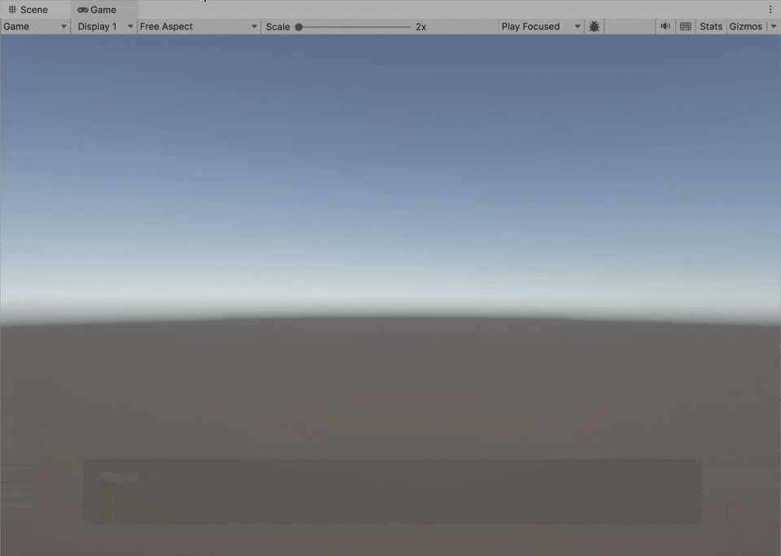

# Yarn Spinner in Unity Scenes

## Getting Started with Yarn Spinner for Unity

This guide will walk you through setting up Yarn Spinner in your Unity project and getting a basic dialogue system running. It assumes you have created a new Unity project and [installed the Yarn Spinner for Unity package](installation-and-setup/).&#x20;



### Creating a Yarn Project

To organise your dialogue, you'll need to create a **Yarn Project.**

A Yarn Project is a special file that groups related Yarn Scripts together. It's essential for using dialogue in your game.

To create a Yarn Project:

1. In the Unity Editor, open the Assets menu -> Yarn Spinner -> and choose Yarn Project
2. Name your new Yarn Project file (e.g., `MyGame`)
3. The Yarn Project will appear in your Assets folder


Yarn Projects include all Yarn Scripts in the same directory by default. You can modify the Source Files setting to include scripts from different locations.


Our recommended best practice is to create a `Dialogue` folder inside your assets, and store your Yarn Spinner Project(s) and Script(s) in it. The name of the folder is not significant, it's just useful to group your Yarn Spinner Script(s) and Project(s) together.


You can take a look at the Inspector of your Yarn Spinner Project to get a better understanding of what it's looking for:

<figure><figcaption><p>The Inspector for a Yarn Spinner Project asset.</p></figcaption></figure>

You'll notice that it's including all `.yarn` scripts in the same folder as it, or in folders below/inside it. You can change this, or add specific Yarn Spinner Scripts if you'd like. You can also use this Inspector to change the default language for your Yarn Spinner Project, add additional localisations, and export your strings for translation.

For now, you don't need to touch anything here.



### Writing Dialogue in Yarn Scripts

Now, let's create a Yarn Script to write your dialogue:

1. Open the Assets menu -> Yarn Spinner > and choose Yarn Script
2. Name your script (e.g., `Introduction`). This will create a file named `Introduction.yarn`
3. Double-click the script to open it in the editor

Here's a simple example of dialogue written in Yarn:

```yarn
title: Start
---
Player: Hello there!
NPC: Oh, hello! How can I help you today?
-> I need information.
    NPC: What would you like to know?
-> I'm just browsing.
    NPC: Feel free to look around!
-> Actually, I should go.
    NPC: No problem. Come back anytime!
    <<jump End>>
===

title: End
---
Player: Thanks for your help!
NPC: You're welcome! Have a nice day!
===
```

Save your changes. The script will be automatically included in your Yarn Project if it's in the same folder.

When writing dialogue, remember:

* Each node begins with `title:` followed by the node name
* The node's content starts after `---` and ends with `===`
* Options are created using `->` at the start of a line
* Commands use `<<command>>` syntax



### Setting Up the Dialogue System in Unity

To use your dialogue in-game, you need to add a **Dialogue System** to your scene:

1. In your scene hierarchy, right-click and choose Yarn Spinner -> Dialogue System
2. With the Dialogue System selected in the Hierarchy, locate its Dialogue Runner component in the Inspector.

<figure><figcaption></figcaption></figure>

3. Drag your Yarn Project from the Assets view into the "Yarn Project" field in the Dialogue Runner:

<figure><figcaption><p>The Yarn Project asset assigned to the correct field.</p></figcaption></figure>

4. If you want dialogue to start automatically, check "Start Automatically" and set your starting node (often titled `Start` , by convention).

<figure><figcaption><p>Setting the Yarn Spinner DIalogue Runner to start automatically and run the node titled <code>Start</code>.</p></figcaption></figure>

The Dialogue System prefab comes with several components:

* **Dialogue Runner**: The core component that runs your dialogue
* **Line Presenter**: Displays text dialogue to the player
* **Options Presenter**: Shows choices for the player to select
* **Line Advancer**: Allows the player to progress through dialogue
* **Markup Processor:** Handles replacement [markup](samples/replacement-markup.md).



### Understanding Dialogue Presenters

**Dialogue Presenters** are components that display dialogue content to the player. There are a few different varieties. You can have multiple Dialogue Presenters in your scene, each handling different aspects of dialogue presentation. You'll often have a **Line Presenter**, to show regular lines, and an **Options Presenter**, to show options.

### **Line Presenter**

A **Line Presenter** shows lines of dialogue. The default Line Presenter looks like this:

<figure><figcaption><p>The default Line Presenter.</p></figcaption></figure>

This default Line Presenter has some configuration options, including:

* Text appearance and positioning
* Character name display
* Typewriter effect speed
* Fading effects
* Auto-advance settings

You can learn about them by selecting the Line Presenter in the Hierarchy:

<figure><figcaption><p>The Line Presenter, selected in the Hierarchy.</p></figcaption></figure>

And then looking at its Inspector:

<figure><figcaption><p>The Line Presenter's Inspector.</p></figcaption></figure>

### **Options Presenter**

The **Options Presenter** displays [options](../write-yarn-scripts/options.md) for the player to select. The default Options Presenter looks like this:

<figure><figcaption></figcaption></figure>

You can configure:

* Option appearance and positioning
* List layout
* Whether to show unavailable options

### **Line Advancer**

The **Line Advancer** allows players to progress dialogue using input. You can configure it by:

1. Selecting your Line Presenter in the hierarchy
2. Finding the associated Line Advancer component
3. Configuring the input method (keycode, button, etc.)

<figure><figcaption><p>Configuring the Line Advancer.</p></figcaption></figure>



### Variable Storage and Line Providers

### **Variable Storage**

Variable Storage components keep track of variables in your dialogue:

* By default, Yarn Spinner uses **In-Memory Variable Storage** (variables are lost when the game ends)
* For persistent variables, create a custom Variable Storage that connects to your game's save system. You can learn to do this in our [variable-storage](components/variable-storage/ "mention") Guide.

To debug variables during development, use the Debug Text View property of the In-Memory Variable Storage component. By creating a [TextMeshPro Text Component](https://docs.unity3d.com/Packages/com.unity.ugui@2.0/manual/TextMeshPro/index.html) in your Hierarchy, and assigning it to the Debut Text View field of the In Memory Variable Storage component attached to the Dialogue System, you can monitor variables in your game view for debug purposes:

<figure><figcaption><p>The In Memory Variable Storage component.</p></figcaption></figure>

### **Line Providers**

Line Providers fetch the content for each line of dialogue:

* **Text Line Provider**: Provides just the text of dialogue lines
* **Audio Line Provider**: Provides text and associated audio clips
* **Unity Localised Line Provider**: Works with Unity's Localization system

If you don't set a Line Provider, the system will create a Text Line Provider automatically. These components are all configured in the Dialogue Runner:



### Testing Your Dialogue

To test your dialogue system:

1. Make sure you have a **Yarn Project** asset and a **Yarn Script** asset, and that the Yarn Script is appropriately included with the Yarn Project:

<figure><figcaption><p>The bottom of the Inspector for a Yarn Project asset, showing the Yarn Scripts it is including.</p></figcaption></figure>

2. Add a **Dialogue System** to the scene, and assign the **Yarn Project** to it in the Inspector for the **Dialogue Runner** component attached to the Dialogue System:

<figure><figcaption><p>The Yarn Project asset assigned to the Dialogue Runner.</p></figcaption></figure>

3. Also set the the Dialogue Runner to **Start Automatically**, and run the appropriate Yarn node:

<figure><figcaption><p>Settings for starting automatically, and running a specific node, found on the Dialogue Runner component.</p></figcaption></figure>

3. Press Play in the Unity Editor. Dialogue should begin!

<figure><figcaption><p>Dialogue running via Yarn Spinner for Unity and the default Line Presenter and Options Presenter.</p></figcaption></figure>

If you didn't want dialogue to start automatically, you can trigger it by calling the `StartDialogue()` method on your Dialogue Runner. For example, you might trigger dialogue when a player presses a button near an NPC.

While testing, use the Unity Console to check for any errors in your Yarn scripts:

<figure><figcaption><p>The Unity console showing that we forgot to close a Yarn Command on line 11 of the Yarn Script.</p></figcaption></figure>



### Working with Localisation

Yarn Spinner makes it easy to add **multiple languages** to your game:

1. Select your Yarn Project in the Assets panel
2. Click "Export Strings as CSV" in the Inspector
3. Translate the exported CSV file
4. Import the translations back into your project

You can use either:

* **Built-in Localisation System**: Manage translations directly through Yarn Spinner
* **Unity Localisation System**: Integrate with Unity's Localisation package


We provide both Yarn Spinner's Built-in Localisation System and Unity's because our built-in system is easier to setup. The Unity Localisation System has more features, but requires a lot of setup.&#x20;

If you're working on a large game with quite a few team members, and are using external services like Google Sheets, and have UI-text that's not powered by Yarn Spinner, then you might want to use the Unity Localisation System.


### For Unity Localization

1. Install the [**Localisation**](https://docs.unity3d.com/Packages/com.unity.localization@1.5/manual/index.html) **package**
2. Create a new **Localization Settings** in the Project Settings - Localization screen:

<figure><figcaption><p>Creating a Localization Settings in the Project Settings screen.</p></figcaption></figure>

3. Create at lease one Locale in the Project Settings - Localization view.
4. Create a String Table Collection via Window menu -> Asset Management -> Localization Tables.
5. Check "Use Unity Localisation System" in your Yarn Project, and assign the String Table, and click Apply.

<figure><figcaption><p>Activating the Unity Localization system on the Yarn Project asset, and assigning a String Table.</p></figcaption></figure>

6. Verify that the String Table (viewable by Window menu -> Asset Management -> Localization Tables) contains your Yarn Spinner Script's lines.
7. In the Inspector for your Dialogue Runner, click the "Add Unity Localized Line Provider" button:

<figure><figcaption></figcaption></figure>

8. This will add a component to your GameObject. Find it, and assign your String Table Collection to the Strings Table field:

<figure><figcaption></figcaption></figure>


Don't manually update the Strings Table Collection for your base language. For example, if you're writing your Yarn Spinner Scripts in English, don't modify the English column. That column is managed and updated by Yarn Spinner. You can safetly modify the other columns (which is how you get your translations in). We recommend having a separate Strings Table Collection for your non-Yarn Spinner strings.


### For Built-in Yarn Spinner Localization





#### Creating Custom Commands and Functions

Extend Yarn Spinner by creating custom commands to connect dialogue with your game mechanics:

**Custom Commands**

Create a command that your Yarn scripts can call:

```csharp
[YarnCommand("give_item")]
public void GiveItem(string itemName, int quantity = 1)
{
    // Your code to give the player an item
    Debug.Log($"Giving {quantity} {itemName}(s) to the player");
}
```

Then use it in your Yarn script:

```yarn
NPC: Here, take this potion.
<<give_item "health_potion">>
```

**Custom Dialogue Presenters**

For unique presentation styles, create custom Dialogue Presenters by subclassing `DialoguePresenterBase`:

```csharp
public class CustomDialoguePresenter : DialoguePresenterBase 
{
    public override void RunLine(LocalizedLine dialogueLine, Action onDialogueLineFinished)
    {
        // Your custom line presentation code
        Debug.Log($"Presenting line: {dialogueLine.TextWithoutCharacterName}");
        
        // Call this when the line presentation is complete
        onDialogueLineFinished();
    }
    
    
}


```



### assets menu - yarn spinner - dialogue presenter script





### Troubleshooting

Common issues and solutions:

#### Dialogue doesn't start

* Check if your Yarn Project is assigned to the Dialogue Runner
* Verify that your Yarn Script contains a node with the name specified in "Start Node"
* Make sure there are no compilation errors in your Yarn Scripts

#### Dialogue text doesn't appear

* Ensure the Line Presenter component is properly configured
* Check that the Canvas Group and Text components are correctly assigned

#### Custom commands don't work

* Verify that your custom command method is in a MonoBehaviour that's in the scene
* Make sure the method has the `[YarnCommand]` attribute
* Check the console for any error messages

#### Variable issues

* For debugging, use the In-Memory Variable Storage's "Debug Text View" to see variable values
* Make sure variables are declared with the correct type

***

This guide should help you get started with Yarn Spinner in Unity. For more detailed information, refer to the [official Yarn Spinner documentation](https://docs.yarnspinner.dev/).
