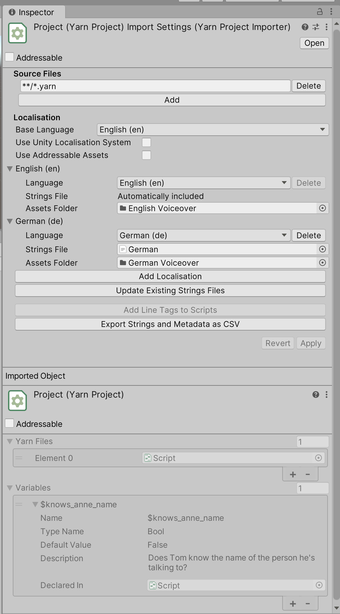

# Yarn Spinner in Unity Scenes

## Yarn Spinner in Unity Scenes

## Getting Started with Yarn Spinner for Unity

Yarn Spinner is a powerful dialogue system for Unity that allows you to create branching narratives for your games. This guide will walk you through setting up Yarn Spinner in your Unity project and getting a basic dialogue system running.



#### Creating Your First Yarn Project

To organize your dialogue, you'll need to create a Yarn Project:

1. In the Unity Editor, go to **Assets > Yarn Spinner > Yarn Project**
2. Name your new Yarn Project file (e.g., "MyGame")
3. The Yarn Project will appear in your Assets folder

A Yarn Project is a special file that groups related Yarn Scripts together. It's essential for using dialogue in your game.


Yarn Projects include all Yarn Scripts in the same directory by default. You can modify the Source Files setting to include scripts from different locations.



#### Writing Dialogue in Yarn Scripts

Now, let's create a Yarn Script to write your dialogue:

1. Go to **Assets > Yarn Spinner > Yarn Script**
2. Name your script (e.g., "Introduction")
3. Double-click the script to open it in the editor

Here's a simple example of dialogue written in Yarn:

```yarn
title: Start
---
Player: Hello there!
NPC: Oh, hello! How can I help you today?
-> I need information.
    NPC: What would you like to know?
-> I'm just browsing.
    NPC: Feel free to look around!
-> Actually, I should go.
    NPC: No problem. Come back anytime!
    <<jump End>>
===

title: End
---
Player: Thanks for your help!
NPC: You're welcome! Have a nice day!
===
```

Save your changes. The script will be automatically included in your Yarn Project if it's in the same folder.

When writing dialogue, remember:

* Each node begins with `title:` followed by the node name
* The node's content starts after `---` and ends with `===`
* Options are created using `->` at the start of a line
* Commands use `<<command>>` syntax



#### Setting Up the Dialogue System in Unity

To use your dialogue in-game, you need to add a Dialogue System to your scene:

1. In your scene hierarchy, right-click and select **Yarn Spinner > Dialogue System**
2. With the Dialogue System selected, locate the Dialogue Runner component in the Inspector
3. Drag your Yarn Project into the "Yarn Project" field in the Dialogue Runner
4. If you want dialogue to start automatically, check "Start Automatically" and set your starting node (usually "Start")


The Dialogue System prefab comes with several components:

* **Dialogue Runner**: The core component that runs your dialogue
* **Line Presenter**: Displays text dialogue to the player
* **Options Presenter**: Shows choices for the player to select
* **Line Advancer**: Allows the player to progress through dialogue



#### Understanding Dialogue Presenters

Dialogue Presenters (formerly called Dialogue Views) are components that display dialogue content to the player:

**Line Presenter**

The Line Presenter shows lines of dialogue in a text box. You can configure:

* Text appearance and positioning
* Character name display
* Typewriter effect speed
* Fading effects
* Auto-advance settings


**Options Presenter**

The Options Presenter displays choices for the player to select. You can configure:

* Option appearance and positioning
* List layout
* Whether to show unavailable options

**Line Advancer**

The Line Advancer (formerly Dialogue Advance Input) allows players to progress dialogue using input:

1. Select your Line Presenter in the hierarchy
2. Find the associated Line Advancer component
3. Configure the input method (keycode, button, etc.)

You can have multiple Dialogue Presenters in your scene, each handling different aspects of dialogue presentation.



#### Variable Storage and Line Providers

**Variable Storage**

Variable Storage components keep track of variables in your dialogue:

* By default, Yarn Spinner uses **In-Memory Variable Storage** (variables are lost when the game ends)
* For persistent variables, create a custom Variable Storage that connects to your game's save system

To debug variables during development, use the Debug Text View property of the In-Memory Variable Storage component.

**Line Providers**

Line Providers fetch the content for each line of dialogue:

* **Text Line Provider**: Provides just the text of dialogue lines
* **Audio Line Provider**: Provides text and associated audio clips
* **Unity Localised Line Provider**: Works with Unity's Localization system

If you don't set a Line Provider, the system will create a Text Line Provider automatically.

These components are all configured in the Dialogue Runner:





#### Testing Your Dialogue

To test your dialogue system:

1. Make sure your Dialogue System is set up properly
2. Press Play in the Unity Editor
3. If "Start Automatically" is enabled, dialogue should begin
4. Otherwise, trigger dialogue by calling the `StartDialogue()` method on your Dialogue Runner

For example, you might trigger dialogue when a player presses a button near an NPC:

```csharp
public class DialogueTrigger : MonoBehaviour
{
    public DialogueRunner dialogueRunner;
    public string startNode = "Start";

    private void OnTriggerEnter(Collider other)
    {
        if (other.CompareTag("Player"))
        {
            dialogueRunner.StartDialogue(startNode);
        }
    }
}
```

While testing, use the Unity Console to check for any errors in your Yarn scripts.



#### Working with Localisation

Yarn Spinner makes it easy to add multiple languages to your game:

1. Select your Yarn Project in the Assets panel
2. Click "Export Strings as CSV" in the Inspector
3. Translate the exported CSV file
4. Import the translations back into your project

You can use either:

* **Built-in Localisation System**: Manage translations directly through Yarn Spinner
* **Unity Localisation System**: Integrate with Unity's Localisation package

If using Unity's Localisation:

1. Install the Localisation package
2. Check "Use Unity Localisation System" in your Yarn Project
3. Use the Unity Localised Line Provider with your Dialogue Runner





#### Creating Custom Commands and Functions

Extend Yarn Spinner by creating custom commands to connect dialogue with your game mechanics:

**Custom Commands**

Create a command that your Yarn scripts can call:

```csharp
[YarnCommand("give_item")]
public void GiveItem(string itemName, int quantity = 1)
{
    // Your code to give the player an item
    Debug.Log($"Giving {quantity} {itemName}(s) to the player");
}
```

Then use it in your Yarn script:

```yarn
NPC: Here, take this potion.
<<give_item "health_potion">>
```

**Custom Dialogue Presenters**

For unique presentation styles, create custom Dialogue Presenters by subclassing `DialoguePresenterBase`:

```csharp
public class CustomDialoguePresenter : DialoguePresenterBase 
{
    public override void RunLine(LocalizedLine dialogueLine, Action onDialogueLineFinished)
    {
        // Your custom line presentation code
        Debug.Log($"Presenting line: {dialogueLine.TextWithoutCharacterName}");
        
        // Call this when the line presentation is complete
        onDialogueLineFinished();
    }
    
    
}


```



### assets menu - yarn spinner - dialogue presenter script





### Troubleshooting

Common issues and solutions:

#### Dialogue doesn't start

* Check if your Yarn Project is assigned to the Dialogue Runner
* Verify that your Yarn Script contains a node with the name specified in "Start Node"
* Make sure there are no compilation errors in your Yarn Scripts

#### Dialogue text doesn't appear

* Ensure the Line Presenter component is properly configured
* Check that the Canvas Group and Text components are correctly assigned

#### Custom commands don't work

* Verify that your custom command method is in a MonoBehaviour that's in the scene
* Make sure the method has the `[YarnCommand]` attribute
* Check the console for any error messages

#### Variable issues

* For debugging, use the In-Memory Variable Storage's "Debug Text View" to see variable values
* Make sure variables are declared with the correct type

***

This guide should help you get started with Yarn Spinner in Unity. For more detailed information, refer to the [official Yarn Spinner documentation](https://docs.yarnspinner.dev/).
